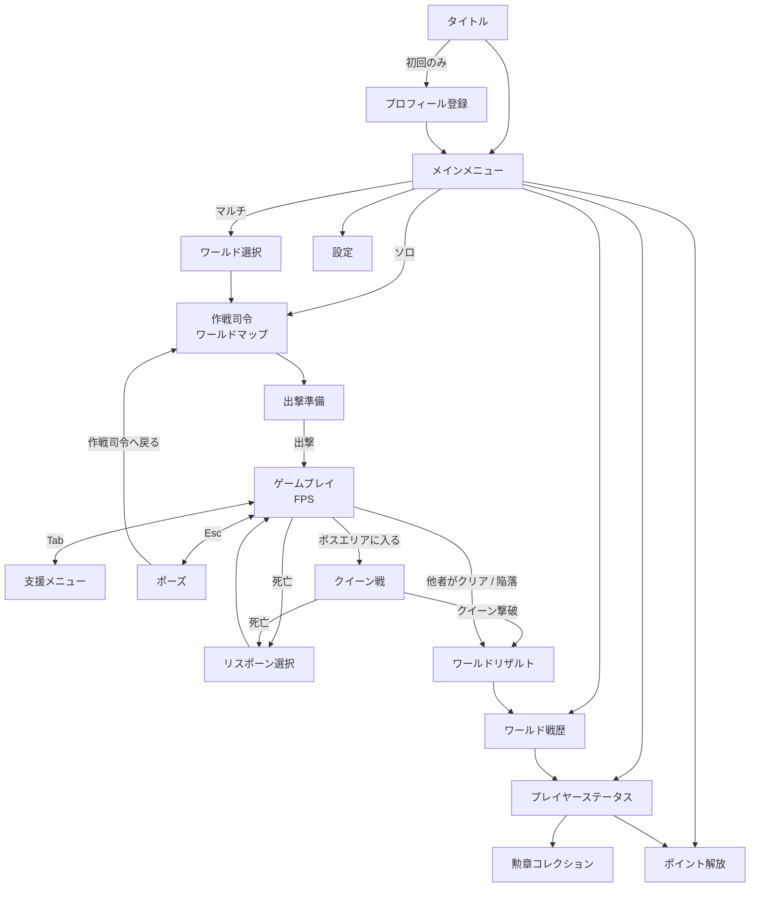

# Relay Resistance 概要

各仕様書を読む前の簡易ガイド。詳細は下記の各ドキュメントを参照する。

| 読みたい内容 | ドキュメント |
|---|---|
| 何を作るか・ルール・数値 | [01_要件定義書.md](01_要件定義書.md) |
| 機能ごとの動作 | [02_機能仕様書.md](02_機能仕様書.md) |
| 画面・UI・遷移の詳細 | [03_画面仕様書.md](03_画面仕様書.md) |
| 技術構成・DB・サーバー関数 | [04_アーキテクチャ.md](04_アーキテクチャ.md) |
| 未確定事項 | [05_確認事項一覧.md](05_確認事項一覧.md) |

---

## 1. どんなゲームか

エイリアンに侵略された地球が舞台の**協力型FPS**。プレイヤーはFPS視点でステージを進み、ボスの「クイーン」を倒して地球を救う。

- **ワールド**：複数プレイヤー（最大20人）が共有する1つの侵略状況。誰か1人がクイーンを倒せばワールド全体がクリアになる。
- **ルート**：ワールド内の攻略経路（最大10本）。プレイヤーは基本的に別々のルートで戦う。
- **託し合い**：敵を倒して得た**資金**を、物資・援護攻撃・共有資金として他プレイヤーに託して間接的に協力する（タイトルの「Relay」）。
- **放置すると不利**：マルチでは誰も遊んでいなくてもエイリアンが4時間ごとに侵攻し、1週間ごとに強化される。作成から30日以内に倒せないとワールドは陥落する。
- **やりこみ**：マルチをクリアするとポイントを獲得し、武器の開放やキャラ強化に使える。貢献度に応じて階級（陸軍の22階級）・勲章も得られる。

### ボスエリアでの合流

**ボスエリア（クイーン）はワールドに1つだけ**で、全ルートが最終的にここへ合流する。各ルートのプレイヤーが近いタイミングで到達すると、最大20人が同じクイーン戦に集まりうる。

- **方針（決定）**：ボスエリア内だけは分隊に分けず、いる全員（最大20人）を同期する。他の場所は従来どおり分隊（最大4人）単位。
- ボスエリアは全ルートの終点で、ルートに属さない（データ上も1つ）。

| 項目 | ボスエリアでの仕様 |
|---|---|
| クイーンの体力 | 全員で共有。サーバーが5秒ごとの報告で集計し、全員へ1秒ごとに即時表示、10秒ごとに補正 |
| 撃破者 | 体力を0にする報告を最初に受け付けた1人 |
| 座標・攻撃アニメ | 全員を2Hzで同期（人数が多いときは1Hz） |
| エイリアン・近衛兵 | 各クライアントでローカルにスポーン（1人あたりの数は人数に関係なく一定）。撃破は通知しない |
| ボス包囲状態（増援停止） | ルートごとに判定（仮置き） |
| 通信量 | 20人が動き続けると10分で約46万件。月200万件の約4回ぶんで、無料枠への影響が大きい（要確認） |

詳細は [機能仕様書 F-15・F-18 19.6](02_機能仕様書.md)、[アーキテクチャ 4.2・12.4](04_アーキテクチャ.md)、[確認事項一覧 A-12](05_確認事項一覧.md) を参照。

### モード

| | ソロ | マルチ |
|---|---|---|
| 遊ぶ相手 | 自分だけ | 最大20人で1ワールドを共有 |
| 時間経過 | 侵攻しない（いつでも遊べる） | 侵攻・強化が進む（作戦期間30日） |
| ルート数 | 1本 | 最大10本 |
| 育成の引き継ぎ | しない | クリア時のみ次のマルチへ引き継ぐ |
| ポイント獲得 | なし | クリア時のみ |
| 目安のクリア時間 | 約1時間 | 約1時間〜（放置すると最長30日） |

### 1回のプレイの流れ

1. 敵を倒して資金を稼ぐ
2. 敵拠点の敵を全滅させ、10秒とどまって**制圧**する（リスポーン地点・ワープ先になる）
3. 資金を自分の強化や他プレイヤーの支援に使う
4. ボスエリアまで進み、クイーンを倒してクリア

---

## 2. どの技術領域か

| 領域 | 内容 |
|---|---|
| ゲームエンジン | Unity（C#） |
| 3D／FPS | ステージは3D。キャラ・敵・銃・アイテムは**2Dビルボード**（素材は前面・背面の2種のみ） |
| バックエンド | Supabase（PostgreSQL / Auth（匿名認証） / Realtime / pg_cron） |
| サーバーロジック | PL/pgSQL の RPC 関数のみ（Edge Functions は使わない）。状態変更はすべて RPC 経由 |
| 時間経過の処理 | バッチに頼らず、参照時に計算する（遅延評価） |
| 通信 | ワールド全体は10秒ごとの RPC（`get_world_pulse`）。座標・撃破は同じ分隊（最大4人）だけ Realtime で同期。**ボスエリアだけは全員（最大20人）を同期**。敵の位置や発砲方向は同期しない |
| WebGL連携 | supabase-js をブラウザ側で動かし、jslib 経由で C# と連携する |
| 運用 | **無料枠のみ**（Supabase Free / unityroom / 外部cronで死活監視） |

設計上の主な課題：Realtime のメッセージ数上限（月200万件）と同時接続数（約200人）。特にボスエリアの全員同期はメッセージ数を大きく使う。

---

## 3. プラットフォーム

| 項目 | 内容 |
|---|---|
| 配信先 | **unityroom**（WebGL ビルド） |
| 実行環境 | PCのブラウザ（キーボード＋マウス） |
| 画面サイズ | 基準 1280×720（16:9） |
| 言語 | 日本語 |
| 性能目標 | 30fps以上（推奨60fps） |
| 制約 | WebGLのため、マルチスレッド・ソケット直接利用は不可。ビルド容量にも制限がある |
| 課金 | なし |

---

## 4. 画面遷移図

主要な画面だけを示した簡略図。全18画面の詳細は [画面仕様書](03_画面仕様書.md) を参照。

### 画面の役割（一言）

| 画面 | 役割 |
|---|---|
| 作戦司令 | 全ルートの状況を俯瞰し、他ルートへの支援（物資・援護攻撃・資金）もここから行う中心画面 |
| 出撃準備 | 資金で強化し、出撃地点（ワープ先）を選ぶ |
| ゲームプレイ | FPSのステージ。敵拠点の制圧、資金獲得 |
| 支援メニュー | プレイ中に開く。時間は止まらない |
| ワールドリザルト | 功績度・ポイント・被害者数・戦死者数などを表示 |
| ワールド戦歴 | 作戦記録と貢献者一覧。グッド（称賛）を押せる |
