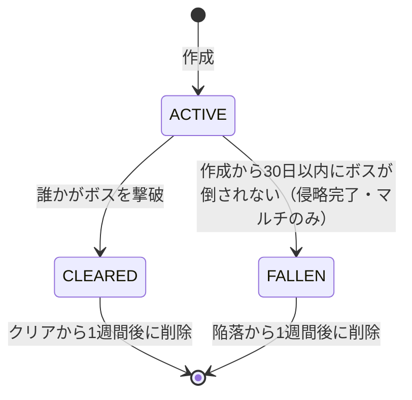

# Relay Resistance 機能仕様書

| 項目 | 内容 |
|---|---|
| 文書名 | 機能仕様書 |
| 版数 | 0.1（ドラフト） |
| 作成日 | 2026-09-23 |
| 関連文書 | [01_要件定義書.md](01_要件定義書.md) / [03_画面仕様書.md](03_画面仕様書.md) / [04_アーキテクチャ.md](04_アーキテクチャ.md) |

> 数値はすべて**初期値（バランス調整用パラメータ）**であり、サーバーの `game_config` テーブルで変更できるものとする（→ アーキテクチャ 5章）。
> 「【解釈】」は元資料の記述を仕様化するにあたって補った解釈、「【要確認】」は仮置きした値を示す。

---

## 1. 機能一覧

| 機能ID | 機能名 | 対応要件 |
|---|---|---|
| F-01 | アカウント・プロフィール | FR-PLY-01 |
| F-02 | ワールド管理（生成・参加・リセット・保存・削除） | FR-MODE-*, FR-WLD-12〜14 |
| F-03 | ルート・エリア構造 | FR-WLD-01〜03 |
| F-04 | エリア制圧 | FR-WLD-04〜07 |
| F-05 | エイリアン侵攻シミュレーション | FR-WLD-08〜11, FR-ALN-01〜04, FR-SYN-06 |
| F-06 | FPS戦闘 | FR-FPS-* |
| F-07 | エイリアンAI・増援 | FR-ALN-05〜07, FR-WLD-06 |
| F-08 | 敵拠点 | FR-ALN-05, 06, FR-FND-08 |
| F-09 | 資金（獲得・消費・共有） | FR-FND-01, 02, 05, 11 |
| F-10 | 物資調達 | FR-FND-03 |
| F-11 | 援護攻撃要請 | FR-FND-04 |
| F-12 | プレイヤー強化 | FR-FND-06, 10 |
| F-13 | 途中拠点設営・リスポーン・ワープ | FR-FND-07, FR-RSP-*, FR-WLD-20 |
| F-14 | 敵拠点攻撃要請 | FR-FND-08 |
| F-15 | ボス戦・ワールドクリア | FR-ALN-07, FR-MODE-03 |
| F-16 | スコア・貢献度・階級・勲章 | FR-SCR-01〜06 |
| F-17 | ワールド戦歴・貢献者一覧・グッド | FR-SCR-07〜09 |
| F-18 | 同期 | FR-SYN-* |

---

## 2. F-01 アカウント・プロフィール

### 2.1 認証
- Supabase Auth の**匿名サインイン**を使う。初回起動時に自動で匿名ユーザーを作る。
- セッション（リフレッシュトークン）はブラウザの `PlayerPrefs`（WebGL では IndexedDB に保存される）に保存し、次回以降は自動でログインする。
- 【要確認】ブラウザのデータを消すとアカウントを失うため、引き継ぎコード（または外部アカウント連携）を用意するか検討する。

### 2.2 プロフィール項目

| 項目 | 型 | 仕様 |
|---|---|---|
| プレイヤー名 | 文字列 | 1〜12文字。NGワードチェックあり。重複は許可する（表示には `#` と4桁の識別子を付ける） |
| アイコン画像 | プリセットID | 用意したプリセットアイコンから選ぶ（画像アップロードはしない） |
| 階級 | 列挙 | 累計貢献度から自動で決まる（F-16） |
| 獲得勲章一覧 | 勲章IDの配列 | F-16 |
| キャラクター育成度 | 整数 | 引き継がれた強化レベルの合計（F-12） |
| 累計貢献度 | 整数 | 全ワールドのスコア合計 |
| グッド数 | 整数 | 他プレイヤーから受けたグッドの合計 |

---

## 3. F-02 ワールド管理

### 3.1 ワールドの種類

| 種類 | 参加人数 | 生成タイミング |
|---|---|---|
| ソロワールド | 1人（本人のみ） | ソロモードを初めて開始したとき、または前のソロワールドをクリアした後 |
| マルチワールド | **最大20人** | プレイヤーが作成する（3.2）。日時に関係なく、いつでも作成できる |

### 3.2 マルチワールドの作成

| 項目 | 仕様 |
|---|---|
| 作成できる人 | 誰でも（ワールド選択画面 SC-04 の［新しい戦域を作る］から） |
| ワールド枠 | 作戦期間中（ACTIVE）のマルチワールドは、全体で同時に **100個まで**。クリア・陥落したワールドは数えない |
| 1人あたりの上限 | 自分が作成した作戦期間中のワールドは、同時に1個まで。そのワールドがクリア、または失敗（陥落）で終わった時点で数がリセットされ、再び作成できる |
| 上限に達したとき | ［新しい戦域を作る］を押せなくし、「作戦中の戦域が上限に達しています」と表示する。既存のワールドには参加できる |
| 参加人数 | 1ワールドあたり20人まで。20人に達したワールドは一覧に「満員」と表示し、参加できない |
| ワールド名 | 自動で連番を付ける（例：第128戦域） |
| 作成した人 | 自動でそのワールドに参加し、ルートを割り当てる |

- 作成とワールド枠のチェックは、サーバー関数 `create_world` の中で1つのトランザクションとして行う。同時に作成されても100個を超えないよう、ロックをかけて数える。

### 3.3 作戦期間とリザルト期間（マルチワールドのみ）

| 期間 | 範囲 | できること |
|---|---|---|
| 作戦期間 | 作成してから **30日間**（`closes_at = created_at + 30日`） | 参加・出撃・資金の使用などすべて。エイリアンの侵攻が進む |
| リザルト期間 | クリアした時点、または作戦期間が終わった（失敗した）時点から **1週間**。経過後にワールドを削除する | 結果・戦歴・貢献者一覧の確認、グッド。**出撃・資金の使用・参加はできない** |

- 作戦期間はワールドごとに異なる。
- `closes_at` の時点でプレイ中のプレイヤーがいた場合は、そのステージを強制的に終わらせ、SC-17「侵略完了」を表示する。締切より後に届いた撃破報告・資金の使用は受け付けない。
- ソロワールドは作戦期間・リザルト期間の対象外で、いつでも遊べる。

### 3.4 ワールドの状態遷移



| パラメータ | 初期値 | 説明 |
|---|---|---|
| `operation_days` | 30日 | 作戦期間の長さ |
| `max_active_worlds` | 100 | 作戦期間中のマルチワールドの上限 |
| `max_active_worlds_per_player` | 1 | 1人が同時に作成できる作戦期間中のワールドの数 |
| `max_members` | 20 | 1ワールドの参加者の上限 |
| `result_days` | 7日 | クリア・陥落の後、ワールドを保存する期間（リザルト期間） |

- ワールドを削除しても、プロフィールの累計貢献度・階級・勲章・グッド数・引き継ぎ強化は残る。戦歴（SC-13）と貢献者一覧は、リザルト期間の間だけ見られる。

- FALLEN になったワールドでの**プレイヤー強化は引き継がれない**。スコア・貢献度は【解釈】プロフィールの累計には加えるが、勲章の判定対象外とする。
- FALLEN のワールドも、削除されるまでは結果・貢献者一覧を見られる。
- 状態が ACTIVE → FALLEN に変わるのは時刻だけで決まるため、定期的な処理（バッチ）を待たずに、参照したときに判定する（アーキテクチャ 8章）。
- ソロワールドは FALLEN にならない（期限がない）。

### 3.5 ワールドへの参加
1. マルチモードを選ぶと、作戦期間中のワールド一覧が表示される（自動選択も可能）。リザルト期間のワールドには新しく参加できない。
2. 初めて参加するときに、ルートを**ランダムに割り当てる**。参加人数が少ないルートを優先して割り当てる。
3. 割り当てたルートは「所属ルート」として、そのワールド内では固定とする。所属ルートは、最初の出撃地点（初期スポーン地点）と途中拠点を設営できる場所を決める。
4. 所属ルートとは別に、制圧済みの拠点へワープすれば、他のルートでも戦える（F-13 14.3）。

---

## 4. F-03 ルート・エリア構造

### 4.1 構造
- ワールドは `route_count` 本のルートを持つ（初期値4）。ルートどうしは互いに独立している。
- ルートはエリアを頂点とする**有向非巡回グラフ（DAG）**で表す。
  - 始点：初期スポーン地点エリア（S）
  - 終点：ボスエリア（B）
  - 分岐：1つのエリアから2つに分かれ、何エリアか進んだ後、必ず1つのエリアに合流する

```
S ─ A1 ─ A2 ─┬─ B1a(拠点あり) ─ B2a ─┬─ A5 ─ A6 ─ B(ボス)
             └─ B1b(拠点なし) ─ B2b ─┘
```

### 4.2 エリアの属性

| 属性 | 説明 |
|---|---|
| `length_m` | エリアの長さ（初期値80〜150m） |
| `owner` | `PLAYER` または `ALIEN` |
| `encroach_m` | エイリアンに侵食された距離。`length_m` 以上になると `owner` が `ALIEN` になる |
| `enemy_remaining` | そのエリアに残っている敵の数（サーバーが正） |
| `enemy_base` | 敵拠点の有無と状態（F-08） |
| `supply_points` | 物資ポイントの一覧（F-10） |
| `outpost` | 途中拠点の有無と状態（F-13） |
| `is_protected` | 初期スポーン地点は `true`（制圧されない） |

- 拠点がない分岐のエリアは、基本の敵数を `0.6倍` とする。

---

## 5. F-04 エリア制圧

### 5.1 制圧できる条件
あるエリア X を制圧（`owner = PLAYER`）にできるのは、次の**すべて**を満たしたときとする。
1. `enemy_remaining` が 0 になる。
2. X に隣接する（前後どちらかの）エリアのうち1つ以上が `PLAYER`、または X が初期スポーン地点の次のエリアである。
   → 飛び地の制圧はできない（虫食い状の制圧不可）。
3. X に敵拠点がある場合、その敵拠点が破壊されている。

条件2を満たさないまま敵を全滅させた場合、`enemy_remaining` は0のまま**未制圧**として扱う。その後、条件2を満たした時点で制圧になる。
【解釈】ただし、敵拠点があるエリアや後方からの増援で敵の数は再び増える可能性がある。

### 5.2 制圧しないまま前進する
- 制圧していないエリアを通り抜けることはできる。
- プレイヤーが最前線より先（`ALIEN` のエリア）にいる間は、**後方の最も近い ALIEN エリア**から増援が一定間隔で出現する（F-07）。

### 5.3 ボスエリアまでの制圧
- ボスの直前のエリアまで、ルート上の必要なエリアがすべて `PLAYER` になると「**ボス包囲状態**」となる。分岐はどちらか一方の系統でよい。
- ボス包囲状態では次のようになる。
  - 後方からの増援が止まる。
  - ボスエリアの手前にリスポーン地点（前線基地）が自動で有効になる。

---

## 6. F-05 エイリアン侵攻シミュレーション

> **本章の処理はマルチワールドにだけ適用する。** ソロワールドでは時間が経ってもエイリアンの侵攻は進まない。
> ソロワールドでは、週ごとの強化（6.1）と敵拠点の修復（6.3）も行わず、常に `week = 0` として扱う。
> マルチワールドでも、リザルト期間に入った後（`closes_at` より後、またはクリアした後）は処理しない。
> 作戦期間は30日のため、`week` は最大4（29〜30日目）になる。

### 6.1 強化段階
- `week = floor((現在時刻 − ワールド生成時刻) / 7日)`
- 各ステータスの倍率 ＝ `基本倍率 ^ week`

| ステータス | 1週ごとの倍率 | 1週目(week=1) | 3週目(week=3) |
|---|---|---|---|
| 体力 | ×1.3 | 1.30 | 2.20 |
| 攻撃力 | ×1.1 | 1.10 | 1.33 |
| 移動速度 | ×1.1 | 1.10 | 1.33 |
| 索敵能力 | ×1.2 | 1.20 | 1.73 |
| 射程 | ×1.2 | 1.20 | 1.73 |
| 1回に出現する数 | ×1.1 | 1.10 | 1.33 |
| 制圧能力 | ×1.5 | 1.50 | 3.38 |

### 6.2 侵攻処理（4時間ごと）
- 4時間ごとの区切り（ワールド生成時刻を起点とする）を「侵攻ティック」と呼ぶ。
- 1ティックの侵攻距離 `d = 5m × 1.5^week`

侵攻ティックごとに、次の処理を行う。
```
for 各ルート:
  for 各 PLAYER エリア P (is_protected=false):
    adj_alien = P に隣接する ALIEN エリアの数（前後の両方向を数える）
    if adj_alien > 0:
      P.encroach_m += d × adj_alien
      if P.encroach_m >= P.length_m:
        P.owner = ALIEN
        P.encroach_m = 0
        P.enemy_remaining = 基本の敵数 × 出現数の倍率
        P 内の途中拠点 → エイリアンに制圧され、エイリアンのリスポーン地点になる（F-13）
        P 内の物資ポイントの在庫 → 失われる
```
- 前後の両方向を数えるため、**分岐の合流で孤立した ALIEN エリア**は、ボス方向と初期スポーン地点方向の両方へ侵攻する（FR-WLD-08）。
- 初期スポーン地点（`is_protected`）は侵食されない。
- プレイヤーがエリアで戦闘している最中（そのエリアに誰かがいる状態）でも、侵食は進む。ただし `owner` が切り替わるのは、そのエリアから全員が離れた後とする。

【解釈】「全プレイヤーが遊ばない状態が続くと取り返される」は、上の侵食が常に進んでいることの結果として実現する。プレイヤーが遊んでいれば、制圧（F-04）が侵食を上回る。
【要確認】プレイ中は侵食を止めたり弱めたりする補正を入れるか。

### 6.3 敵拠点の修復
- 破壊された敵拠点は、そのエリアが制圧されないまま `base_repair_hours`（初期値12時間）が過ぎると、耐久値・物資が最大値で復活する。

### 6.4 遊んでいない間の計算（遅延評価）
- ワールドは `last_simulated_at` を持つ。
- 次のいずれかのタイミングで、サーバー関数 `advance_world(world_id)` が `last_simulated_at` から現在時刻までの**未処理の侵攻ティックを順番にすべて処理する**。
  1. プレイヤーがワールドに入ったとき（ログインして参加したとき）、作戦司令を開いたとき
  2. ワールド一覧を取得したとき（最後の計算から4時間以上経っているワールドだけ）
  3. 制圧・資金使用など、状態を変えるAPIを呼び出す直前
- 処理は時刻だけで決まる（決定的）ため、どのタイミングで計算しても結果は同じになる。
- **定期的な処理（バッチ）がなくても正しく動く**。誰も見ていないワールドは計算されないが、誰かが見た時点で、それまでの分をまとめて計算するため、結果は変わらない。
- 同時に呼び出されたときは、ワールド単位の行ロック（`SELECT … FOR UPDATE`）で二重処理を防ぐ。

---

## 7. F-06 FPS戦闘

### 7.1 操作（キーボード＋マウス）

| 操作 | キー |
|---|---|
| 移動 | WASD |
| 視点 | マウス |
| 射撃 | 左クリック |
| エイム（ズーム） | 右クリック |
| リロード | R |
| ダッシュ（スタミナを消費） | Shift |
| ジャンプ | Space |
| しゃがみ | C |
| 武器切替 | 1〜3 / ホイール |
| インタラクト（物資を拾う・拠点を使う） | E |
| 支援メニュー | Tab |
| ポーズ | Esc |

### 7.2 プレイヤーの基本値

| 項目 | 初期値 |
|---|---|
| 最大体力 | 100 |
| 最大スタミナ | 100（ダッシュ中は毎秒20消費、止まると毎秒25回復） |
| 歩行速度 / ダッシュ速度 | 4.0 m/s / 7.0 m/s |

### 7.3 武器

| 武器 | 弾数 | ダメージ | 連射 | 入手 |
|---|---|---|---|---|
| ハンドガン（基本） | **無限**（マガジン12発、リロードあり） | 20 | 単発 | 最初から持っている |
| アサルトライフル | 有限 | 15 | 連射 | 物資調達【要確認】 |
| ショットガン | 有限 | 10×8 | 単発 | 物資調達【要確認】 |

- ハンドガンだけでソロクリアできるように、敵の体力・数を調整する（FR-MODE-04）。

### 7.4 ビルボード描画
- 各ビルボードは「正面方向」のベクトルを持つ。
- カメラへの方向と正面方向の内積が 0以上なら**前面**、0未満なら**背面**のテクスチャを表示する。
- ビルボードはY軸だけ回転させ、常にカメラの方を向ける（縦軸固定）。

### 7.5 被弾と死亡
- 体力が0になると死亡し、リスポーン選択画面（→ 画面仕様書 SC-10）へ移る。
- 死亡イベントは同じエリアの他プレイヤーにも通知する（F-18）。
- 所持金は失わない。【要確認】死亡時のペナルティ

---

## 8. F-07 エイリアンAI・増援

### 8.1 エリアでの敵の出現
- エリアに入ると、サーバーの `enemy_remaining` を上限として、クライアントがそのエリアのスポーン地点に敵を出現させる。
- 同時に出現させる上限は20体とする。倒されるたびに、残りがあれば補充する。

### 8.2 敵の種類（初期案）

| 種類 | 役割 | 特徴 |
|---|---|---|
| ドローン | 近接 | 速い・体力が低い |
| ソルジャー | 射撃 | 標準 |
| スナイパー | 牽制射撃 | 射程が長い。敵拠点の物資がなくなると出現しなくなる |
| グレネーダー | 範囲攻撃 | 敵拠点の物資が50%以上のときだけ出現する |
| ボス | — | 複数の攻撃パターンを持つ（F-15） |

### 8.3 AIの状態遷移
`待機 → 索敵(索敵範囲×倍率) → 接近 → 攻撃(射程×倍率) → (見失う) → 捜索 → 待機`

### 8.4 後方からの増援
- 条件：プレイヤーが `ALIEN` のエリアにいて、かつボス包囲状態でない。
- 発生元：プレイヤーの後方（初期スポーン地点方向）で最も近い `ALIEN` エリア。なければ、そのエリアの入口から出現させる。
- 間隔：`reinforce_interval_sec`（初期値45秒）ごとに `3 × 出現数の倍率` 体。
- 増援で出現した敵は、その場限り（クライアント内だけ）の敵とし、倒してもサーバーの `enemy_remaining` は減らない。資金は得られる。

---

## 9. F-08 敵拠点

| 属性 | 初期値 | 説明 |
|---|---|---|
| 耐久値 | 1000 × 体力の倍率 | プレイヤーの攻撃、または敵拠点攻撃要請で減る |
| 物資 | 100% | 敵拠点攻撃要請で減る |
| 増援 | 物資の割合に比例 | エリア内の敵の補充速度が変わる |

物資の割合による敵の行動の変化：

| 物資 | 効果 |
|---|---|
| 100〜50% | すべての攻撃パターンを使う |
| 50〜20% | グレネーダーが出現しなくなる。牽制射撃の頻度が半分になる |
| 20〜0% | スナイパーが出現しなくなる。牽制射撃をしなくなる |

- 耐久値が0になると「破壊」状態になる。エリアを制圧すれば完全に消える。制圧しないまま `base_repair_hours` が過ぎると修復される（F-05 6.3）。
- 敵拠点を破壊した（とどめを刺した）プレイヤーに「敵拠点制圧」の実績を1件記録する。

---

## 10. F-09 資金

### 10.1 財布の種類

| 財布 | 持ち主 | 用途 |
|---|---|---|
| 個人資金 | プレイヤー（ワールドごと） | すべての用途に使える |
| 共有資金プール | ワールド | 同じワールドの誰でも、**どの用途（プレイヤー強化を含む）にも自由に**使える。1回・1日あたりの引き出し上限は設けない |

- ソロワールドには共有資金プールがない（他のプレイヤーがいないため）。

### 10.2 獲得

| 敵 | 報酬 |
|---|---|
| ドローン | 10 |
| ソルジャー | 15 |
| スナイパー / グレネーダー | 25 |
| 敵拠点の破壊 | 500 |
| エリア制圧（参加者全員に分配） | 200 |

- 報酬 × `1.1^week`（エイリアンが強くなるほど報酬も増える）
- 獲得はクライアントから「撃破の報告」として送り、サーバーで検証してから加算する（→ アーキテクチャ 7章）。

### 10.3 消費の一覧

| 用途 | 対象 | 効果の範囲 | 資金貢献として数えるか |
|---|---|---|---|
| 物資調達 | 任意のルート・エリアの物資ポイント | そのエリアに来た全プレイヤー | ○ |
| 援護攻撃要請 | 任意のルート・エリア | そのエリア | ○ |
| 共有資金 | ワールドの共有プール | ワールド全体 | ○ |
| プレイヤー強化 | 自分 | 自分だけ | ×（数えない） |
| 途中拠点設営 | 自分のルートの PLAYER エリア | そのルートの全プレイヤー | ○ |
| 敵拠点攻撃要請 | 任意のルートの敵拠点 | そのルート | ○ |

- 「任意のルート」＝自分以外のルートも支援できる（別々のステージで戦いながら助け合う）。
- 共有プールから支払った分は、**実際に使ったプレイヤーの**資金貢献には数えない（プールへ入れた時点で入れた人の貢献として数え済みのため）。
- 共有プールから誰がいくら何に使ったかは `support_events` に記録し、作戦司令の「最近の出来事」に表示する（使い道を見えるようにして、託した側が確認できるようにする）。
- リザルト期間中は、個人資金・共有資金とも使えない。

### 10.4 リアルタイム同期
- 個人資金・共有プールの残高が変わったら、ワールドのチャンネルで全参加者へ通知する（F-18）。

---

## 11. F-10 物資調達

- 各エリアに0〜2か所の物資ポイントがある。
- 投入額に応じて段階が決まる。

| 段階 | 投入額 | 内容 |
|---|---|---|
| S | 300 | 弾薬×1、回復(小)×1 |
| M | 800 | 弾薬×3、回復(小)×2、回復(大)×1 |
| L | 2000 | 弾薬×6、回復(大)×3、特殊武器×1 |

- 物資はその物資ポイントの**在庫**として積み上がる（ワールドで共有される）。
- 拾うと在庫が1つ減る。在庫の減少は同期する（サーバーでアトミックに減算する）。
- 物資ポイントのエリアがエイリアンに制圧されると在庫を失う。

---

## 12. F-11 援護攻撃要請

| 種類 | 投入額の範囲 | 範囲 | 威力 |
|---|---|---|---|
| 上空爆撃 | 500〜5000 | 半径 `10m + 投入額/250 m` | `200 × (投入額/500)^0.8` |
| タレット展開 | 400〜4000 | 射程 `20m + 投入額/200 m` | 秒間ダメージ `15 × (投入額/400)^0.7`、持続180秒 |

- 要請の流れ
  1. 支援メニューで種類・対象のエリア・投入額を選ぶ。
  2. サーバーで資金を引き落とし、`support_events` に記録する。
  3. 対象エリアに**プレイヤーがいる場合**：そのエリアのチャンネルへイベントを送り、各クライアントが演出を再生し、効果範囲内のローカルの敵にダメージを与える。
  4. 対象エリアに**プレイヤーがいない場合**：サーバーが簡易計算で撃破数を決めて、`enemy_remaining` を減らす。
     `撃破数 = min(enemy_remaining, floor(威力 / (基本の敵の体力 × 体力の倍率) × 範囲係数))`
- 援護攻撃による撃破は、要請したプレイヤーの「**援護キル数**」として通常のキル数とは別に記録する（FR-SCR-03）。

---

## 13. F-12 プレイヤー強化

| 項目 | 1レベルごとの効果 | 最大レベル | 費用（Lv n→n+1） |
|---|---|---|---|
| 最大体力 | +10 | 20 | 200 × 1.25^n |
| 最大スタミナ | +10 | 20 | 150 × 1.25^n |
| リロード速度 | −4% | 10 | 250 × 1.3^n |
| 反動・拡散 | −5% | 10 | 250 × 1.3^n |
| マガジン容量 | +10% | 10 | 300 × 1.3^n |
| 攻撃力 | **+1%** | 5 | 1000 × 1.5^n |

- 支払いには個人資金・共有資金のどちらも使える（F-09 10.1）。
- 強化レベルは「ワールド内の強化」として記録する。
- ワールドに参加するときの初期値は、プロフィールに保存された「**引き継ぎ強化**」とする。
- ワールドがクリア（CLEARED）されると、そのワールドに参加した全員について、ワールド内の強化をプロフィールの引き継ぎ強化へ上書き保存する（各項目で大きい方の値を採用する）。
- ワールドがFALLENになった場合、ワールド内の強化は破棄する。
- キャラクター育成度 ＝ 引き継ぎ強化のレベルの合計。

---

## 14. F-13 途中拠点設営・リスポーン・ワープ

### 14.1 途中拠点
- 設営できる場所：どのルートでも、`PLAYER` エリアの設営ポイント（エリアごとに1か所）。作戦司令からの遠隔設営もできる。
- 費用：1500（【要確認】）。
- 設営した拠点は、ワールドの参加者全員がワープ先として使える（14.3）。
- エリアがエイリアンに制圧されると、拠点も制圧され、**エイリアンのリスポーン地点**になる。
  - エイリアンのリスポーン地点になった拠点は、そのエリアの敵の補充元になる（補充速度+50%）。
  - エリアを取り返すと、拠点は「破壊」状態になり、再び設営が必要になる。

### 14.2 リスポーン地点の選択肢

| 地点 | 条件 |
|---|---|
| 所属ルートの初期スポーン地点 | いつでも選べる（制圧されない） |
| ワープ先の拠点 | 14.3 のワープ先すべて |

- 残機の制限はない。リスポーン待ち時間は5秒とする。

### 14.3 ワープ

ワールドの参加者は、ワールド内の**制圧済みの拠点**へワープし、そこから出撃できる。自分の所属ルート以外の拠点も選べる。

| ワープ先 | 条件 |
|---|---|
| 各ルートの初期スポーン地点 | いつでも |
| 途中拠点 | 状態が `PLAYER` のもの（どのルートでも） |
| 制圧した敵拠点の跡 | 敵拠点を破壊し、そのエリアを制圧したもの（「制圧拠点」と呼ぶ）。エリアがエイリアンに取り返されると使えなくなる |
| ボス前の前線基地 | そのルートがボス包囲状態のとき |

| 項目 | 仕様 |
|---|---|
| ワープできる場面 | 出撃準備（SC-06）、リスポーン選択（SC-10）、ステージ内で拠点に近づいて［E］を押したとき |
| 費用 | 無料 |
| 待ち時間 | ステージ内からのワープは3秒の詠唱（被弾で中断）。出撃・リスポーン時は待ち時間なし |
| 移動先のルート | ワープすると、そのルートのステージを読み込み、`route:{route_id}` の購読を切り替える |

- ワープがあるため、プレイヤーの多くは**最前線とその先**に集まる想定とする。
  - 最前線に近い制圧拠点ほどワープ先として人気になる。作戦司令のルート図に、各拠点にいる人数を表示する。
  - 同じエリアに大勢が集まったときの座標の同期は、分隊単位（最大4人）に分けて行う（F-18 19.3）。
- 【解釈】1人でボスまで走り抜けて戦わずに進むルートでは、制圧拠点ができないため、ワープで追いつくことはできない。最前線を押し上げることが、ほかの参加者の移動を助けることになる。

---

## 15. F-14 敵拠点攻撃要請

| 投入額 | 耐久値へのダメージ | 物資の減少 |
|---|---|---|
| 1000 | 20% | −25% |
| 2500 | 45% | −50% |
| 5000 | 80% | −100% |

- 対象：任意のルートの、破壊されていない敵拠点。
- 攻撃要請で拠点を破壊しても「敵拠点制圧」の実績は付かない。資金貢献として数える。

---

## 16. F-15 ボス戦・ワールドクリア

- ボスエリアに入るとボス戦が始まる。ボスはクライアントがローカルで管理する（同期しない）。
- ボスの体力 ＝ `基本値 × 体力の倍率`。攻撃パターンは3段階の体力割合に応じて変わる。
- 撃破したらサーバーの `clear_world(world_id)` を呼ぶ。
  - サーバー側で、撃破の妥当性を簡易チェックする（ボス戦を始めてからの経過時間、そのプレイヤーの強化段階など）。
  - 先に誰かが撃破していた場合は、「既にクリア済み」の結果を返す（最初の1人だけをクリア者として記録する）。
- クリアしたら、ワールドにいる全プレイヤーへ**ワールドクリアを通知**し、リザルト画面へ移る。
- 作戦期間の終わり（作成から30日）までにボスが撃破されなかった場合は、ワールドを FALLEN にして、侵略完了を通知する（マルチのみ）。

---

## 17. F-16 スコア・貢献度・階級・勲章

### 17.1 ワールドスコア

```
score = 資金貢献額 × W_fund
      + 敵拠点制圧数 × W_base
      + 敵キル数 × W_kill
      + 援護キル数 × W_support_kill
```

| 係数 | 初期値 | 備考 |
|---|---|---|
| W_fund | 1.0 / 資金1あたり | |
| W_base | 400 / 1件あたり | |
| W_kill | 3 / 1体あたり | |
| W_support_kill | 1 / 1体あたり | 別枠でカウントする |
| ボス撃破ボーナス | +2000 | |

- 係数は、一般的なプレイでのスコアの割合が「資金貢献 ＞ 敵拠点制圧 ＞ 敵キル数」になるように調整する。
- ワールドスコアはワールドが CLEARED のとき確定し、プロフィールの累計貢献度に加算する。

### 17.2 階級

階級の名称と順番は陸軍の階級に従う（参考：[MAMOR-WEB](https://mamor-web.jp/_ct/17734119) の「アメリカ陸軍」の表）。英語呼称も同じ表から採った。
必要な累計貢献度は初期値【要確認】。1ワールドのスコアを約2万（積極的に参加したプレイヤー）と想定して決めている。

| No | 区分 | 階級 | 英語呼称（アメリカ陸軍） | 必要な累計貢献度 |
|---|---|---|---|---|
| 1 | 兵 | 2等兵 | プライベート | 0 |
| 2 | 兵 | 1等兵 | プライベート | 3,000 |
| 3 | 兵 | 上等兵 | プライベートファーストクラス | 10,000 |
| 4 | 下士官 | 伍長 | コーポラル | 25,000 |
| 5 | 下士官 | 3等軍曹 | サージェント | 50,000 |
| 6 | 下士官 | 2等軍曹 | スタッフサージェント | 90,000 |
| 7 | 下士官 | 1等軍曹 | サージェントメイジャーオブジアーミーファーストクラス | 150,000 |
| 8 | 下士官 | 曹長 | ファーストサージェント／マスターサージェント | 230,000 |
| 9 | 下士官 | 上級曹長 | サージェントメイジャーオブジアーミー | 330,000 |
| 10 | 准士官 | 准尉 | ワラントオフィサー | 460,000 |
| 11 | 准士官 | 上級准尉 | チーフワラントオフィサー | 620,000 |
| 12 | 尉官 | 少尉 | セカンドルーテナント | 820,000 |
| 13 | 尉官 | 中尉 | ファーストルーテナント | 1,060,000 |
| 14 | 尉官 | 大尉 | キャプテン | 1,350,000 |
| 15 | 佐官 | 少佐 | メイジャー | 1,700,000 |
| 16 | 佐官 | 中佐 | ルーテナントカーネル | 2,100,000 |
| 17 | 佐官 | 大佐 | カーネル | 2,600,000 |
| 18 | 将官 | 准将 | ブリガディヤージェネラル | 3,200,000 |
| 19 | 将官 | 少将 | メイジャージェネラル | 3,900,000 |
| 20 | 将官 | 中将 | ルーテナントジェネラル | 4,700,000 |
| 21 | 将官 | 大将 | ジェネラル | 5,600,000 |
| 22 | 元帥 | 元帥 | ジェネラルオブジアーミー | 7,000,000 |

- 参考の表では「上級准尉〜准尉」が1つの欄にまとめられているが、本作では 准尉 → 上級准尉 の2段階に分ける。
- 表にある「候補生（カデット）」は士官候補生という立場であり、昇格の段階には含めない。
- 元帥は最上位の名誉階級とし、到達したプレイヤーには専用の階級章を表示する。
- 階級章のアイコンは区分ごとに意匠を変える（兵：山形、下士官：山形＋弧、准士官・尉官・佐官・将官：棒や星の数で区別する）。

### 17.3 勲章（初期案）

| 勲章 | 獲得条件 |
|---|---|
| 補給勲章 | 1ワールドで資金貢献額10,000以上 |
| 殊勲の盾 | 1ワールドで敵拠点制圧3件以上 |
| 撃墜章 | 1ワールドで敵キル数300以上 |
| 空の守護者章 | 1ワールドで援護キル数100以上 |
| 英雄勲章 | ボスを撃破した |
| 託す者の章 | 共有資金へ累計50,000以上入れた |
| 最前線章 | ワールドの貢献度ランキング1位 |

- 勲章は同じものを何度でも獲得でき、獲得回数を記録する。

---

## 18. F-17 ワールド戦歴・貢献者一覧・グッド

### 18.1 ワールド戦歴（経歴風のまとめ）
ワールドごとに、時系列のイベントログから次のような文章を自動で作る。
```
2026年9月1日 第12戦域 作戦開始
9月3日  伍長 ○○ が 西ルート第3区画の敵拠点を制圧
9月5日  上等兵 △△ が 物資 12,000 を前線へ供給
…
9月14日 2等軍曹 □□ がエイリアン指揮官を撃破。地球は守られた
```
- 記録するイベント：作戦開始、敵拠点の制圧、大口の資金貢献（1回あたり2000以上）、途中拠点の設営・陥落、ボス包囲状態になった、ボス撃破、クリア。

### 18.2 貢献者一覧
- プレイヤー名、階級、スコア、資金貢献、敵拠点制圧、キル数、援護キル数、グッド数を表示する。
- スコアの降順に並べる。

### 18.3 グッド
- 貢献者一覧・プレイヤーステータスから押せる。
- **自分には押せない**。1ワールドにつき、同じ相手に1回までとする。
- 押された数はプロフィールのグッド数に加算する。

---

## 19. F-18 同期

| 対象 | 同期するか | 範囲 | 方式 |
|---|---|---|---|
| プレイヤーの座標・向き | ○ | 同じエリアの同じ分隊（最大4人。19.3） | Realtime Broadcast（分隊のチャンネル、4Hz。他のプレイヤーがいて、動いているときだけ送る） |
| 敵撃破 | ○ | 同じ分隊は即時。同じエリアの他の分隊は `enemy_remaining` の更新で反映 | Broadcast で即時通知＋サーバーへの撃破報告 |
| プレイヤーの死亡 | ○ | 同じ分隊 | Broadcast |
| 敵の位置・行動 | × | — | 各クライアントでローカルに計算する |
| 資金の残高 | ○ | ワールド全体 | Postgres Changes（`wallets` テーブル） |
| エリアの状態（owner / enemy_remaining / 拠点） | ○ | 同じルート | Postgres Changes（`areas` テーブル。ルートIDで絞り込む） |
| 援護攻撃イベント | ○ | 対象エリア | Broadcast |
| ワールドクリア / 侵略完了 | ○ | ワールド全体 | Postgres Changes（`worlds` テーブル） |
| 別ルート・別エリアのプレイヤー | × | — | — |

### 19.1 他プレイヤーが敵を倒したとき
- 同じエリアのプレイヤーAが敵を倒すと、プレイヤーBのクライアントは**画面外にいる自分のローカルの敵を1体**消す（画面外にいなければ、最も遠い敵を消す）。
- こうして敵の位置を同期しなくても、エリアの残り敵数は全員で一致する。
- 別の分隊のプレイヤーによる撃破は、`areas.enemy_remaining` の更新（約5秒ごと）を受け取ったときに、ローカルの敵の数を合わせることで反映する。

### 19.2 通信が切れたとき
- 撃破報告・物資の取得はクライアント内のキューにためておき、再接続したときに送り直す（重複しないよう、プレイヤーごとの連番を付ける）。
- 通信が切れている間は、資金を使う操作をできなくする。

### 19.3 分隊（同じエリアに大勢が集まったとき）

ワープによってプレイヤーが最前線に集まるため、同じエリアに最大20人がいることがある。全員の座標を互いに送り合うと、無料枠の Realtime のメッセージ数（月200万件）をすぐに使い切る（例：20人が4Hzで送り合うと、1時間で約550万件）。そこで、同じエリアのプレイヤーを**最大4人の分隊**に分け、座標は分隊の中だけで同期する。

| 項目 | 仕様 |
|---|---|
| 分隊の人数 | 最大4人 |
| 分隊の決め方 | エリアに入ったときに、空きのある分隊に入る。空きがなければ新しい分隊を作る（Presence で人数を見る） |
| 見えるプレイヤー | 同じ分隊のプレイヤーだけを表示する。別の分隊のプレイヤーは表示しない |
| 分隊の入れ替え | エリアを出ると分隊から抜ける。次のエリアで改めて分隊に入る |

- メッセージ数の予算を守るため、その月の使用量が上限の80%に達したら、座標の同期を止め、撃破・死亡の同期だけを続ける【要確認】。Broadcast はクライアント同士で直接やりとりするため、サーバーでは数えられない。使用量は Supabase のダッシュボードで確認し、`game_config` の `pos_sync_enabled` を手動で切り替える（クライアントは起動時とエリアに入るときにこの値を読む）。
