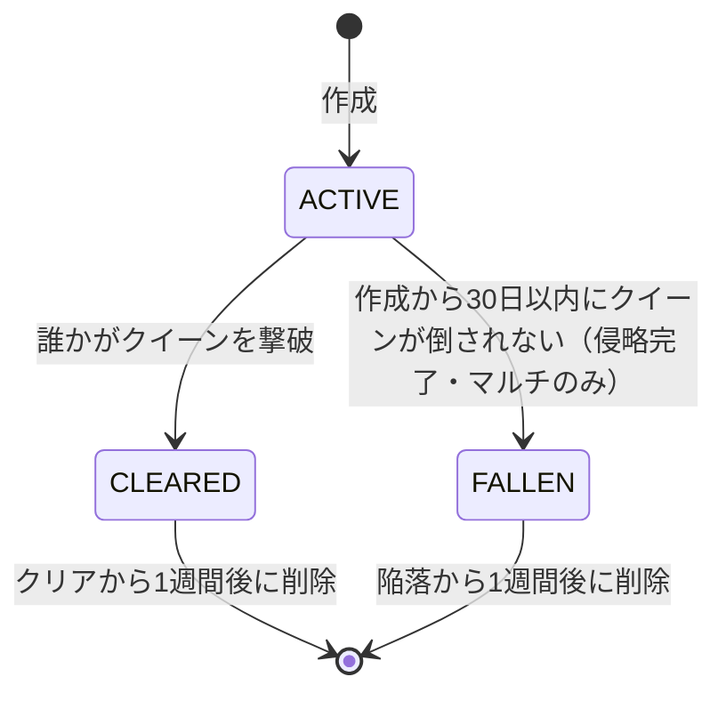

# Relay Resistance 機能仕様書

| 項目 | 内容 |
|---|---|
| 文書名 | 機能仕様書 |
| 版数 | 0.2（ドラフト） |
| 作成日 | 2026-09-23 |
| 更新日 | 2026-10-01 |
| 関連文書 | [01_要件定義書.md](01_要件定義書.md) / [03_画面仕様書.md](03_画面仕様書.md) / [04_アーキテクチャ.md](04_アーキテクチャ.md) |

> 数値はすべて**初期値（バランス調整用パラメータ）**であり、サーバーの `game_config` テーブルで変更できるものとする（→ アーキテクチャ 5章）。
> 「【解釈】」は要件定義書の記述を仕様化するにあたって補った解釈、「【要確認】」は仮置きした値を示す。「【Ph.2】」は初期リリース後に検討する要素を示す。
> 本書では、ルートを区切る単位を「ノード」と呼ぶ（要件定義書の「エリア」と同義。DBのテーブル名・ID名は `areas` / `area_id` のままとする）。

---

## 1. 機能一覧

| 機能ID | 機能名 | 対応要件 |
|---|---|---|
| F-01 | アカウント・プロフィール | FR-PLY-01 |
| F-02 | ワールド管理（生成・参加・リセット・保存・削除） | FR-MODE-*, FR-WLD-12〜14 |
| F-03 | ルート・ノード構造 | FR-WLD-01〜03 |
| F-04 | ノード制圧・中立エリア | FR-WLD-04〜07 |
| F-05 | エイリアン侵攻シミュレーション・被害者数 | FR-WLD-08〜11, FR-ALN-01〜04, FR-SCR-10, FR-SYN-06 |
| F-06 | FPS戦闘（ジャンプ・スラスター・投擲） | FR-FPS-* |
| F-07 | エイリアンの種類・AI・増援 | FR-ALN-06, 07, 12, 13, FR-WLD-06 |
| F-08 | 敵拠点（制圧） | FR-ALN-05, 06, 08〜11, FR-WLD-22, FR-FND-08 |
| F-09 | 資金（獲得・消費・共有） | FR-FND-01, 02, 05, 11 |
| F-10 | 物資調達 | FR-FND-03 |
| F-11 | 援護攻撃要請 | FR-FND-04 |
| F-12 | 資金による強化（武器・補給・援護） | FR-FND-06, 10, FR-MODE-05, 06 |
| F-13 | リスポーン・ワープ（ファストトラベル） | FR-RSP-*, FR-WLD-20, 24 |
| F-14 | 敵拠点攻撃要請 | FR-FND-08 |
| F-15 | クイーン戦・ワールドクリア | FR-ALN-07, FR-MODE-03 |
| F-16 | スコア・貢献度・階級・勲章 | FR-SCR-01〜06 |
| F-17 | ワールド戦歴・貢献者一覧・グッド | FR-SCR-07〜09 |
| F-18 | 同期 | FR-SYN-* |
| F-19 | ポイント・解放要素（やりこみ） | FR-MODE-07, FR-PNT-*, FR-FPS-08 |
| F-20 | 朝・夜の切替 | FR-WLD-21 |
| F-21 | 【Ph.2】ダイナミックレベリング | FR-WLD-23 |

---

## 2. F-01 アカウント・プロフィール

### 2.1 認証
- Supabase Auth の**匿名サインイン**を使う。初回起動時に自動で匿名ユーザーを作る。
- セッション（リフレッシュトークン）はブラウザの `PlayerPrefs`（WebGL では IndexedDB に保存される）に保存し、次回以降は自動でログインする。
- 【要確認】ブラウザのデータを消すとアカウントを失うため、引き継ぎコード（または外部アカウント連携）を用意するか検討する。

### 2.2 プロフィール項目

| 項目 | 型 | 仕様 |
|---|---|---|
| プレイヤー名 | 文字列 | 1〜12文字。NGワードチェックあり。重複は許可する（表示には `#` と4桁の識別子を付ける） |
| アイコン画像 | プリセットID | 用意したプリセットアイコンから選ぶ（画像アップロードはしない） |
| 階級 | 列挙 | 累計貢献度から自動で決まる（F-16） |
| 獲得勲章一覧 | 勲章IDの配列 | F-16 |
| キャラクター育成度 | 整数 | マルチワールドのクリアで引き継いだ強化レベルの合計（F-12）＋ポイントで強化したレベルの合計（F-19） |
| 累計貢献度 | 整数 | 全ワールドのスコア合計 |
| グッド数 | 整数 | 他プレイヤーから受けたグッドの合計 |
| 所持ポイント | 整数 | マルチワールドのクリアで獲得し、解放要素に使う（F-19） |
| 解放済みの要素 | IDの配列 | スキン・スキル・スラスター・ステータス割り振り（F-19） |

---

## 3. F-02 ワールド管理

### 3.1 ワールドの種類

| 種類 | 参加人数 | 生成タイミング |
|---|---|---|
| ソロワールド | 1人（本人のみ） | ソロモードを初めて開始したとき、または前のソロワールドをクリアした後 |
| マルチワールド | **最大20人** | プレイヤーが作成する（3.2）。日時に関係なく、いつでも作成できる |

- ソロワールドの資金・武器・キャラクターの育成度は、そのワールドの中だけで有効とし、マルチワールドには引き継げない（FR-MODE-05）。ソロワールドをクリアした後、次に生成するソロワールドでは、資金・武器・育成度をすべて初期状態に戻す（FR-MODE-06）。

### 3.2 マルチワールドの作成

| 項目 | 仕様 |
|---|---|
| 作成できる人 | 誰でも（ワールド選択画面 SC-04 の［新しい戦域を作る］から） |
| ワールド枠 | 作戦期間中（ACTIVE）のマルチワールドは、全体で同時に **100個まで**。クリア・陥落したワールドは数えない |
| 1人あたりの上限 | 自分が作成した作戦期間中のワールドは、同時に1個まで。そのワールドがクリア、または失敗（陥落）で終わった時点で数がリセットされ、再び作成できる |
| 上限に達したとき | ［新しい戦域を作る］を押せなくし、「作戦中の戦域が上限に達しています」と表示する。既存のワールドには参加できる |
| 参加人数 | 1ワールドあたり20人まで。20人に達したワールドは一覧に「満員」と表示し、参加できない |
| ワールド名 | 自動で連番を付ける（例：第128戦域） |
| 作成した人 | 自動でそのワールドに参加し、ルートを割り当てる |

- 作成とワールド枠のチェックは、サーバー関数 `create_world` の中で1つのトランザクションとして行う。同時に作成されても100個を超えないよう、ロックをかけて数える。

### 3.3 作戦期間とリザルト期間（マルチワールドのみ）

| 期間 | 範囲 | できること |
|---|---|---|
| 作戦期間 | 作成してから **30日間**（`closes_at = created_at + 30日`） | 参加・出撃・資金の使用などすべて。エイリアンの侵攻が進む |
| リザルト期間 | クリアした時点、または作戦期間が終わった（失敗した）時点から **1週間**。経過後にワールドを削除する | 結果・戦歴・貢献者一覧の確認、グッド。**出撃・資金の使用・参加はできない** |

- 作戦期間はワールドごとに異なる。
- `closes_at` の時点でプレイ中のプレイヤーがいた場合は、そのステージを強制的に終わらせ、SC-17「侵略完了」を表示する。締切より後に届いた撃破報告・資金の使用は受け付けない。
- ソロワールドは作戦期間・リザルト期間の対象外で、いつでも遊べる。

### 3.4 ワールドの状態遷移



| パラメータ | 初期値 | 説明 |
|---|---|---|
| `operation_days` | 30日 | 作戦期間の長さ |
| `max_active_worlds` | 100 | 作戦期間中のマルチワールドの上限 |
| `max_active_worlds_per_player` | 1 | 1人が同時に作成できる作戦期間中のワールドの数 |
| `max_members` | 20 | 1ワールドの参加者の上限 |
| `result_days` | 7日 | クリア・陥落の後、ワールドを保存する期間（リザルト期間） |

- ワールドを削除しても、プロフィールの累計貢献度・階級・勲章・グッド数・引き継ぎ強化・ポイントは残る。戦歴（SC-13）と貢献者一覧は、リザルト期間の間だけ見られる。
- FALLEN になったワールドでの**プレイヤー強化は引き継がれず、ポイントも付与されない**（FR-PNT-02）。スコア・貢献度は【解釈】プロフィールの累計には加えるが、勲章の判定対象外とする。
- FALLEN のワールドも、削除されるまでは結果・貢献者一覧・被害者数を見られる。
- 状態が ACTIVE → FALLEN に変わるのは時刻だけで決まるため、定期的な処理（バッチ）を待たずに、参照したときに判定する（アーキテクチャ 8章）。
- ソロワールドは FALLEN にならない（期限がない）。

### 3.5 ワールドへの参加
1. マルチモードを選ぶと、作戦期間中のワールド一覧が表示される（自動選択も可能）。リザルト期間のワールドには新しく参加できない。
2. 初めて参加するときに、ルートを**ランダムに割り当てる**。参加人数が少ないルートを優先して割り当てる。招待やプレイヤー数が多い場合は、同じルートに複数人が割り当てられる。
3. 割り当てたルートは「所属ルート」として、そのワールド内では固定とする。所属ルートは、最初の出撃地点（初期スポーン地点）を決める。
4. 所属ルートとは別に、制圧済みの拠点へワープすれば、他のルートでも戦える（F-13 14.3）。

---

## 4. F-03 ルート・ノード構造

### 4.1 構造
- ワールドは `route_count` 本のルートを持つ。マルチは**最大10本**（初期値10）、ソロは1本とする【要確認：マルチの本数を参加人数で変えるか】。ルートどうしは、ボスエリアを除いて互いに独立している。
- ルートはノード（エリア）を頂点とする**有向非巡回グラフ（DAG）**で表す。
  - 始点：初期スポーン地点ノード（S）
  - 終点：ボスエリア（B）。**ボスエリアはワールドに1つだけで、全ルートの終点が同じ B につながる**（ルートはここで合流する）。B はどのルートにも属さず、ルートごとのノード数には数えない
  - 分岐：1つのノードから2つに分かれ、何ノードか進んだ後、必ず1つのノードに合流する
- **1ルートあたりのノード数は、分岐を含めて30〜50の間でランダムに決める**（`route_nodes_min` = 30、`route_nodes_max` = 50。S・B・分岐の両側を合計に含む）。

生成のルール（`generate_routes`）：
1. 合計ノード数 `n` を 30〜50 の乱数で決める。
2. 「直線区間 → 分岐（2本、各3〜6ノード） → 合流」を2〜4回繰り返す構成にして、合計が `n` になるよう直線区間の長さで調整する。
3. 分岐の先は、50%の確率で敵拠点を置く。分岐が必ず2か所以上になるようにし、拠点が1つもないルートにはならないようにする。
4. 乱数は `worlds.seed` から作り、同じ seed なら同じ構成になるようにする。

```
S ─ A1 ─ A2 ─┬─ B1a(拠点あり) ─ B2a ─┬─ A5 ─ A6 ─ … ─ B(ボス)
             └─ B1b(拠点なし) ─ B2b ─┘
（実際は1ルートに30〜50ノード）
```

- 1ワールドは最大 10ルート × 50ノード ＋ ボスエリア1つ = 501ノードとなる。100ワールドでも `areas` は最大5万行程度に収まる（アーキテクチャ 12章）。

### 4.2 ノードの属性

| 属性 | 説明 |
|---|---|
| `length_m` | ノードの3D空間の長さ（初期値80〜150m）。ステージの組み立てにだけ使い、侵食の計算には使わない |
| `owner` | `PLAYER` / `ALIEN` / `NEUTRAL`（中立エリア。F-04 5.1） |
| `encroach` | エイリアンに侵食された割合（0〜1）。1以上になると `owner` が `ALIEN` になる |
| `enemy_remaining` | そのノードに残っている敵の数（サーバーが正） |
| `enemy_base` | 敵拠点の有無と状態（F-08） |
| `supply_points` | 物資ポイントの一覧（F-10） |
| `is_protected` | 初期スポーン地点は `true`（制圧されない） |

- 拠点がない分岐のノードは、基本の敵数を `0.6倍` とする。
- **初期状態**：初期スポーン地点を除くすべてのノードが `ALIEN`（エイリアンに制圧されている）。`enemy_remaining` は基本の敵数で始める（FR-WLD-11）。
- 専用のリスポーン地点（途中拠点・前線基地）は設けない。リスポーンできるのは、制圧した敵拠点と初期スポーン地点だけ（F-13）。

---

## 5. F-04 ノード制圧・中立エリア

### 5.1 制圧できる条件
あるノード X が敵を全滅させたときの扱いは、次のとおり。

| 状態 | 条件 | 結果 |
|---|---|---|
| 制圧（`PLAYER`） | `enemy_remaining` が 0 になり、かつ X に隣接する（前後どちらかの）ノードのうち1つ以上が `PLAYER`、または X が初期スポーン地点の次のノードである | `owner = PLAYER` |
| 中立エリア（`NEUTRAL`） | `enemy_remaining` が 0 になったが、隣接する `PLAYER` のノードがない（飛び地になる） | `owner = NEUTRAL`。虫食い状に制圧はできない |

- 敵拠点があるノードは、上の条件に加えて、**敵拠点を制圧している**（F-08 9.2）ことが必要。敵拠点を制圧するまでは、敵が0でも制圧にならない。
- 中立エリアには敵がいない。ただし、出撃地点・ワープ先にはならず、貢献度（制圧数）にも数えない。エイリアンの侵食の対象にはなる（6.2）。
- **中立エリアの昇格**：あるノードが `PLAYER` になったとき、隣接する `NEUTRAL` のノードも `PLAYER` に切り替える（隣接する中立エリアがなくなるまで繰り返す）。最前線が届いた時点で、中立だったノードも制圧扱いになる。
- 制圧の判定は、`report_kills` の中で行う（アーキテクチャ 6章）。
- 功績度（F-16）に数えるのは**敵拠点の制圧数**だけで、通常のノードの制圧数・敵キル数は数えない。ノードの制圧は、進行度・中立エリアの昇格・侵攻の判定にだけ使う。

### 5.2 制圧しないまま前進する
- 制圧していないノードを通り抜けることはできる。
- プレイヤーが最前線より先（`ALIEN` のノード）にいる間は、**後方の最も近い ALIEN ノード**から増援が一定間隔で出現する（F-07）。

### 5.3 ボスエリアまでの制圧
- ボスエリアの直前のノードまで、ルート上の必要なノードがすべて `PLAYER` になると「**ボス包囲状態**」となる。分岐はどちらか一方の系統でよい。
- ボス包囲状態では、後方からの増援が止まる。【仮置き】ボス包囲状態は**ルートごと**に判定する（あるルートが包囲状態でも、他のルートの増援は止まらない）。ボスエリアは共通だが、ボスエリア内の増援はクイーンのスポーン（F-15）だけで、ルートの状態には依存しない。
- 各ルートの最前線がボスエリアに届く時期はばらばらになる。先に着いたプレイヤーは、他のルートのプレイヤーが来るのを待って、合流してからクイーンと戦うこともできる（待たずに先に戦ってもよい）。
- ボスエリア付近で復活できるのは、その近くの敵拠点を制圧しているためであり、専用の復活地点はない（FR-WLD-07）。
- 分岐の片方だけを制圧すると、もう片方に `ALIEN` の飛び地ができる。この飛び地はクイーン方向へ2倍の速度で侵攻する（6.2）。ファストトラベル（F-13 14.3）で、飛び地の制圧に向かいやすくする。
- ボスエリアの直前まで制圧していても、その後プレイヤーが遊ばなければ、通常の侵食（6.2）によって順次取り返される。ボス包囲状態は、必要なノードのいずれかが `ALIEN` に戻った時点で解除される。

---

## 6. F-05 エイリアン侵攻シミュレーション・被害者数

> **本章の処理はマルチワールドにだけ適用する。** ソロワールドでは時間が経ってもエイリアンの侵攻は進まない。
> ソロワールドでは、週ごとの強化（6.1）・制圧した敵拠点の奪還（6.3）・被害者数の計算（6.5）も行わず、常に `week = 0` として扱う。
> マルチワールドでも、リザルト期間に入った後（`closes_at` より後、またはクリアした後）は処理しない。
> 作戦期間は30日のため、`week` は最大4（29〜30日目）になる。

### 6.1 強化段階
- `week = floor((現在時刻 − ワールド生成時刻) / 7日)`
- 各ステータスの倍率 ＝ `基本倍率 ^ week`

| ステータス | 1週ごとの倍率 | 1週目(week=1) | 3週目(week=3) |
|---|---|---|---|
| 体力 | ×1.3 | 1.30 | 2.20 |
| 攻撃力 | ×1.1 | 1.10 | 1.33 |
| 移動速度 | ×1.1 | 1.10 | 1.33 |
| 索敵能力 | ×1.2 | 1.20 | 1.73 |
| 射程 | ×1.2 | 1.20 | 1.73 |
| 1回に出現する数 | ×1.1 | 1.10 | 1.33 |
| 制圧能力 | ×1.5 | 1.50 | 3.38 |

- 体力は基本値10（F-07）に倍率を掛けるため、`week` が進むと、頭への1発（10ダメージ）では倒せなくなる。

### 6.2 侵攻処理（4時間ごと）
- 4時間ごとの区切り（ワールド生成時刻を起点とする）を「侵攻ティック」と呼ぶ。
- 1ティックの侵攻量 `d = 0.5ノード × 制圧能力倍率 = 0.5 × 1.5^week`（ノード単位。旧仕様のメートル単位は廃止）

侵攻ティックごとに、次の処理を行う。
```
for 各ルート:
  for 各 PLAYER / NEUTRAL ノード P (is_protected=false):
    # 隣接する ALIEN ノードを、侵攻の向きで重み付けして数える
    #   P より下流（クイーン側）の ALIEN → 初期スポーン方向への侵攻      … 重み 1
    #   P より上流（初期スポーン側）の ALIEN → クイーン方向への侵攻      … 重み 2（fly_forward_mult。FR-WLD-08）
    adj_alien = 1 × (下流の ALIEN ノード数) + 2 × (上流の ALIEN ノード数)
    if adj_alien > 0:
      P.encroach += d × adj_alien
      while P.encroach >= 1:                    # d が1を超える場合は、余りを繰り越す
        P.owner = ALIEN
        余り = P.encroach − 1
        P.encroach = 0
        P.enemy_remaining = 基本の敵数 × 出現数の倍率
        P 内の敵拠点 → 制圧が解除され、エイリアンの拠点に戻る（6.3）。リスポーン地点・ワープ先から外れる
        P 内の物資ポイントの在庫 → 失われる
        余り を、次に侵食される隣接ノード（PLAYER / NEUTRAL）の encroach に加える（なければ終了）
```
- 上流・下流の両方の隣接ノードを数えるため、**分岐の片方だけを制圧してできた ALIEN の飛び地**は、ボス方向と初期スポーン地点方向の両方へ侵攻する。このとき、**クイーン方向（飛び地から見て下流のPLAYERノードを、上流のALIENが侵食する向き）の制圧能力は2倍**になる（FR-WLD-08）。通常の最前線（ALIENが下流側にだけある状態）は、重み1のままで変わらない。
- 重み 2 は `game_config.fly_forward_mult`（初期値2）で変えられる。
- 初期スポーン地点（`is_protected`）は侵食されない。
- プレイヤーがノードで戦闘している最中（そのノードに誰かがいる状態）でも、侵食は進む。ただし `owner` が切り替わるのは、そのノードから全員が離れた（または倒された）後とする。【解釈】これが、「エイリアンがプレイヤーを全滅させ、10秒間とどまると制圧する」（FR-ALN-10）の実装にあたる。サーバーは `current_area` の最終更新から10秒以上経過したプレイヤーを「不在」とみなす。

【解釈】「全プレイヤーが遊ばない状態が続くと取り返される」は、上の侵食が常に進んでいることの結果として実現する。プレイヤーが遊んでいれば、制圧（F-04）が侵食を上回る。
【要確認】プレイ中は侵食を止めたり弱めたりする補正を入れるか。

### 6.3 制圧した敵拠点の奪還
- 敵拠点は「破壊」せず、ノードの制圧（F-08）で状態が変わる。旧仕様の「破壊しても修復される」は廃止した。
- 制圧した敵拠点のノードが侵食で `ALIEN` に戻ると、拠点は `ALIEN` の状態に戻り、物資が100%に戻り、無限湧きも再開する。再び制圧しない限り、ワープ先・リスポーン地点として使えない。

### 6.4 遊んでいない間の計算（遅延評価）
- ワールドは `last_simulated_at` を持つ。
- 次のいずれかのタイミングで、サーバー関数 `advance_world(world_id)` が `last_simulated_at` から現在時刻までの**未処理の侵攻ティックを順番にすべて処理する**。
  1. プレイヤーがワールドに入ったとき（ログインして参加したとき）、作戦司令を開いたとき
  2. ワールド一覧を取得したとき（最後の計算から4時間以上経っているワールドだけ）
  3. 制圧・資金使用など、状態を変えるAPIを呼び出す直前
  4. 10秒ごとの同期（`get_world_pulse`。F-18）で、未処理のティックがあるとき
- 処理は時刻だけで決まる（決定的）ため、どのタイミングで計算しても結果は同じになる。
- **定期的な処理（バッチ）がなくても正しく動く**。誰も見ていないワールドは計算されないが、誰かが見た時点で、それまでの分をまとめて計算するため、結果は変わらない。
- 同時に呼び出されたときは、ワールド単位の行ロック（`SELECT … FOR UPDATE`）で二重処理を防ぐ。

### 6.5 被害者数（リザルトに表示）

侵略によって出た被害者数を、リザルト（SC-12）に表示する。**貢献度・功績・ポイントには影響しない**（FR-SCR-10）。

侵攻ティックごとに（4時間分＝4回の1時間ごとの計算として）、次のように加算し、`worlds.casualties` に累計する。

```
for 各ティックの4つの1時間 h:
  N     = その時点の ALIEN ノードの数
  R_h   = 90〜130 の乱数（worlds.seed と h から決める。同じ入力なら同じ値）
  mult  = 1 + 1.5 × floor(N / 5)              # 5ノードごとに1.5倍を加算する
  casualties += N × R_h × mult
```
- 倒れたプレイヤーの数は、この式には含めない（戦死者数として別に数える。下記）。

| パラメータ | 初期値 | 説明 |
|---|---|---|
| `casualty_rand_min` / `casualty_rand_max` | 90 / 130 | 1ノード1時間あたりの被害人数の乱数の範囲 |
| `casualty_step_nodes` | 5 | 倍率が上がるノード数の間隔 |
| `casualty_step_add` | 1.5 | 間隔ごとに加算する倍率 |

- 乱数は `worlds.seed` と時間の番号から作る決定的な擬似乱数とする。遅延評価でどのタイミングで計算しても結果が変わらない（6.4）。
- クリアしたとき、または陥落したときは、最後のティックから終了時刻までの端数の時間（1時間未満は切り捨て）も同じ式で加算する。
- **戦死者数**：ワールド内で倒れたプレイヤーの数を、被害者数とは別に数え、リザルトに表示する（FR-SCR-11）。`report_kills` にまとめて送られる死亡数（`deaths`）を全参加者で合計する（F-18）。被害者数・功績・ポイントには影響しない。
- 【要確認】次の2点は解釈による仮置き。
  1. 「エイリアンが制圧しているノード数」を、ワールド生成時点で敵のノードも含めた `ALIEN` ノードの合計とした。
  2. 「5ノードごとに1.5倍を加算」は、倍率を重ねて掛ける（1.5^n）と数値が非現実的な大きさになるため、加算（`1 + 1.5 × n`）とした。
- 【参考】`ALIEN` が400ノードの状態が続くと、1時間で約 400 × 110 × 121 ≒ 530万人となり、陥落（30日）まで放置すると数十億人に達する規模になる。

---

## 7. F-06 FPS戦闘

### 7.1 操作（キーボード＋マウス）

| 操作 | キー |
|---|---|
| 移動 | WASD |
| 視点 | マウス |
| 射撃 | 左クリック |
| エイム（ズーム） | 右クリック |
| リロード | R |
| ダッシュ（スタミナを消費） | Shift |
| ジャンプ（空中でもう1回押すと二段ジャンプ） | Space |
| スラスター | Q（入力している方向へ。入力がなければ前方） |
| しゃがみ | C |
| 手榴弾を投げる | G |
| 焼夷手榴弾を投げる | H |
| 武器切替 | 1〜3 / ホイール |
| インタラクト（物資を拾う・拠点を使う） | E |
| 支援メニュー | Tab |
| ポーズ | Esc |

### 7.2 プレイヤーの基本値

| 項目 | 初期値 |
|---|---|
| 最大体力 | 100（× ポイント強化の倍率。F-19） |
| 最大スタミナ | 100（ダッシュ中は毎秒20消費、止まると毎秒25回復）（× ポイント強化の倍率） |
| 歩行速度 / ダッシュ速度 | 4.0 m/s / 7.0 m/s（× ポイント強化の倍率） |
| ジャンプ | 最大2回（二段まで）。空中ではスラスターの後でもジャンプ回数は戻らない |
| スラスターのエネルギー | 105（1回の使用で35を消費＝初期は3回。F-19 のポイント強化で増える。7.7） |
| 予備弾数・投擲武器の所持数 | 武器ごとの基本値（× ポイント強化の倍率。7.3, 7.6） |

- 「基本値 × 倍率」の倍率は、ポイントによるステータス強化（F-19 20.2）で決まる。強化前は1.0倍。

### 7.3 武器

エイリアンの部位ごとのダメージ（F-07 8.2）は、ハンドガン1発を基準にした値とし、武器ごとに倍率を掛ける。

| 武器 | 弾数 | ダメージ倍率（仮置き） | 連射 | 入手 |
|---|---|---|---|---|
| ハンドガン（基本） | **無限**（マガジン12発、リロードあり） | ×1.0（頭10 / 胴3 / 手足1） | 単発 | 最初から持っている |
| サブマシンガン | 有限 | ×0.4（頭4 / 胴1.2 / 手足0.4） | 高速連射 | ポイントで開放（500） |
| アサルトライフル | 有限 | ×0.6（頭6 / 胴1.8 / 手足0.6） | 連射 | ポイントで開放（1000） |
| ショットガン | 有限 | 1ペレット ×0.4、8ペレット（頭4 / 胴1.2 / 手足0.4） | 単発 | ポイントで開放（1000） |
| ライフル | 有限 | ×3.0（頭30 / 胴9 / 手足3） | 単発（低速） | ポイントで開放（2000） |

- ハンドガン以外の武器は、ポイントで開放するまで使えない（物資調達では手に入らない）。開放した武器はソロ・マルチのどちらでも使える（F-19）。
- 弾薬は、物資調達（F-10）の弾薬で補充する。弾薬の予備の上限は、武器ごとの基本値 × ポイント強化「所持弾薬数」の倍率。
- ハンドガンだけでソロクリアできるように、敵の体力・数を調整する（FR-MODE-04）。
- 資金による武器の強化（F-12：装弾数・リロード速度・反動抑制・攻撃力）は、開放済みのすべての武器に適用する。攻撃力の倍率は、部位ダメージ・武器のダメージ倍率に掛ける。
- 上級エイリアンの装甲（-2）を受けた後のダメージは、下限を1とする。

### 7.4 ビルボード描画
- 各ビルボードは「正面方向」のベクトルを持つ。
- カメラへの方向と正面方向の内積が 0以上なら**前面**、0未満なら**背面**のテクスチャを表示する。
- ビルボードはY軸だけ回転させ、常にカメラの方を向ける（縦軸固定）。

### 7.5 被弾と死亡
- 体力が0になると死亡し、リスポーン選択画面（→ 画面仕様書 SC-10）へ移る。
- 死亡イベントは同じ分隊の他プレイヤーにも通知する（F-18）。死亡数は `report_kills` にまとめて送る（戦死者数として数える。被害者数とは別。6.5）。
- 所持金は失わない。【要確認】死亡時のペナルティ

### 7.6 投擲武器（手榴弾・焼夷手榴弾）

| 種類 | 効果 | 初期値 |
|---|---|---|
| 手榴弾 | 投げてから2秒後に爆発する。半径4mの敵に一律6ダメージ（上級エイリアンは装甲-2で4）。タンクは盾のある前面側の爆風を受けない（背面に投げると有効） | ポイントで開放（300）。所持数の基本上限4、開放時の所持2 |
| 焼夷手榴弾 | 着弾した場所に、半径3mの炎を5秒間残す。炎の中の敵に毎秒2ダメージ | ポイントで開放（300）。所持数の基本上限2、開放時の所持1 |

- 投げる間隔は1秒。プレイヤー自身も爆風・炎でダメージを受ける（威力は敵の半分）。
- 所持数の上限は、基本上限 × ポイント強化「所持投擲武器数」の倍率（小数は切り捨て）。
- 未開放の間は投げられない。補充は物資調達（F-10）で行う。

### 7.7 スラスター

| 項目 | 仕様 |
|---|---|
| 動作 | 入力している方向へ、約0.3秒だけ加速する（水平方向に基本+12 m/s × 加速量の倍率）。地上でも空中でも使える |
| エネルギー量 | 基本105 × エネルギー量の倍率。1回使うと35を消費する（初期は3回。上限は強化で増える） |
| 回復速度 | 着地している間、基本11.7/秒（＝3秒で1回ぶん）× 回復速度の倍率で回復する |
| 強化 | ポイントで、エネルギー量・回復速度・加速量を各10段階まで強化する（F-19 20.2）。旧仕様の「回数」を、エネルギー量の考え方に置き換えた |

- スラスターは、ポイントで強化する前（Lv0）から使える【要確認：旧仕様の「ポイントで解放」を、強化に読み替えた】。
- 【要確認】回復の方法・加速の強さ・消費量は仮置き。
- 同期する場合は、状態フラグの「スラスター使用中」だけを送る（F-18）。

---

## 8. F-07 エイリアンの種類・AI・増援

### 8.1 ノードでの敵の出現
- ノードに入ると、サーバーの `enemy_remaining` を上限として、クライアントがそのノードのスポーン地点に敵を出現させる。
- 同時に出現させる上限は20体とする。倒されるたびに、残りがあれば補充する。

### 8.2 エイリアンの種類と部位ダメージ

すべてのエイリアンは**体力10**（× 週ごとの体力の倍率）を基本とする。部位ごとのダメージ（ハンドガン1発。7.3）：

| 部位 | ダメージ |
|---|---|
| 頭 | 10 |
| 胴 | 3 |
| 手・足 | 1 |

| 種類 | 役割 | 特徴 |
|---|---|---|
| エイリアン | 射撃 | 光線銃を使う人型。標準 |
| 上級エイリアン | 射撃・範囲攻撃 | 光線銃に加えて手榴弾を使う。重装備で、頭にもヘルメットを付けており即死しない。**すべての部位のダメージが-2される**（ただし1以下にはならない）。ヘルメットがあるため、頭の10ダメージでも8になる |
| タンク | 盾持ち | 大盾を持つ。前面（正面±60°）からの攻撃は盾に防がれる。盾からはみ出た足への攻撃、背面への手榴弾は有効。通り抜けて背中を攻撃すると盾を落とし、その後は通常のエイリアンと同じになる |
| バルーン | 空中・自爆 | 空中（高さ3〜5m）に浮く。頭が肥大化し、胴体は華奢。頭を攻撃すると誘爆する（半径2mの敵とプレイヤーに爆風）。プレイヤーの半径1m以内まで近づくと自爆する |
| スプレッダー | 範囲・地形 | 腹部だけが膨張している。体液をまき散らして攻撃する。体液は床に3分間残り、乗るとプレイヤーが毎秒2ダメージ受ける。倒されるときも自爆して体液をまき散らす |
| 近衛兵 | クイーンの護衛 | クイーン戦にだけ出現する（クイーンが30秒ごとに呼び出す）。上級エイリアンと同等のスペック。肩に自動照準の銃器を装備し、光学シールドが右半身を完全にガードする（左半身・背面が有効） |
| クイーン | ボス（攻撃能力なし） | 高さ約10mの巨体な人型。頭が大きく発達している。**体力10万**。**頭への攻撃でも即死しない**（部位ダメージは上の表と同じ。頭10 / 胴3 / 手足1）。**15秒おきにエイリアンを10体スポーン**させ、**30秒おきに近衛兵を呼び出す**。自分では攻撃しない。詳細は F-15（16章） |

- 体液は、ノード内にあるものだけをクライアントで管理する（同期しない）。床に残る体液は、同時に最大20か所までとする（性能のため）。
- 種類ごとの出現は、ノードごとの構成データ（`WaveTable`）で決める。敵拠点の物資による制限は F-08 9.3 を参照。
- エイリアンは素朴な見た目にする（世界観の設定。01_要件定義書 4.4.3）。

### 8.3 AIの状態遷移
`待機 → 索敵(索敵範囲×倍率) → 接近 → 攻撃(射程×倍率) → (見失う) → 捜索 → 待機`

- 牽制射撃：エイリアンが射程の外から撃つ。敵拠点の物資が減ると、頻度が下がる（F-08 9.3）。
- タンク・スプレッダー・バルーンは、上の遷移を基本に、専用の行動（接近して自爆する、体液をまくなど）を追加する。

### 8.4 後方からの増援
- 条件：プレイヤーが `ALIEN` のノードにいて、かつボス包囲状態でない。
- 発生元：プレイヤーの後方（初期スポーン地点方向）で最も近い `ALIEN` ノード。なければ、そのノードの入口から出現させる。
- 間隔：`reinforce_interval_sec`（初期値45秒）ごとに `3 × 出現数の倍率` 体。
- 増援で出現した敵は、その場限り（クライアント内だけ）の敵とし、倒してもサーバーの `enemy_remaining` は減らない。資金は得られる。

### 8.5 敵の報酬

| 種類 | 報酬 |
|---|---|
| エイリアン | 10 |
| 上級エイリアン | 20 |
| タンク | 30 |
| バルーン | 10 |
| スプレッダー | 15 |
| 近衛兵 | 0 |
| クイーン | 0 |

---

## 9. F-08 敵拠点（制圧）

敵拠点は、エイリアンの増援の供給源であり、**ノード内のエイリアンを全滅させ、拠点内に10秒間とどまる**ことで制圧できる（FR-ALN-08）。旧仕様の耐久値と「破壊」は廃止した。

| 属性 | 初期値 | 説明 |
|---|---|---|
| 状態 | `ALIEN` | `ALIEN`（エイリアンの拠点）または `CAPTURED`（プレイヤーが制圧）。拠点はノードに1つだけ |
| 物資 | 100% | 敵拠点攻撃要請（F-14）で減る。物資が減るほど、補充が遅くなり、出現する種類が減る |
| 補充（無限湧き） | 物資の割合に比例 | `ALIEN` の間、ノード内の敵を補充する。制圧すると止まる（FR-ALN-11） |

### 9.1 制圧前の補充（無限湧き）
- `ALIEN` の拠点があるノードでは、敵を倒しても、拠点から新しいエイリアンが出現し続ける。補充は物資の割合に比例して遅くなる。
- 補充された敵は、クライアント内だけの敵（増援と同じ扱い）とする。倒しても `enemy_remaining` は減らない。資金は得られる。サーバーの `enemy_remaining` が減るのは、そのノードの元々の敵を倒した分だけ。

### 9.2 制圧の手順（FR-ALN-08〜11）
1. プレイヤーが、ノード内のエイリアン（元々の敵と補充された敵の両方）を全滅させ、かつ `enemy_remaining` が 0 になる。
2. 拠点の範囲内（`base_zone`、拠点を中心とした半径15m）にとどまると、**10秒のカウント**が始まる。クライアントが `begin_base_hold(area_id)` を呼び、サーバーが開始時刻を記録する。
3. カウント中は、隣接する `ALIEN` ノードから**取り返しに向かうエイリアンが常にスポーンする**（`capture_wave_interval_sec` = 8秒ごとに `2 × 出現数の倍率` 体）。増援と同じくクライアント内だけの敵とする。
4. カウント中にエイリアンが拠点の範囲内に侵入すると、**カウントはリセット**される。拠点の範囲内のエイリアンを再び全滅させるまで、カウントは再開しない。再開のたびに `begin_base_hold` を呼び直す。
5. 10秒たったら、クライアントが `capture_base(area_id)` を呼ぶ。サーバーは、次を確認して制圧を確定する。
   - `enemy_remaining` が 0 であること、状態が `ALIEN` であること
   - `begin_base_hold` から10秒以上（通信の遅れを考えて9秒以上）たっていること
   - 呼び出したプレイヤーの `current_area` がそのノードであること
6. 制圧すると、拠点は `CAPTURED` になり、補充が止まり、そのノードは制圧（`PLAYER`）の判定に進む（F-04 5.1）。制圧した拠点は、**プレイヤーのリスポーン地点・ワープ先**になる（F-13）。制圧した最初のプレイヤーに「敵拠点制圧」の実績を1件記録する。
- 制圧をあきらめる（拠点の範囲から離れる）と、カウントは止まる。拠点は `ALIEN` のまま、補充も続く。
- プレイヤーが全滅した（または全員が離れた）状態で、エイリアンが拠点に10秒とどまると、6.2 の侵食が確定し、拠点はエイリアンのものになる（FR-ALN-10）。

### 9.3 物資の割合による敵の行動の変化

| 物資 | 効果 |
|---|---|
| 100〜50% | すべての種類のエイリアンが出現する。牽制射撃をふつうの頻度で行う |
| 50〜20% | 上級エイリアンが出現しなくなる。牽制射撃の頻度が半分になる |
| 20〜0% | タンク・スプレッダーも出現しなくなる（エイリアン・バルーンだけになる）。牽制射撃をしなくなる |

---

## 10. F-09 資金

### 10.1 財布の種類

| 財布 | 持ち主 | 用途 |
|---|---|---|
| 個人資金 | プレイヤー（ワールドごと） | すべての用途に使える |
| 共有資金プール | ワールド | 同じワールドの誰でも、**どの用途（プレイヤー強化を含む）にも自由に**使える。1回・1日あたりの引き出し上限は設けない |

- ソロワールドには共有資金プールがない（他のプレイヤーがいないため）。
- ソロワールドの資金は、そのワールドの中だけで有効で、マルチワールドには引き継がれない（3.1）。

### 10.2 獲得

| 項目 | 報酬 |
|---|---|
| エイリアンの撃破 | 種類ごとに 0〜30（8.5。近衛兵・クイーンは0） |
| 敵拠点の制圧 | 500 |
| ノードの制圧（参加者全員に分配） | 200 |

- 報酬 × `1.1^week`（エイリアンが強くなるほど報酬も増える）
- 獲得はクライアントから「撃破の報告」として送り、サーバーで検証してから加算する（→ アーキテクチャ 7章）。

### 10.3 消費の一覧

| 用途 | 対象 | 効果の範囲 | 資金貢献として数えるか |
|---|---|---|---|
| 物資調達 | 任意のルート・ノードの物資ポイント | そのノードに来た全プレイヤー | ○ |
| 援護攻撃要請 | 任意のルート・ノード | そのノード | ○ |
| 共有資金 | ワールドの共有プール | ワールド全体 | ○ |
| 強化（武器・補給・援護爆撃・タレット。F-12） | 自分 | 自分の武器・自分が行う要請の強さ | ×（数えない） |
| 敵拠点攻撃要請 | 任意のルートの敵拠点 | そのルート | ○ |

- 「任意のルート」＝自分以外のルートも支援できる（別々のステージで戦いながら助け合う）。
- 共有プールから支払った分は、**実際に使ったプレイヤーの**資金貢献には数えない（プールへ入れた時点で入れた人の貢献として数え済みのため）。
- 共有プールから誰がいくら何に使ったかは `support_events` に記録し、作戦司令の「最近の出来事」に表示する（使い道を見えるようにして、託した側が確認できるようにする）。
- リザルト期間中は、個人資金・共有資金とも使えない。

### 10.4 同期
- 個人資金・共有プールの残高・資金提供の記録は、**10秒間隔**で全参加者に同期する（FR-FND-11。F-18 19.4 の `get_world_pulse`）。誰がいつ資金を共有したかは気付かれにくいため、この頻度で足りる。
- 自分の操作（撃破報酬・支援要請・強化など）による残高の変化は、RPC の応答で即座に自分の画面に反映する。

---

## 11. F-10 物資調達

- 各ノードに0〜2か所の物資ポイントがある。
- 投入額に応じて段階が決まる。

| 段階 | 投入額 | 内容 |
|---|---|---|
| S | 300 | 弾薬×1、回復(小)×1、手榴弾×1 |
| M | 800 | 弾薬×3、回復(小)×2、回復(大)×1、手榴弾×2 |
| L | 2000 | 弾薬×6、回復(大)×3、手榴弾×2、焼夷手榴弾×2 |

- 特殊武器は物資調達では手に入らない（ポイントで開放する。F-19）。手榴弾・焼夷手榴弾は、開放済みのプレイヤーだけが拾える。
- **弾薬1個の補充量**は、基本値（各武器のマガジン2本分）× 「弾丸補給量」の倍率、**回復物資の回復量**は、基本値（小25・大60）× 「体力回復量」の倍率とする。倍率は、**調達したプレイヤーの**強化レベル（F-12）で決まり、在庫を作るときに確定する【要確認：拾うプレイヤーのレベルにするか】。
- 物資はその物資ポイントの**在庫**として積み上がる（ワールドで共有される）。
- 拾うと在庫が1つ減る。在庫の減少は、サーバーでアトミックに減算する（他の参加者への反映は10秒ごと）。
- 物資ポイントのノードがエイリアンに制圧されると在庫を失う。

---

## 12. F-11 援護攻撃要請

要請の費用は**固定**とし（投入額を選ぶ方式は廃止）、効果の大きさは、要請するプレイヤーの強化レベル（F-12）で決まる。

| 種類 | 要請の費用 | 攻撃量（基本） | 範囲（基本） | 威力（基本） |
|---|---|---|---|---|
| 援護爆撃 | 600 | 4発 | 半径12m | 1発あたり200 |
| タレット展開 | 300 | 持続180秒 | 射程20m | 毎秒15ダメージ |

- 強化の対象（各5段階。値は F-12 13.1）：援護爆撃は「攻撃量（発数）」「攻撃範囲」「攻撃力」、タレットは「攻撃量（持続時間）」「射程」「攻撃力」。倍率は、基本値に掛ける（発数は小数を切り捨て）。
- 1回の要請の総ダメージ ＝ 攻撃力 × 発数（タレットは 攻撃力 × 持続秒数）。
- 上の基本値は仮置き（【要確認】）。
- 要請の流れ
  1. 支援メニューで種類・対象のノードを選ぶ。
  2. サーバーで資金を引き落とし、`support_events` に記録する。
  3. 対象ノードに**プレイヤーがいる場合**：そのノードのチャンネルへイベントを送り、各クライアントが演出を再生し、効果範囲内のローカルの敵にダメージを与える。
  4. 対象ノードに**プレイヤーがいない場合**：サーバーが簡易計算で撃破数を決めて、`enemy_remaining` を減らす。
     `撃破数 = min(enemy_remaining, floor(総ダメージ / (基本の敵の体力 × 体力の倍率) × 範囲係数))`（範囲係数は、範囲の倍率が大きいほど大きい値）
- 援護攻撃による撃破は、要請したプレイヤーの「**援護キル数**」として通常のキル数とは別に記録する（FR-SCR-03）。戦歴の表示用で、貢献度には含めない。

---

## 13. F-12 資金による強化（武器・補給・援護）

資金で行う強化は、**武器・補給・援護爆撃・タレット**の4分類とする。すべて5段階。体力・スタミナ・移動速度・所持弾薬数・所持投擲武器数・スラスターは、資金ではなく**ポイント**で強化する（F-19）。

### 13.1 強化の一覧（Lv0は1.0倍。倍率は「基本値に掛ける値」。Lv1〜5に、下限〜上限を等間隔で割り当てる）

| 分類 | 項目 | 効果 | 倍率（Lv1〜Lv5） | 費用（Lv1〜Lv5） |
|---|---|---|---|---|
| 武器 | 装弾数 | マガジン容量 × 倍率 | 1.20〜2.50 | 100〜3000 |
| 武器 | リロード速度 | リロードの速さ × 倍率 | 1.20〜2.50 | 100〜3000 |
| 武器 | 反動抑制 | 反動・拡散 × 倍率（0で反動なし） | 0.90〜0 | 100〜3000 |
| 武器 | 攻撃力 | ダメージ × 倍率 | 1.01〜1.50 | 100〜10000 |
| 補給 | 弾丸補給量 | 弾薬1個の補充量 × 倍率（F-10） | 1.20〜2.50 | 100〜3000 |
| 補給 | 体力回復量 | 回復物資の回復量 × 倍率（F-10） | 1.20〜2.50 | 100〜3000 |
| 援護爆撃 | 攻撃量 | 爆撃の発数 × 倍率 | 1.01〜1.50 | 100〜1500 |
| 援護爆撃 | 攻撃範囲 | 爆撃の半径 × 倍率 | 1.20〜2.50 | 100〜1000 |
| 援護爆撃 | 攻撃力 | 1発の威力 × 倍率 | 1.20〜2.50 | 100〜1000 |
| タレット | 攻撃量 | 持続時間 × 倍率 | 1.01〜1.50 | 100〜1500 |
| タレット | 射程 | 射程 × 倍率 | 1.20〜2.50 | 100〜1000 |
| タレット | 攻撃力 | 毎秒のダメージ × 倍率 | 1.20〜2.50 | 100〜1000 |

- 援護爆撃・タレットの「要請」の費用は固定（爆撃600・タレット300。F-11）で、強化とは別に、要請のたびに支払う。
- 補間の式：`倍率(n) = 下限 + (上限 − 下限) × (n − 1) / (段階数 − 1)`、`費用(n) = 費用の下限 + (費用の上限 − 費用の下限) × (n − 1) / (段階数 − 1)`（nは強化後のレベル）。段階の途中の値は、指定がないため【要確認】等間隔とした。

各レベルの値（5段階）：

| Lv | 1.20〜2.50 の項目：倍率 | 反動抑制：倍率 | 1.01〜1.50 の項目：倍率 | 費用 100〜3000 | 費用 100〜10000（武器の攻撃力） | 費用 100〜1500（攻撃量） | 費用 100〜1000 |
|---|---|---|---|---|---|---|---|
| 1 | 1.20 | 0.90 | 1.01 | 100 | 100 | 100 | 100 |
| 2 | 1.53 | 0.68 | 1.13 | 825 | 2,575 | 450 | 325 |
| 3 | 1.85 | 0.45 | 1.26 | 1,550 | 5,050 | 800 | 550 |
| 4 | 2.18 | 0.23 | 1.38 | 2,275 | 7,525 | 1,150 | 775 |
| 5 | 2.50 | 0.00 | 1.50 | 3,000 | 10,000 | 1,500 | 1,000 |

- 全項目を最大にするために必要な資金の合計は、1ワールドの想定貢献額（資金貢献約2万）に対して大きい。どの項目から強化するかを選ぶ要素になる。

### 13.2 強化のルール

- 支払いには個人資金・共有資金のどちらも使える（F-09 10.1）。
- 強化のレベルは、プレイヤーごとに持つ（共有しない）。要請（物資調達・援護爆撃・タレット）の強さは、**要請したプレイヤーの**強化レベルで決まる【要確認：ワールド全体の共通レベルにするか】。
- 強化レベルは「ワールド内の強化」として記録する。
- **マルチワールド**に参加するときの初期値は、プロフィールに保存された「**引き継ぎ強化**」とする。
- マルチワールドがクリア（CLEARED）されると、そのワールドに参加した全員について、ワールド内の強化をプロフィールの引き継ぎ強化へ上書き保存する（各項目で大きい方の値を採用する）。
- マルチワールドが FALLEN になった場合、ワールド内の強化は破棄する。
- **ソロワールド**は、引き継ぎ強化を使わずに、常に初期状態から始める。ソロワールドの強化・資金・武器は、クリアしても引き継がれない（次のソロワールドで初期化する。FR-MODE-05, 06）。
- キャラクター育成度 ＝ 引き継ぎ強化のレベルの合計 ＋ ポイントで強化したステータスのレベルの合計（F-19）。
- ポイントによる強化（F-19）は、ワールドの強化とは別に保存し、ワールドが FALLEN でも失われない。武器・補給・援護の強化は、この節のルールに従う。

---

## 14. F-13 リスポーン・ワープ（ファストトラベル）

### 14.1 リスポーン地点は制圧した拠点だけ
- 「有効な途中拠点」は「制圧した敵拠点」と同じものとする（01_要件定義書 3章）。資金で設営する途中拠点は廃止した。
- リスポーンできるのは、**制圧した敵拠点**と**初期スポーン地点**だけ。ボスエリア専用の復活地点（前線基地）もない（FR-RSP-01）。
- 制圧した拠点のノードがエイリアンに取り返されると、拠点はエイリアンのものに戻り、**エイリアンのリスポーン地点**（そのノードの敵の補充元）になる。補充速度は制圧前と同じにする。

### 14.2 リスポーン地点の選択肢

| 地点 | 条件 |
|---|---|
| 所属ルートの初期スポーン地点 | いつでも選べる（制圧されない） |
| 制圧した敵拠点 | 14.3 のワープ先すべて |

- 残機の制限はない。リスポーン待ち時間は5秒とする。

### 14.3 ワープ（ファストトラベル）

ワールドの参加者は、ワールド内の**制圧済みの拠点**へワープ（ファストトラベル）し、そこから出撃できる。自分の所属ルート以外の拠点も選べる。飛び地の制圧への対応と、新しく参加したプレイヤーの移動時間を減らすために設ける（FR-WLD-24）。

| ワープ先 | 条件 |
|---|---|
| 各ルートの初期スポーン地点 | いつでも |
| 制圧した敵拠点 | 敵拠点を制圧し（`CAPTURED`）、そのノードが `PLAYER` のもの（「制圧拠点」と呼ぶ。FR-WLD-22）。ノードがエイリアンに取り返されると使えなくなる |

| 項目 | 仕様 |
|---|---|
| ワープできる場面 | 出撃準備（SC-06）、リスポーン選択（SC-10）、ステージ内で拠点に近づいて［E］を押したとき |
| 費用 | 無料（`fast_travel_cost` で変更できる） |
| 待ち時間 | ステージ内からのワープは3秒の詠唱（被弾で中断）。出撃・リスポーン時は待ち時間なし |
| 移動先のルート | ワープすると、そのルートのステージを読み込み、`area:*` の購読を切り替える |

ファストトラベルの設定（`game_config`）：

| パラメータ | 初期値 | 説明 |
|---|---|---|
| `fast_travel_enabled` | true | false にすると、ファストトラベルを使えなくする（歩いての移動だけになる） |
| `fast_travel_cast_sec` | 3 | ステージ内からワープするときの詠唱時間（0で即時） |
| `fast_travel_cooldown_sec` | 0 | ステージ内からワープしたあと、次にワープできるまでの時間 |
| `fast_travel_cost` | 0 | ワープの費用（個人資金）。0で無料 |
| `fast_travel_new_member_free` | true | 参加して間もないプレイヤー（初回の出撃）は、費用・待ち時間なしで、最前線の拠点へワープできる |
| `fast_travel_combat_block_sec` | 5 | 被弾・攻撃した直後は、ステージ内からのワープを使えない時間 |

- 出撃・リスポーン時のワープは、`fast_travel_enabled` が false でも使える（そうしないと拠点から復活できなくなる）。false にできるのは、ステージ内のファストトラベルだけ。

- ワープがあるため、プレイヤーの多くは**最前線とその先**に集まる想定とする。
  - 最前線に近い制圧拠点ほどワープ先として人気になる。作戦司令のルート図に、各拠点にいる人数を表示する。
  - 同じノードに大勢が集まったときの座標の同期は、分隊単位（最大4人）に分けて行う（F-18 19.3）。
- 中立エリアはワープ先にならない。
- 【解釈】1人でクイーンまで走り抜けて戦わずに進むルートでは、制圧拠点ができないため、ワープで追いつくことはできない。最前線を押し上げることが、ほかの参加者の移動を助けることになる。

---

## 15. F-14 敵拠点攻撃要請

| 投入額 | 物資の減少 |
|---|---|
| 1000 | −25% |
| 2500 | −50% |
| 5000 | −100% |

- 対象：任意のルートの、`ALIEN` の敵拠点。
- 物資が減ると、補充の速度が下がり、出現する種類が減る（F-08 9.3）。拠点は制圧しない限り残るため、攻撃要請だけでは制圧にならない（旧仕様の耐久値・破壊は廃止）。
- 攻撃要請では「敵拠点制圧」の実績は付かない。資金貢献として数える。

---

## 16. F-15 クイーン戦・ワールドクリア

- ボスエリアはワールドに1つで、全ルートが合流する。ボスエリアに入ると、そのワールドの**共通のクイーン戦**に参加する。クイーンは1体で、体力は全員で共有する。ボスエリアにいる全員（最大20人）は互いに見え、同期される（F-18 19.6）。
- 最初にボスエリアに入ったプレイヤーの時刻を、クイーン戦の開始（`boss_fights.started_at`）として記録する。クイーンのスポーンのタイミングはこの時刻を基準にする。
- クイーンは移動しないため、位置は同期しない。体力と、スポーンのタイミングだけをサーバーの時刻を基準に合わせる。
- クイーンは**攻撃能力を持たない**。体力は**10万**（`queen_hp` = 100,000）× 体力の倍率。頭への攻撃でも即死しない（部位ダメージは F-07 8.2。頭はハンドガンで10ダメージ）。攻撃パターンの段階（Ⅰ/Ⅱ/Ⅲ）は設けない。
- **クイーンは、エイリアンと近衛兵をスポーンさせる**。

| パラメータ | 初期値 | 説明 |
|---|---|---|
| `queen_spawn_interval_sec` | 15 | エイリアンをスポーンさせる間隔 |
| `queen_spawn_count` | 10 | 1回にスポーンさせるエイリアンの数（× 出現数の倍率） |
| `queen_guard_interval_sec` | 30 | 近衛兵を呼び出す間隔 |
| `queen_guard_count` | 【要確認】2 | 1回に呼び出す近衛兵の数 |
| `queen_max_alive_aliens` | 【要確認】30 | 同時に生存しているスポーン済みエイリアンの上限（性能のため。上限に達している間は、スポーンを遅らせる） |
| `queen_max_alive_guards` | 【要確認】8 | 同時に生存している近衛兵の上限 |

- スポーンされたエイリアン・近衛兵は、クライアント内だけの敵とする（同期しない）。倒しても資金は得られない（近衛兵・クイーンの報酬は0。エイリアンは種類ごとの報酬）。
- 【仮置き】スポーンは各クライアントが同じ時刻の格子（`queen_spawn_interval_sec` ごと）でローカルに行い、1人あたりの数は人数に関係なく一定とする（全体の数は人数分に増えるが、各プレイヤーが相手にする数は変わらない）。ボスエリアでは、エイリアン・近衛兵の撃破を他のプレイヤーに通知しない（通信量の削減。19.6）。
- 【要確認】体力10万は、ハンドガン（頭10ダメージ）だけでは約1万発が必要になる（1秒に3発撃っても約55分。しかも毎回頭に当てた場合）。ソロで基本武器だけでクリアできる（FR-MODE-04）ようにするには、援護攻撃（上空爆撃）・武器・攻撃力の強化との組み合わせでの調整が必要。バランス調整の際に確認する。
- クイーンへのダメージは、クライアントが集計して5秒ごとにサーバーの `report_queen_damage` で報告する。サーバーは妥当性をチェックして、クイーンの体力（`boss_fights.queen_hp`）から差し引く。
  - 報告できる量には、1人あたりの上限を設ける（強化段階・武器・経過時間から求める。上限を超えた分は無視して `suspicious_logs` に記録する）。
  - 体力を0にする報告を**最初に受け付けたプレイヤー**を撃破者とし、そのとき同じ処理の中で `clear_world` を実行する（先着1名）。他のプレイヤーの報告は、「既にクリア済み」の結果を返す。
  - 全員のダメージは、1秒ごとにボスエリアのチャンネルで通知し、クイーンの体力バーに即時に反映する（19.6）。サーバーの値は、10秒ごとの `get_world_pulse` で全員に補正される。
- クリアしたら、ワールドにいる全プレイヤーへ**ワールドクリアを通知**し、リザルト画面へ移る（通知は10秒ごとの同期で届く。F-18）。
- クリア時に、マルチワールドの参加者全員にポイントを付与する（F-19 20.1）。
- 作戦期間の終わり（作成から30日）までにクイーンが撃破されなかった場合は、ワールドを FALLEN にして、侵略完了を通知する（マルチのみ）。この場合、ポイントは付与しない。

---

## 17. F-16 スコア・貢献度・階級・勲章

### 17.1 ワールドスコア（貢献度）

功績度（貢献度）は、ワールドごとに次の式で算出する（FR-SCR-01）。

```
score = 制圧した敵拠点数 × W_base + 資金貢献額 × W_fund
```

| 係数 | 初期値 | 備考 |
|---|---|---|
| W_base | 1000 / 1件あたり | 敵拠点の制圧数（`world_members.base_captures`）。通常のノードの制圧数は数えない |
| W_fund | 100 / 資金1あたり | 資金貢献額（F-09 10.3で「資金貢献として数える」用途に使った額。共有プールへ入れた額を含む） |

- **敵キル数・援護キル数は功績に反映しない**。戦歴・貢献者一覧・勲章の判定には使う（`world_members.kills` / `support_kills`）。拠点を制圧せずに残して、無限湧きの敵を倒して功績を稼ぐ行為を防ぐため（FR-SCR-02）。
- クイーン撃破ボーナスは設けない（旧仕様から削除。ワールドクリア自体がポイントの付与条件になる）。
- ワールドスコアはワールドが CLEARED のとき確定し、プロフィールの累計貢献度に加算する。
- 例：資金貢献 18,400・敵拠点3件 → `3 × 1000 + 18,400 × 100 = 1,843,000`。

### 17.2 階級

階級の名称と順番は陸軍の階級に従う（参考：[MAMOR-WEB](https://mamor-web.jp/_ct/17734119) の「アメリカ陸軍」の表）。英語呼称も同じ表から採った。
必要な累計貢献度は初期値【要確認】。功績度の式（17.1）に合わせて、旧仕様の値を100倍にした。1ワールドのスコアを約200万（積極的に参加したプレイヤー。資金貢献約2万）と想定している。

| No | 区分 | 階級 | 英語呼称（アメリカ陸軍） | 必要な累計貢献度 |
|---|---|---|---|---|
| 1 | 兵 | 2等兵 | プライベート | 0 |
| 2 | 兵 | 1等兵 | プライベート | 300,000 |
| 3 | 兵 | 上等兵 | プライベートファーストクラス | 1,000,000 |
| 4 | 下士官 | 伍長 | コーポラル | 2,500,000 |
| 5 | 下士官 | 3等軍曹 | サージェント | 5,000,000 |
| 6 | 下士官 | 2等軍曹 | スタッフサージェント | 9,000,000 |
| 7 | 下士官 | 1等軍曹 | サージェントメイジャーオブジアーミーファーストクラス | 15,000,000 |
| 8 | 下士官 | 曹長 | ファーストサージェント／マスターサージェント | 23,000,000 |
| 9 | 下士官 | 上級曹長 | サージェントメイジャーオブジアーミー | 33,000,000 |
| 10 | 准士官 | 准尉 | ワラントオフィサー | 46,000,000 |
| 11 | 准士官 | 上級准尉 | チーフワラントオフィサー | 62,000,000 |
| 12 | 尉官 | 少尉 | セカンドルーテナント | 82,000,000 |
| 13 | 尉官 | 中尉 | ファーストルーテナント | 106,000,000 |
| 14 | 尉官 | 大尉 | キャプテン | 135,000,000 |
| 15 | 佐官 | 少佐 | メイジャー | 170,000,000 |
| 16 | 佐官 | 中佐 | ルーテナントカーネル | 210,000,000 |
| 17 | 佐官 | 大佐 | カーネル | 260,000,000 |
| 18 | 将官 | 准将 | ブリガディヤージェネラル | 320,000,000 |
| 19 | 将官 | 少将 | メイジャージェネラル | 390,000,000 |
| 20 | 将官 | 中将 | ルーテナントジェネラル | 470,000,000 |
| 21 | 将官 | 大将 | ジェネラル | 560,000,000 |
| 22 | 元帥 | 元帥 | ジェネラルオブジアーミー | 700,000,000 |

- 参考の表では「上級准尉〜准尉」が1つの欄にまとめられているが、本作では 准尉 → 上級准尉 の2段階に分ける。
- 表にある「候補生（カデット）」は士官候補生という立場であり、昇格の段階には含めない。
- 元帥は最上位の名誉階級とし、到達したプレイヤーには専用の階級章を表示する。
- 階級章のアイコンは区分ごとに意匠を変える（兵：山形、下士官：山形＋弧、准士官・尉官・佐官・将官：棒や星の数で区別する）。

### 17.3 勲章（初期案）

| 勲章 | 獲得条件 |
|---|---|
| 補給勲章 | 1ワールドで資金貢献額10,000以上 |
| 殊勲の盾 | 1ワールドで敵拠点制圧3件以上 |
| 撃墜章 | 1ワールドで敵キル数300以上 |
| 空の守護者章 | 1ワールドで援護キル数100以上 |
| 英雄勲章 | クイーンを撃破した |
| 託す者の章 | 共有資金へ累計50,000以上入れた |
| 最前線章 | ワールドの貢献度ランキング1位 |

- 勲章は同じものを何度でも獲得でき、獲得回数を記録する。

---

## 18. F-17 ワールド戦歴・貢献者一覧・グッド

### 18.1 ワールド戦歴（経歴風のまとめ）
ワールドごとに、時系列のイベントログから次のような文章を自動で作る。
```
2026年9月1日 第12戦域 作戦開始
9月3日  伍長 ○○ が 西ルート第3区画の敵拠点を制圧
9月5日  上等兵 △△ が 物資 12,000 を前線へ供給
…
9月14日 2等軍曹 □□ がクイーンを撃破。地球は守られた
```
- 記録するイベント：作戦開始、敵拠点の制圧、大口の資金貢献（1回あたり2000以上）、敵拠点の奪還（エイリアンに取り返された）、ボス包囲状態になった、クイーン撃破、クリア。

### 18.2 貢献者一覧
- プレイヤー名、階級、スコア（功績度）、資金貢献、敵拠点制圧、キル数、援護キル数、グッド数を表示する。キル数・援護キル数は戦歴として残るが、功績には反映されない。
- スコアの降順に並べる。

### 18.3 グッド
- 貢献者一覧・プレイヤーステータスから押せる。
- **自分には押せない**。1ワールドにつき、同じ相手に1回までとする。
- 押された数はプロフィールのグッド数に加算する。

---

## 19. F-18 同期

要件定義書 FR-SYN-01〜06 に従い、通信量を減らすため、同期する内容を絞る。

| 対象 | 同期するか | 範囲 | 方式 |
|---|---|---|---|
| 各ルートの進行度 | ○ | ワールド全体 | 10秒ごとの `get_world_pulse`（19.4） |
| 資金（共有プールの残高・資金提供の記録・自分の残高） | ○ | ワールド全体（個人の残高は本人だけ） | 10秒ごとの `get_world_pulse` |
| ワールドクリア / 侵略完了 | ○ | ワールド全体 | 10秒ごとの `get_world_pulse`（`worlds.status`） |
| 自分がいるノードの状態（owner / enemy_remaining / 拠点の状態） | ○ | 自分がいるノード | 10秒ごとの `get_world_pulse` |
| プレイヤーの座標・向き | ○ | 同じノードの同じ分隊（最大4人。19.3）。**ボスエリアだけは、いる全員（最大20人。19.6）** | Realtime Broadcast（分隊のチャンネル、4Hz。他のプレイヤーがいて、動いているときだけ送る）。ボスエリアは全員のチャンネル、2Hz |
| クイーンの体力 | ○ | ボスエリアにいる全員。ボスエリア外には10秒ごとの同期で通知 | ダメージを1秒ごとに Broadcast（即時の表示）＋ 5秒ごとのサーバー報告 ＋ 10秒ごとの `get_world_pulse` で補正（19.6） |
| 攻撃アニメーション（発砲・投擲・スラスターなど） | ○ | 同じ分隊 | `pos` メッセージの状態フラグ（19.1）。方向・命中対象は送らない |
| エイリアンを倒したイベント | ○ | 同じ分隊は即時。同じノードの他の分隊は `enemy_remaining` の更新（10秒ごと）で反映 | Broadcast で即時通知（個体は指定しない）＋サーバーへの撃破報告 |
| プレイヤーの死亡 | ○ | 同じ分隊 | Broadcast |
| 援護攻撃イベント | ○ | 対象ノード | Broadcast |
| どの方向へ発砲したか / どのエイリアンに当たったか | × | — | 通信削減のため同期しない（FR-SYN-03） |
| 敵の位置・行動 | × | — | 各クライアントでローカルに計算する |
| 他のルートのノードごとの詳細 | × | — | 自動では配信しない。作戦司令（SC-05）を開いたときや、ルートを切り替えたときに `get_world_snapshot` で取得する |
| 別ルート・別ノードのプレイヤーの座標 | × | — | — |

### 19.1 プレイヤーの座標と攻撃アニメーション
- 座標のメッセージは `{uid, x, y, z, yaw, st, t}` の形とする。`st` は状態フラグ（ビット0＝発砲中、ビット1＝投擲、ビット2＝スラスター使用中、ビット3＝しゃがみ）。
- **状態フラグが変わったときは、止まっていても送る**。発砲のために別のメッセージを増やさない（自動射撃でもメッセージ数が増えない）。
- 受け取った側は、`st` に応じて2Dビルボードの発砲エフェクト・アニメーションを再生する。銃の向きは、そのプレイヤーの向き（`yaw`）にだけ従い、実際に撃たれた方向・当たった相手は表示しない。

### 19.2 他プレイヤーが敵を倒したとき
- 同じ分隊のプレイヤーAが敵を倒すと、Aのクライアントが `kill`（種類だけを含み、個体は指定しない）を送る。プレイヤーBのクライアントは**画面外にいる自分のローカルの敵を1体**消す（画面外にいなければ、最も遠い敵を消す）。
- こうして敵の位置を同期しなくても、ノードの残り敵数は全員で一致する。
- 別の分隊のプレイヤーによる撃破は、10秒ごとの `get_world_pulse` で受け取った `enemy_remaining` に、ローカルの敵の数を合わせることで反映する。

### 19.3 分隊（同じノードに大勢が集まったとき）

ワープによってプレイヤーが最前線に集まるため、同じノードに最大20人がいることがある。全員の座標を互いに送り合うと、無料枠の Realtime のメッセージ数（月200万件）をすぐに使い切る（例：20人が4Hzで送り合うと、1時間で約550万件）。そこで、同じノードのプレイヤーを**最大4人の分隊**に分け、座標は分隊の中だけで同期する。

| 項目 | 仕様 |
|---|---|
| 分隊の人数 | 最大4人 |
| 分隊の決め方 | ノードに入ったときに、空きのある分隊に入る。空きがなければ新しい分隊を作る（Presence で人数を見る） |
| 見えるプレイヤー | 同じ分隊のプレイヤーだけを表示する。別の分隊のプレイヤーは表示しない |
| 分隊の入れ替え | ノードを出ると分隊から抜ける。次のノードで改めて分隊に入る |

- **ボスエリアには分隊を適用しない**。ボスエリアは全員が1つのチャンネルに入る（19.6）。
- メッセージ数の予算を守るため、その月の使用量が上限の80%に達したら、座標の同期を止め、撃破・死亡の同期だけを続ける【要確認】。Broadcast はクライアント同士で直接やりとりするため、サーバーでは数えられない。使用量は Supabase のダッシュボードで確認し、`game_config` の `pos_sync_enabled` を手動で切り替える（クライアントは起動時とノードに入るときにこの値を読む）。

### 19.4 ワールド全体の同期（`get_world_pulse`）

ワールド全体に同期するのは、ルートの進行度と資金提供だけとする。これらは Realtime を使わず、**10秒ごとに RPC を呼んで**取得する（FR-FND-11）。Realtime のメッセージ数を使わず、同時接続数の上限にも影響しない。

| 項目 | 内容 |
|---|---|
| 呼び出し | `get_world_pulse(world_id, area_id, last_event_id)`（ワールドに参加している間、10秒ごと。作戦司令・ステージのどちらでも） |
| 返す内容 | ① サーバー時刻（朝・夜の判定用。F-20）<br>② `worlds.status`（クリア・侵略完了の通知）<br>③ ルートごとの進行度（制圧ノード数・最前線のノード名・侵食中かどうか）<br>④ 共有プールの残高、自分の個人資金の残高<br>⑤ 前回以降の資金提供・支援の記録（誰が・何に・いくら。最大20件）<br>⑥ 自分がいるノードの `owner` / `enemy_remaining` / 拠点の状態<br>⑦ 前回以降の `world_events`（最近の出来事のティッカー用） |
| サイズの目安 | 2KB以内（10ルート分を含めても） |

- 未処理の侵攻ティックがあるときだけ、サーバーは `advance_world` を実行してから返す（6.4）。
- 別ルート・別ノードのプレイヤーの資金提供は、⑤の記録として全員に表示する。誰がいつ提供したかを厳密に即時反映する必要はないため、10秒の遅れは許容する。
- 通信量の見積もり：1人あたり10秒ごとに約2KB → 1時間で約0.7MB。データ転送量（月5GB）の範囲では、月に約7,000人時間ぶんに相当する（アーキテクチャ 12章）。
- 【要確認】追加で同期したいデータがあれば、`get_world_pulse` の返す内容に加える。

### 19.5 通信が切れたとき
- 撃破報告・物資の取得・死亡数はクライアント内のキューにためておき、再接続したときに送り直す（重複しないよう、プレイヤーごとの連番を付ける）。
- 通信が切れている間は、資金を使う操作をできなくする。

### 19.6 ボスエリアの全員同期

ボスエリアはワールドに1つで、全ルートのプレイヤーが合流する。ここだけは、分隊に分けず、いる全員（最大20人）を1つのチャンネルで同期する（FR-SYN-07）。

| 項目 | 仕様 |
|---|---|
| チャンネル | `boss:{world_id}`（Presence＋Broadcast）。ボスエリアに入ったときに参加し、出たら抜ける |
| 座標・攻撃アニメーション | 全員の `pos`（19.1 と同じ形式）。**2Hz**（`boss_pos_hz`）。他のプレイヤーがいて、動いているとき（または `st` が変わったとき）だけ送る。補間して表示する |
| クイーンへのダメージ | 各クライアントが、直近1秒の合計ダメージを `queen_dmg` として送る。受け取った側は、体力バーを減らす。誰がどれだけ与えたかは表示しない |
| プレイヤーの死亡 | `death` を送る（キルログに表示） |
| 表示するプレイヤー | ボスエリアにいる全員。性能のため、遠くのプレイヤーは名前を省略し、同時に表示する人数の上限（`boss_max_visible` = 20）を設ける |
| 敵の撃破の通知 | ボスエリアでは、エイリアン・近衛兵の `kill` は送らない（各クライアントのローカルの敵は、そのクライアントで処理する） |
| 援護攻撃 | ボスエリアでも要請できる。`support_fx` はボスエリアのチャンネルで送る |
| 体力の補正 | サーバーの `boss_fights.queen_hp` を、10秒ごとの `get_world_pulse`（`area_id` がボスエリアのとき）で返す。クライアントの表示がずれたら、サーバーの値に合わせる |

- ボスエリアにいる人数は `world_members.current_area` から数え、作戦司令（SC-05）のボスエリアに表示する。
- 通信量：20人が2Hzで動き続けると、送信と受信で約270万件/時（約4.6万件/分）になる。10分のクイーン戦1回で約46万件。月200万件の約4回ぶんになるため、ボスエリアの使用は無料枠に大きく影響する（アーキテクチャ 12.4）。人数が多いとき（例：10人超）は、頻度を1Hzに下げる（`boss_pos_hz_crowded`）【要確認】。
- 月の使用量が上限の80%に達したときは、`pos_sync_enabled` を false にして座標の同期を止める（19.3）。ボスエリアでも、クイーンの体力・死亡の同期は続ける。

---

## 20. F-19 ポイント・解放要素（やりこみ）

### 20.1 ポイントの付与（FR-MODE-07, FR-PNT-01, 02）

| 条件 | 付与 |
|---|---|
| マルチワールドが CLEARED になったとき、参加者全員（そのワールドで功績度が1以上のプレイヤー） | `floor(score / point_score_div)`（リザルトの合計功績度を100で割った値） |
| ワールドが FALLEN（侵略された）のとき | **全員なし** |
| ソロワールドをクリアしたとき | なし |

| パラメータ | 初期値 |
|---|---|
| `point_score_div` | 100（功績度100ごとに1ポイント） |

- 功績度は「敵拠点数×1000＋資金貢献額×100」なので、ポイントは「敵拠点数×10＋資金貢献額」と同じになる（資金貢献1につき1ポイント、拠点1つにつき10ポイント）。
- 例：スコア1,843,000 → 18,430ポイント。
- 価格は20.2のとおり（100〜3000ポイントの範囲。資金貢献1につき1ポイント得られるため、この規模になる）。
- ポイントの付与は、サーバーの `clear_world` の中で行う（クライアントからは付与できない）。

### 20.2 ポイントの使い道（FR-PNT-03）

ポイントで、**武器の開放**、**プレイヤーの強化（10段階）**、**スラスターの強化（10段階）**を行う。

#### 武器・投擲武器の開放

| 種類 | 費用（ポイント） |
|---|---|
| サブマシンガン | 500 |
| アサルトライフル | 1000 |
| ショットガン | 1000 |
| ライフル | 2000 |
| 手榴弾 | 300 |
| 焼夷手榴弾 | 300 |

#### プレイヤーの強化（各10段階）

| 項目 | 効果（倍率は基本値に掛ける） | 倍率（Lv1〜Lv10） | 費用（Lv1〜Lv10） |
|---|---|---|---|
| 体力 | 最大体力 × 倍率 | 1.20〜2.50 | 100〜3000 |
| スタミナ | 最大スタミナ × 倍率 | 1.20〜2.50 | 100〜3000 |
| 移動速度 | 歩行・ダッシュの速度 × 倍率 | 1.20〜2.50 | 100〜3000 |
| 所持弾薬数 | 予備弾数の上限 × 倍率 | 1.20〜2.50 | 100〜3000 |
| 所持投擲武器数 | 手榴弾・焼夷手榴弾の上限 × 倍率 | 1.20〜2.50 | 100〜3000 |

#### スラスターの強化（各10段階）

| 項目 | 効果 | 倍率（Lv1〜Lv10） | 費用（Lv1〜Lv10） |
|---|---|---|---|
| エネルギー量 | スラスターのエネルギー × 倍率 | 1.20〜2.50 | 100〜3000 |
| 回復速度 | エネルギーの回復速度 × 倍率 | 1.20〜2.50 | 100〜3000 |
| 加速量 | 加速の強さ × 倍率 | 1.20〜2.50 | 100〜3000 |

各レベルの値（10段階。F-12 と同じ補間式。費用は10未満を四捨五入）：

| Lv | 1 | 2 | 3 | 4 | 5 | 6 | 7 | 8 | 9 | 10 |
|---|---|---|---|---|---|---|---|---|---|---|
| 倍率 | 1.20 | 1.34 | 1.49 | 1.63 | 1.78 | 1.92 | 2.07 | 2.21 | 2.36 | 2.50 |
| 費用 | 100 | 420 | 740 | 1,070 | 1,390 | 1,710 | 2,030 | 2,360 | 2,680 | 3,000 |

- 1項目を最大にするのに必要なポイントは合計約15,500。8項目（プレイヤー5＋スラスター3）を最大にすると約124,000で、武器の開放（合計5,300）と合わせて約129,000となる。1ワールドのクリアで約1.8万ポイント得られる想定（20.1）なので、およそ7回のクリアが目安。
- 段階の途中の値は、指定がないため等間隔とした【要確認】。

#### その他

| 種類 | 内容 |
|---|---|
| スキン | キャラクターの見た目（前面・背面の2種セット）。【要確認】価格・種類は未定 |
| スキル | 【要確認】内容・価格は未定 |

- 解放・強化した内容は、プロフィールに保存する。ワールドが削除されても残る（FR-PNT-04）。
- 【解釈】開放した武器・ステータス・スラスターの強化・スキルの効果は、ソロワールドでもマルチワールドでも有効とする（ポイントを得られるのはマルチのクリアだけだが、使う場面は限定しない）。
- 使うときは `spend_points(item_id)` を呼ぶ。サーバーが残高を確認して引き落とす。

---

## 21. F-20 朝・夜の切替

- サーバー時刻によって、ステージの背景を朝と夜に切り替える（FR-WLD-21）。ソロ・マルチとも同じ。

| パラメータ | 初期値 |
|---|---|
| `timezone_offset_hours` | +9（日本時間）【要確認】 |
| `day_start_hour` | 6（6:00〜18:00 を朝） |
| `night_start_hour` | 18（18:00〜6:00 を夜） |

- クライアントは、`get_world_pulse` の返す**サーバー時刻**と自分の時計の差を覚えておき、それを使って判定する（NFR-06。プレイヤーの時計に依存しない）。ワールドに入るときにも、同じ値を取得する。
- 切り替わるときは、5秒かけてフェードする（空・環境光・霧の色）。ステージに入ったあとは、時刻が変わっても次のノードに入るまで切り替えない、という制限は設けない。
- 【要確認】朝・夜で、ゲームバランス（敵の視界・出現数など）を変えるか。初期値は見た目だけを変える（バランスは変えない）。
- 背景のテクスチャ・ライティングは朝用・夜用の2種類を用意する（01_要件定義書 7章）。

---

## 22. F-21 【Ph.2】ダイナミックレベリング

初期リリースには含めない（FR-WLD-23）。メイン開発とは切り離して検討する。

- 新しくワールドを生成するとき、全ワールドを通したクリア数・クリアにかかった時間から、ワールドの「レベル」（難易度）を決める。
- 目安（仮）：
  - 直近14日間に終了したワールドが10個以上あるとき、クリア率が20%未満なら、次に作るワールドのレベルを1下げる（最小-3）。
  - クリア率が80%以上で、平均クリア時間が2時間未満なら、レベルを1上げる（最大+5）。
- レベルは、敵の体力・出現数・制圧能力の倍率に反映する（例：`1.1^level`）。
- Ph.1 では `worlds.level` の列だけを用意し、常に 0 とする。統計は `worlds` の `created_at` / `ended_at` / `status` から集計できるため、専用のテーブルは不要。
