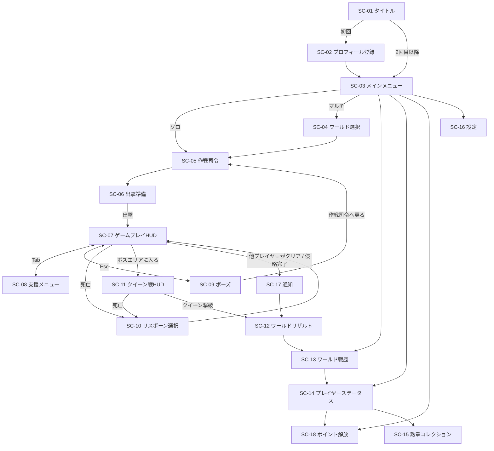

# Relay Resistance 画面仕様書

| 項目 | 内容 |
|---|---|
| 文書名 | 画面仕様書 |
| 版数 | 0.2（ドラフト） |
| 作成日 | 2026-09-23 |
| 更新日 | 2026-10-01 |
| 関連文書 | [01_要件定義書.md](01_要件定義書.md) / [02_機能仕様書.md](02_機能仕様書.md) / [04_アーキテクチャ.md](04_アーキテクチャ.md) |

> 基準解像度は 1280×720（unityroom の標準的な埋め込みサイズ）とし、16:9 で拡縮する。
> レイアウト図は配置のイメージであり、最終的なデザインではない。

---

## 1. 画面一覧

| 画面ID | 画面名 | 種別 | 関連機能 |
|---|---|---|---|
| SC-01 | タイトル | シーン | F-01 |
| SC-02 | プロフィール登録 | ダイアログ | F-01 |
| SC-03 | メインメニュー | シーン | — |
| SC-04 | ワールド選択 | シーン | F-02 |
| SC-05 | 作戦司令（ワールドマップ） | シーン | F-03〜05, F-09〜14 |
| SC-06 | 出撃準備 | パネル | F-12, F-13 |
| SC-07 | ゲームプレイHUD | オーバーレイ | F-06〜09, F-18 |
| SC-08 | 支援メニュー | オーバーレイ | F-09〜11, F-14 |
| SC-09 | ポーズメニュー | オーバーレイ | — |
| SC-10 | リスポーン選択 | オーバーレイ | F-13 |
| SC-11 | クイーン戦HUD | オーバーレイ | F-15 |
| SC-12 | ワールドリザルト | シーン | F-05, F-15, F-16, F-19 |
| SC-13 | ワールド戦歴 | シーン | F-17 |
| SC-14 | プレイヤーステータス | パネル | F-01, F-16 |
| SC-15 | 勲章コレクション | パネル | F-16 |
| SC-16 | 設定 | パネル | — |
| SC-17 | 通知ダイアログ（共通） | ダイアログ | F-02, F-05 |
| SC-18 | ポイント解放 | パネル | F-19 |

---

## 2. 画面遷移図



---

## 3. 共通仕様

| 項目 | 仕様 |
|---|---|
| フォント | 日本語対応のゴシック体（TextMeshPro 用に日本語フォントアセットを用意する） |
| 配色 | 基調色：暗い灰緑（軍用）、強調色：橙（プレイヤー側）、紫（エイリアン側） |
| 資金の表示 | 3桁ごとにカンマを入れ、頭に `¥` ではなく独自の記号 `◆` を付ける |
| 読み込み中 | 通信中は画面右下にスピナーを出す。3秒以上かかるときは「通信中…」と表示する |
| 通信エラー | SC-17 で「再試行 / タイトルへ戻る」を示す |
| カーソル | FPSプレイ中はロックして非表示。オーバーレイを開いたら表示する |

---

## 4. 各画面の仕様

### SC-01 タイトル

```
┌──────────────────────────────────────────┐
│                                          │
│          RELAY  RESISTANCE               │
│        ─ 託す者たちの抗戦 ─              │
│                                          │
│            [ クリックで開始 ]            │
│                                          │
│  v0.1.0                     © ○○○○      │
└──────────────────────────────────────────┘
```

| 要素 | 動作 |
|---|---|
| クリックで開始 | 匿名サインイン、またはセッションを復元する → プロフィールがなければ SC-02、あれば SC-03 へ |

---

### SC-02 プロフィール登録

```
┌────────── 入隊手続き ──────────┐
│  アイコン                       │
│  [◯][◯][◯][◯][◯][◯]  ←選択  │
│                                 │
│  プレイヤー名                   │
│  [________________] (1〜12字)   │
│                                 │
│           [ 入隊する ]          │
└─────────────────────────────────┘
```

| 要素 | 入力チェック・動作 |
|---|---|
| アイコン | プリセットから1つ選ぶ（必須。最初は1つ目を選択済み） |
| プレイヤー名 | 1〜12文字。NGワードなら赤字でエラーを出す |
| 入隊する | `profiles` に登録し → SC-03 へ |

---

### SC-03 メインメニュー

```
┌──────────────────────────────────────────┐
│ [icon] プレイヤー名#1234   伍長   ♥ 42  ◈ 30pt │
├──────────────────────────────────────────┤
│                                          │
│     ▶ ソロ作戦                           │
│     ▶ 共同作戦（マルチ）                 │
│     ▶ 戦歴                               │
│     ▶ プレイヤーステータス               │
│     ▶ ポイント解放                       │
│     ▶ 設定                               │
│                                          │
│  ── 作戦中のワールド ──                  │
│  第12戦域  残り 16日  制圧率 38%  [再開] │
│  ── 結果が出たワールド ──                │
│  第9戦域   地球防衛成功        [結果を見る]│
└──────────────────────────────────────────┘
```

| 要素 | 動作 |
|---|---|
| ヘッダー | アイコン・名前・階級・グッド数・所持ポイント（◈）を表示。押すと SC-14 |
| ソロ作戦 | 本人のソロワールドへ（なければ生成）→ SC-05。ソロワールドの資金・強化・武器は、マルチには引き継がれず、クリア後の新しいソロワールドで初期化される（開始前に注意書きを表示する） |
| ポイント解放 | SC-18 |
| 共同作戦 | SC-04 |
| 作戦中のワールド | 参加中の ACTIVE なワールドを最大3件表示する。残り日数は作戦期間の終わり（作成から30日）まで。［再開］→ SC-05 |
| 結果が出たワールド | 参加したワールドのうち、リザルト期間中（終了から1週間以内）のものを表示する。［結果を見る］→ SC-12 |

---

### SC-04 ワールド選択

```
┌──────────────────────────────────────────┐
│ ← 戻る          共同作戦 ワールド選択    │
│                     作戦中の戦域 87 / 100│
├──────────────────────────────────────────┤
│ 戦域名   残り    侵攻段階  人数   制圧率 │
│ 第12戦域 16日    ▲▲      20/20 満員 38% │
│ 第13戦域 28日    ─        12/20   71%  ▶│
│ 第14戦域 30日    ─         3/20    5%  ▶│
├──────────────────────────────────────────┤
│   [ おまかせで参加 ]  [ 新しい戦域を作る ] │
└──────────────────────────────────────────┘
```

| 列・要素 | 内容 |
|---|---|
| 作戦中の戦域 | 作戦期間中のマルチワールドの数 / 上限（100） |
| 残り | 作戦期間の終わり（作成から30日）までの日数。1日を切ったら時間で表示する |
| 侵攻段階 | `week` の値を ▲ の数で表す |
| 人数 | 参加者数 / 上限（20）。満員のワールドは「満員」と表示し、選べない（既に参加している場合は選べる） |
| 制圧率 | 全エリアに対する PLAYER エリアの割合 |

- おまかせで参加：制圧率が低く、人数に余裕のあるワールドを自動で選ぶ。
- 新しい戦域を作る：確認ダイアログ（「作戦期間は作成から30日間です」）を出した後、ワールドを作成して参加し、SC-05 へ移る。
  - 作戦中の戦域が100個に達しているときは押せなくし、「作戦中の戦域が上限に達しています」と表示する。
  - 自分が作成した作戦中の戦域が既にあるときは押せなくし、「作成できる戦域は1人1つまでです（作成した戦域がクリアまたは失敗で終わると、再び作成できます）」と表示する。
- 初めて参加するときに、ルートの割り当て（F-02 3.5）を行う。

---

### SC-05 作戦司令（ワールドマップ）

ワールドの状況を俯瞰し、他ルートへの支援もここから行う中心の画面。

```
┌──────────────────────────────────────────────────────────┐
│ 第12戦域 ☀朝 経過14日 / 残り16日 侵攻段階 ▲▲ 次の侵攻 2:13:05 │
│ 個人資金 ◆12,300    共有資金 ◆45,800   （10秒ごとに更新）│
├───────────────┬──────────────────────────────────────────┤
│ ルート(最大10) │  [ルート図：自分のルート（30〜50ノード）]│
│ ● 東(自)  38% │   S ■■■■┬■■□□─┬□□□ ☠               │
│ ○ 西      12% │          └■■◇□─┘                       │
│ ○ 南      55% │   ■PLAYER □ALIEN ◇中立 ▲敵拠点(未制圧)  │
│ ○ 北       0% │   ★制圧拠点 ▣侵食中 👤×3 拠点にいる人数  │
│ ⋮（スクロール）│                                          │
├───────────────┴──────────────────────────────────────────┤
│ 選択中のノード：東3-b   敵 残り24  敵拠点 物資40%        │
│ [物資調達] [援護攻撃] [敵拠点攻撃] [ここへワープ]          │
├──────────────────────────────────────────────────────────┤
│ 最近の出来事: △△が西ルートへ◆2,000の物資を投下 …         │
│                            [ 出撃準備へ ]  [ メニューへ ] │
└──────────────────────────────────────────────────────────┘
```

| 要素 | 仕様 |
|---|---|
| ヘッダー | マルチ：経過日数・作戦期間の終わり（作成から30日）までの残り時間・強化段階・次の侵攻ティックまでの時間を表示する。残り24時間を切ったら赤で表示する<br>ソロ：侵攻しないため、ワールド名だけを表示する<br>共通：サーバー時刻による朝（☀）・夜（☾）のアイコンを表示する（F-20） |
| 資金 | 個人資金と共有資金を**10秒間隔**で更新する（ソロは個人資金のみ）。自分の操作による増減は即時に反映する（F-09 10.4） |
| ルートの切り替え | 最大10本のルートを一覧にし（多いときはスクロール）、各ルートの**進行度（制圧率）**を表示する。他のルートのマップも見られる（支援の対象にするため）。自分のルートには「自」と表示する。進行度は10秒ごとに更新する（F-18 19.4） |
| ボスエリア | 各ルート図の終点に、共通のボスエリア（クイーン）を表示する。どのルートを開いても同じもので、クイーンの体力と、ボスエリアにいる人数（👤×n）を表示する。ボスエリアは出撃・ワープ先にならない |
| ルート図 | ノードをタイルで表示する（1ルート30〜50ノード。折り返して表示する）。PLAYER＝橙、ALIEN＝紫、中立エリア＝灰（◇）。侵食中のノードは侵食量をゲージで表示する。ワープ先（初期スポーン地点・制圧拠点）には、そこにいる参加者の数を表示する。ルート図の詳細は、開いたときとルートを切り替えたときに取得する |
| ノードを選ぶ | 下部の詳細欄に敵の残り数・敵拠点（状態と物資）・物資の在庫を表示する。ワープ先のノードなら［ここへ出撃］を表示し、押すとそのワープ先を選んだ状態で SC-06 を開く。中立エリアは出撃・ワープの対象にならない |
| 支援ボタン | SC-08 の該当するタブを、そのノードを対象にした状態で開く |
| ここへワープ | ワープ先（制圧拠点）を選んだときだけ有効。ファストトラベル（F-13 14.3）で SC-06 のその地点を選んだ状態にして出撃準備を開く。`fast_travel_enabled` が false の設定でも、出撃時のワープは使える |
| 最近の出来事 | ワールドのイベントログのうち最新の5件をティッカー表示する（10秒ごとに更新） |
| 出撃準備へ | SC-06 |

---

### SC-06 出撃準備

```
┌──────────── 出撃準備 ────────────┐
│ ［強化］[武器][補給][爆撃][タレット]│
│  装弾数     Lv 1  → 2  ◆825  [強化]│
│  リロード   Lv 2  → 3  ◆1550 [強化]│
│  反動抑制   Lv 0  → 1  ◆100  [強化]│
│  攻撃力     Lv 0  → 1  ◆100  [強化]│
│  ※マルチの強化は、ワールドをクリアした場合のみ引き継がれます │
│  ※ソロの強化は引き継がれず、次のソロで初期化されます │
│ ［出撃地点（ワープ先）］          │
│  ○ 初期スポーン地点（東・所属）   │
│  ○ 制圧拠点 東2          👤×1    │
│  ◉ 制圧拠点 西4 ★最前線  👤×6    │
│  ○ 制圧拠点 南3          👤×2    │
│  ✕ 制圧拠点 東5（奪還された）     │
│               [ 出撃 ]  [ 戻る ]  │
└───────────────────────────────────┘
```

| 要素 | 仕様 |
|---|---|
| 強化 | 4つのタブで切り替える：武器（装弾数・リロード速度・反動抑制・攻撃力）／補給（弾丸補給量・体力回復量）／爆撃（攻撃量・攻撃範囲・攻撃力）／タレット（攻撃量・射程・攻撃力）。各5段階（F-12 13.1）。行には、現在のレベル → 次のレベル、次のレベルの倍率、費用を表示する。支払い元（個人資金／共有資金）を選べる（ソロは個人資金のみ）。費用が選んだ支払い元の残高を超えるときはボタンを無効にする。最大レベルなら「MAX」と表示する |
| ポイント強化 | 体力・スタミナ・移動速度・スラスターなどのポイントによる強化は、この画面では行わない。SC-18 を開く［ポイント解放へ］ボタンを置く |
| 注意書き | 引き継ぎの条件（マルチ：クリア時のみ引き継ぎ／ソロ：引き継がない）を、遊んでいるモードに合わせて表示する |
| 出撃地点 | 全ルートのワープ先（F-13 14.3）を一覧にする。各ルートで最も前にあるものに「★最前線」を付け、そこにいる人数を表示する。使えない地点は✕で表示し選べない。初期値は、最前線のワープ先のうち人数が最も多いもの |
| 出撃 | ステージを読み込み → SC-07 |

---

### SC-07 ゲームプレイHUD

```
┌──────────────────────────────────────────────────────────┐
│ 東3-a ☀ 敵 残り 18     ▣侵食 32%          ◆12,300 (+15)  │
│ [後方から増援接近!]                          共有 ◆45,800 │
│                                                          │
│                           +                              │
│                                                          │
│ 他プレイヤー △△ (同じ分隊)                               │
│                                                          │
│ HP ██████████░░ 84         手榴弾 ×2 [G]  ハンドガン  12/∞ │
│ ST ███████░░░░░ 60         焼夷   ×1 [H]  [1]HG [2]AR [3]-- │
│ TH ███████░░░ 70/105 (スラスター) [Q]                     │
│ [Tab]支援  [E]拾う                    ⟳ リロード        │
└──────────────────────────────────────────────────────────┘
```

| 要素 | 位置 | 仕様 |
|---|---|---|
| エリア情報 | 左上 | ノード名・朝（☀）／夜（☾）・サーバーの敵の残り数・侵食率。敵の残り数の他分隊の分は10秒ごとに反映する |
| 警告 | 左上の下 | 後方からの増援・ノードが制圧されそう・敵拠点制圧中のカウント（10秒）、などを表示 |
| 資金 | 右上 | 個人資金。獲得した分を `(+n)` で1.5秒表示する。共有資金も併せて表示（共有資金は10秒ごとに更新） |
| 照準 | 中央 | 命中したらヒットマーカーを表示する |
| 投擲武器 | 左下 | 手榴弾［G］・焼夷手榴弾［H］の所持数。0のときはグレー表示 |
| スラスター | 左下 | エネルギーの残量をバーと数値で表示する（1回の使用で35消費。上限・回復速度はポイント強化で増える。F-06 7.7） |
| 他プレイヤー | ワールド空間 | 同じ分隊（最大4人）の他プレイヤーを2Dビルボード（前面・背面のみ）で表示し、頭上に名前を出す。発砲・投擲・スラスターのアニメーションを再生するが、撃った方向・命中した相手は表示しない（F-18 19.1） |
| 敵拠点の制圧 | 中央 | 拠点内の敵を全滅させると「制圧中 10…」のカウントダウンを表示する。敵が侵入するとリセットし、「奪還されている！」と表示する |
| ノードの人数 | 左上 | ノード名の横に、そのノードにいる参加者の数（分隊の外も含む）を `👤×n` で表示する |
| ワープ | 拠点の近く | 制圧拠点に近づくと［E］ワープ を表示し、押すとワープ先の一覧を開く。詠唱時間（初期3秒）中に被弾すると中断する。攻撃・被弾した直後（初期5秒）は使えない。設定で無効にされているときは表示しない（F-13 14.3） |
| HP / スタミナ | 左下 | バー＋数値。HPが25%以下なら赤く点滅する |
| 武器 | 右下 | 弾数/予備弾数（ハンドガンは ∞）。武器スロット |
| 操作ガイド | 左下 | インタラクトできる物の近くでだけ［E］を表示する |
| ノード制圧の演出 | 中央 | 「エリア制圧」の帯を2秒表示し、制圧報酬を表示する。制圧できずに中立エリアになったときは「中立エリア（最前線が届くと制圧）」と表示する |
| 支援の着弾 | 画面全体 | 援護攻撃の予告マーカー（赤い円）を着弾の3秒前に表示する |
| キルログ | 右中段 | 同じ分隊での撃破・死亡・援護攻撃による撃破を表示する |

---

### SC-08 支援メニュー

ゲームプレイ中は**ポーズしない**（オーバーレイ中もゲームは進む）。

```
┌──────────────────── 支援要請 ────────────────────┐
│ [物資調達] [援護攻撃] [敵拠点攻撃] [共有資金]            │
├──────────────────────────────────────────────────┤
│ 対象：東ルート ▼   エリア：東3-a ▼                │
│ 種類：◉ 上空爆撃  ○ タレット展開                  │
│ 要請費用：◆600（固定）                            │
│   4発   範囲 半径14m   威力 1発240（あなたの強化レベル）│
│ 支払い：◉ 個人資金 ◆12,300  ○ 共有資金 ◆45,800   │
│                         [ 要請する ] [ 閉じる ]   │
└──────────────────────────────────────────────────┘
```

| タブ | 入力項目 | 表示するプレビュー |
|---|---|---|
| 物資調達 | ルート、エリア、物資ポイント、段階 S/M/L | 投下される内容 |
| 援護攻撃 | ルート、エリア、種類（援護爆撃600／タレット300。費用は固定） | 要請するプレイヤーの強化レベルでの、攻撃量・範囲（射程）・威力 |
| 敵拠点攻撃 | ルート、敵拠点、投入額（3段階） | 物資の減少（敵拠点は制圧するまで残る。F-14） |
| 共有資金 | 入れる額 | 入れた後の個人資金と共有資金 |

- 支払い元：どのタブでも個人資金・共有資金のどちらでも選べる。ただし共有資金タブ（プールへ入れる操作）では個人資金しか選べない。
- ソロワールドでは、共有資金タブと支払い元の選択を表示しない。
- 要請が完了したら、トースト「要請受理」を表示し、資金を減らした表示にする。失敗したら（残高不足・対象が無効）エラーを表示する。

---

### SC-09 ポーズメニュー

| 項目 | 動作 |
|---|---|
| 再開 | HUDに戻る |
| 設定 | SC-16 |
| 作戦司令へ戻る | 確認のうえでステージを出て SC-05 へ。未送信のデータを送ってから移動する |

※ マルチでは、ゲーム内の時間は止まらない（オンラインのワールドのため）。ポーズ中もプレイヤーを無敵にしない。
※ ソロでは、ポーズ中はゲームを止める（ソロワールドは時間経過で変化しないため）。

---

### SC-10 リスポーン選択

```
┌──────────── 戦闘不能 ────────────┐
│   KIA  ─  東3-a にて             │
│                                  │
│  再出撃地点（ワープ先）           │
│   ○ 初期スポーン地点（東・所属）  │
│   ○ 制圧拠点 東2                  │
│   ◉ 制圧拠点 西4 ★最前線 👤×6    │
│   ✕ 制圧拠点 東3（奪還された）    │
│                                  │
│       [ 再出撃 (5) ]  [ 作戦司令へ ] │
└──────────────────────────────────┘
```

| 要素 | 仕様 |
|---|---|
| 地点の一覧 | SC-06 の出撃地点と同じ一覧（初期スポーン地点と、全ルートの制圧拠点）。使えない地点は✕で表示して選べなくする。初期値は、倒れた場所に最も近いワープ先。ボスエリア専用の復活地点はない |
| 再出撃 | 5秒のカウントダウン後に押せるようになる |

---

### SC-11 クイーン戦HUD

ボスエリアはワールドに1つで、全ルートのプレイヤーがここで合流する。SC-07 に次の要素を加える（SC-07 の分隊表示の代わりに、ボスエリア全員の表示にする）。

| 要素 | 位置 | 仕様 |
|---|---|---|
| クイーンの体力バー | 上部中央 | 「クイーン」と体力（最大10万）を表示する。攻撃能力を持たないため、段階は表示しない |
| 近衛兵 | 上部中央（体力バーの下） | 残りの近衛兵の数を表示する（30秒ごとに呼び出される）。次のスポーンまでのカウント（エイリアン15秒・近衛兵30秒）も小さく表示する |
| 増援の状態 | 左上 | ボス包囲状態なら「増援停止中」と表示する。クイーンがエイリアンをスポーンさせている間は、「クイーンが増援を呼んでいる」と表示する |
| クイーンの体力の同期 | 上部中央 | 体力は全員で共有する。他のプレイヤーのダメージは1秒ごとに反映され、サーバーの値で10秒ごとに補正される（F-18 19.6）。誰が何ダメージ与えたかは表示しない |
| 他のプレイヤー | ワールド空間 | ボスエリアでは分隊に分けず、ボスエリアにいる全員（最大20人）を2Dビルボードで表示する。頭上に名前を出す（遠いときは省略）。発砲・投擲・スラスターのアニメーションを再生する（撃った方向・命中対象は表示しない） |
| ボスエリアの人数 | 右上 | ボスエリアにいる人数を `👤×n` で表示する |
| キルログ | 右中段 | ボスエリアでは、全員の死亡を表示する（エイリアン・近衛兵の撃破は表示しない） |
| 撃破者 | 画面中央 | クイーンの体力が0になったとき、撃破者の名前を表示してから SC-12 へ進む |

---

### SC-12 ワールドリザルト

```
┌────────────────────────────────────────────┐
│            地 球 防 衛 成 功               │
│   第12戦域  作戦期間 14日3時間             │
│   撃破者：2等軍曹 □□                       │
├────────────────────────────────────────────┤
│ あなたの戦果                                │
│  資金貢献     ◆18,400    1,840,000 功績度  │
│  敵拠点制圧   3件              3,000 功績度  │
│  ────────────────────────────              │
│  功績度   1,843,000   (順位 4 / 18)        │
│  累計貢献度  4,821,000 → 6,664,000 ★昇格：3等軍曹 │
│  獲得ポイント ◈ +18,430（功績度 ÷ 100）    │
│  獲得勲章    [補給勲章] [殊勲の盾]         │
│  強化の引き継ぎ  装弾数 Lv2→4 ほか         │
│  戦歴：敵キル数 412体 / 援護キル数 88体     │
│        （功績には反映されません）           │
├────────────────────────────────────────────┤
│ 被害者数   1,842,600人                      │
│ 戦死者数   126人（ワールド全体）            │
│ （どちらも功績には影響しません）            │
├────────────────────────────────────────────┤
│          [ 戦歴を見る ]  [ メニューへ ]    │
└────────────────────────────────────────────┘
```

- 「撃破者」は、クイーンを撃破したプレイヤーを表示する。
- 被害者数は、機能仕様書 F-05 6.5 の式で計算した値を、3桁ごとにカンマを入れて表示する。ソロワールドでは侵攻しないため、被害者数の欄を表示しない。
- 戦死者数は、ワールド内で倒れたプレイヤーの数（全参加者の合計）を、被害者数とは別に表示する。ソロでは自分が倒れた回数を表示する。
- 功績度は「敵拠点制圧数 × 1000 ＋ 資金貢献額 × 100」（F-16 17.1）。敵キル数・援護キル数は戦歴として残るが、功績には含まれない（拠点を制圧せずに無限湧きを倒して稼ぐことを防ぐため）。
- ポイントは、マルチワールドをクリアした場合だけ獲得できる。「獲得ポイント」の欄は、マルチのクリア時にだけ表示する。
- ワールドが FALLEN になった場合（作成から30日以内にクイーンを倒せなかった場合）は、見出しを「地球陥落」とし、強化の引き継ぎ欄に「なし」、獲得ポイント欄に「なし（侵略されたため、全員ポイントを獲得できません）」と表示する。被害者数は表示する。
- マルチでは、クリアした直後に加えて、ワールドが削除されるまで（リザルト期間中）はメインメニュー（SC-03）・戦歴（SC-13）からいつでも開ける。
- 昇格したとき・勲章を得たときは演出を入れる。

---

### SC-13 ワールド戦歴

```
┌────────────────────────────────────────────┐
│ ← 戻る   戦歴     [第12戦域 ▼] 保存期限 残り5日 │
├──────────────────────┬─────────────────────┤
│ 作戦記録              │ 貢献者一覧           │
│ 9/1 作戦開始          │ #  名前   階級  スコア  ♥│
│ 9/3 伍長○○が…制圧    │ 1 □□  2等軍曹 31,020 [♥]│
│ 9/5 上等兵△△が…供給  │ 2 ○○  伍長   25,400 [♥]│
│ …                    │ 3 あなた …           │
│ 9/14 ボス撃破         │ …                    │
└──────────────────────┴─────────────────────┘
```

| 要素 | 仕様 |
|---|---|
| ワールドの切り替え | 自分が参加したワールドのうち、CLEARED・FALLEN のもの（リザルト期間中＝終了から1週間以内）を選べる。保存期限の残り日数を表示する |
| 作戦記録 | F-17 18.1 のイベントを時系列で表示する |
| 貢献者一覧 | 行を押すと、その人の SC-14 を開く。［♥］はグッドボタン |
| グッドボタン | 自分の行には表示しない。押したら塗りつぶし表示にし、再び押せなくする |

---

### SC-14 プレイヤーステータス

```
┌──────────── プレイヤーステータス ────────────┐
│ [アイコン]  プレイヤー名#1234                │
│             階級：伍長  ▰▰▰▱▱ 次の階級まで 1,210,000│
│ 累計貢献度 3,790,000   グッド ♥ 42   ◈ 30pt   │
│ キャラクター育成度 Lv 23                      │
│   資金の強化：装弾数2 / リロード3 / 反動1 / 攻撃力0 …   │
│   ポイントの強化：体力8 / スタミナ6 / 移動4 / スラスター(エネルギー)3 … │
│ 獲得勲章  [◎×3][◎×1][◎×1]  [一覧を見る]    │
│                       [♥ グッド] [閉じる]    │
└───────────────────────────────────────────────┘
```

- 自分のステータスを開いたときは、アイコン・名前の［編集］と、［ポイント解放］（→ SC-18）を表示し、［♥ グッド］は表示しない。所持ポイントは自分のステータスにだけ表示する。
- 他人のステータスを開いたときは［♥ グッド］を表示する（押せる条件は F-17 18.3 に従う）。

---

### SC-15 勲章コレクション

- 全勲章をグリッドで表示する。持っていない勲章はシルエットで表示し、獲得条件を表示する。
- 持っている勲章には獲得回数と、初めて獲得したワールド・日付を表示する。

---

### SC-18 ポイント解放

マルチワールドのクリアで得たポイントを使って、やりこみ要素を解放する画面（F-19）。

```
┌──────────── ポイント解放 ◈ 18,430pt ────────┐
│ [武器] [プレイヤー] [スラスター] [スキン] [スキル] │
├──────────────────────────────────────────────┤
│ 武器の開放                                    │
│  サブマシンガン      ◈500    [ 開放する ]     │
│  アサルトライフル    ◈1,000  [ 開放済み ]     │
│  ショットガン        ◈1,000  [ 開放する ]     │
│  ライフル            ◈2,000  [ 開放する ]     │
│  手榴弾 / 焼夷手榴弾  ◈300 / ◈300  [ 開放する ]│
│                              [ 閉じる ]       │
└──────────────────────────────────────────────┘
```

| タブ | 内容 |
|---|---|
| 武器 | サブマシンガン500・アサルトライフル1000・ショットガン1000・ライフル2000・手榴弾300・焼夷手榴弾300。開放済みは「開放済み」と表示する |
| プレイヤー | 体力・スタミナ・移動速度・所持弾薬数・所持投擲武器数。各10段階。行には、現在のレベル → 次のレベル、倍率、費用（100〜3000）を表示する。［強化］で上げる |
| スラスター | エネルギー量・回復速度・加速量。各10段階（プレイヤータブと同じ表示） |
| スキン | 前面・背面のプレビューを表示し、［開放する］［装備する］。【要確認】価格・種類は未定 |
| スキル | 【要確認】内容が決まるまでは、タブを非表示にする |

- 価格は F-19 20.2 のとおり（武器の開放は300〜2000、強化は1レベルごとに100〜3000ポイント）。
- 所持ポイントが足りないときは、ボタンを無効にする。
- 解放したときに、確認ダイアログを表示する（ポイントは戻らない）。
- ソロ・マルチのどちらで遊ぶときでも、解放した内容は有効（F-19 20.2）。

---

### SC-16 設定

| 項目 | 範囲 | 初期値 |
|---|---|---|
| マウス感度 | 0.1〜5.0 | 1.0 |
| 視点の上下反転 | ON/OFF | OFF |
| 視野角（FOV） | 60〜100 | 75 |
| BGM音量 | 0〜100 | 70 |
| 効果音音量 | 0〜100 | 80 |
| 描画品質 | 低/中/高 | 中 |
| 他プレイヤーの名前表示 | ON/OFF | ON |

- 設定は `PlayerPrefs` に保存する（サーバーには送らない）。

---

### SC-17 通知ダイアログ（共通）

| 通知の種類 | タイミング | ボタン |
|---|---|---|
| ワールドクリア | 他プレイヤーがクイーンを撃破したとき（10秒ごとの同期で検知する） | ［リザルトへ］ |
| 侵略完了 | 作成から30日が過ぎ、ワールドが FALLEN になったとき（プレイ中ならステージを強制的に終える） | ［リザルトへ］ |
| 不在中の戦況 | マルチワールドに入ったとき、前回からの変化があれば（ソロでは表示しない） | ［確認］ |
| 通信エラー | API・Realtime との接続が切れたとき | ［再試行］［タイトルへ］ |

不在中の戦況の表示例：
```
┌──── 不在中の戦況 ────┐
│ 前回のプレイから 2日5時間 │
│ ・侵攻段階 ▲ → ▲▲      │
│ ・自ルートで2エリア陥落  │
│ ・制圧拠点 東3 を奪還された │
│ ・受け取った支援 ◆3,400  │
│            [ 確認 ]     │
└─────────────────────────┘
```
