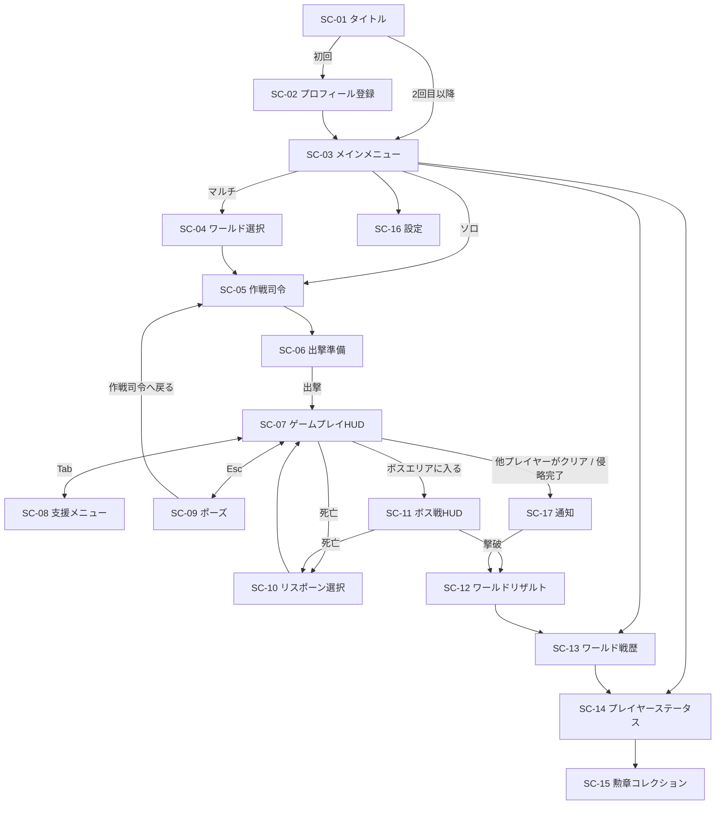

# Relay Resistance 画面仕様書

| 項目 | 内容 |
|---|---|
| 文書名 | 画面仕様書 |
| 版数 | 0.1（ドラフト） |
| 作成日 | 2026-09-23 |
| 関連文書 | [01_要件定義書.md](01_要件定義書.md) / [02_機能仕様書.md](02_機能仕様書.md) / [04_アーキテクチャ.md](04_アーキテクチャ.md) |

> 基準解像度は 1280×720（unityroom の標準的な埋め込みサイズ）とし、16:9 で拡縮する。
> レイアウト図は配置のイメージであり、最終的なデザインではない。

---

## 1. 画面一覧

| 画面ID | 画面名 | 種別 | 関連機能 |
|---|---|---|---|
| SC-01 | タイトル | シーン | F-01 |
| SC-02 | プロフィール登録 | ダイアログ | F-01 |
| SC-03 | メインメニュー | シーン | — |
| SC-04 | ワールド選択 | シーン | F-02 |
| SC-05 | 作戦司令（ワールドマップ） | シーン | F-03〜05, F-09〜14 |
| SC-06 | 出撃準備 | パネル | F-12, F-13 |
| SC-07 | ゲームプレイHUD | オーバーレイ | F-06〜09, F-18 |
| SC-08 | 支援メニュー | オーバーレイ | F-09〜11, F-14 |
| SC-09 | ポーズメニュー | オーバーレイ | — |
| SC-10 | リスポーン選択 | オーバーレイ | F-13 |
| SC-11 | ボス戦HUD | オーバーレイ | F-15 |
| SC-12 | ワールドリザルト | シーン | F-15, F-16 |
| SC-13 | ワールド戦歴 | シーン | F-17 |
| SC-14 | プレイヤーステータス | パネル | F-01, F-16 |
| SC-15 | 勲章コレクション | パネル | F-16 |
| SC-16 | 設定 | パネル | — |
| SC-17 | 通知ダイアログ（共通） | ダイアログ | F-02, F-05 |

---

## 2. 画面遷移図



---

## 3. 共通仕様

| 項目 | 仕様 |
|---|---|
| フォント | 日本語対応のゴシック体（TextMeshPro 用に日本語フォントアセットを用意する） |
| 配色 | 基調色：暗い灰緑（軍用）、強調色：橙（プレイヤー側）、紫（エイリアン側） |
| 資金の表示 | 3桁ごとにカンマを入れ、頭に `¥` ではなく独自の記号 `◆` を付ける |
| 読み込み中 | 通信中は画面右下にスピナーを出す。3秒以上かかるときは「通信中…」と表示する |
| 通信エラー | SC-17 で「再試行 / タイトルへ戻る」を示す |
| カーソル | FPSプレイ中はロックして非表示。オーバーレイを開いたら表示する |

---

## 4. 各画面の仕様

### SC-01 タイトル

```
┌──────────────────────────────────────────┐
│                                          │
│          RELAY  RESISTANCE               │
│        ─ 託す者たちの抗戦 ─              │
│                                          │
│            [ クリックで開始 ]            │
│                                          │
│  v0.1.0                     © ○○○○      │
└──────────────────────────────────────────┘
```

| 要素 | 動作 |
|---|---|
| クリックで開始 | 匿名サインイン、またはセッションを復元する → プロフィールがなければ SC-02、あれば SC-03 へ |

---

### SC-02 プロフィール登録

```
┌────────── 入隊手続き ──────────┐
│  アイコン                       │
│  [◯][◯][◯][◯][◯][◯]  ←選択  │
│                                 │
│  プレイヤー名                   │
│  [________________] (1〜12字)   │
│                                 │
│           [ 入隊する ]          │
└─────────────────────────────────┘
```

| 要素 | 入力チェック・動作 |
|---|---|
| アイコン | プリセットから1つ選ぶ（必須。最初は1つ目を選択済み） |
| プレイヤー名 | 1〜12文字。NGワードなら赤字でエラーを出す |
| 入隊する | `profiles` に登録し → SC-03 へ |

---

### SC-03 メインメニュー

```
┌──────────────────────────────────────────┐
│ [icon] プレイヤー名#1234   伍長   ♥ 42   │
├──────────────────────────────────────────┤
│                                          │
│     ▶ ソロ作戦                           │
│     ▶ 共同作戦（マルチ）                 │
│     ▶ 戦歴                               │
│     ▶ プレイヤーステータス               │
│     ▶ 設定                               │
│                                          │
│  ── 作戦中のワールド ──                  │
│  第12戦域  残り 16日  制圧率 38%  [再開] │
│  ── 結果が出たワールド ──                │
│  第9戦域   地球防衛成功        [結果を見る]│
└──────────────────────────────────────────┘
```

| 要素 | 動作 |
|---|---|
| ヘッダー | アイコン・名前・階級・グッド数を表示。押すと SC-14 |
| ソロ作戦 | 本人のソロワールドへ（なければ生成）→ SC-05 |
| 共同作戦 | SC-04 |
| 作戦中のワールド | 参加中の ACTIVE なワールドを最大3件表示する。残り日数は作戦期間の終わり（作成から30日）まで。［再開］→ SC-05 |
| 結果が出たワールド | 参加したワールドのうち、リザルト期間中（終了から1週間以内）のものを表示する。［結果を見る］→ SC-12 |

---

### SC-04 ワールド選択

```
┌──────────────────────────────────────────┐
│ ← 戻る          共同作戦 ワールド選択    │
│                     作戦中の戦域 87 / 100│
├──────────────────────────────────────────┤
│ 戦域名   残り    侵攻段階  人数   制圧率 │
│ 第12戦域 16日    ▲▲      20/20 満員 38% │
│ 第13戦域 28日    ─        12/20   71%  ▶│
│ 第14戦域 30日    ─         3/20    5%  ▶│
├──────────────────────────────────────────┤
│   [ おまかせで参加 ]  [ 新しい戦域を作る ] │
└──────────────────────────────────────────┘
```

| 列・要素 | 内容 |
|---|---|
| 作戦中の戦域 | 作戦期間中のマルチワールドの数 / 上限（100） |
| 残り | 作戦期間の終わり（作成から30日）までの日数。1日を切ったら時間で表示する |
| 侵攻段階 | `week` の値を ▲ の数で表す |
| 人数 | 参加者数 / 上限（20）。満員のワールドは「満員」と表示し、選べない（既に参加している場合は選べる） |
| 制圧率 | 全エリアに対する PLAYER エリアの割合 |

- おまかせで参加：制圧率が低く、人数に余裕のあるワールドを自動で選ぶ。
- 新しい戦域を作る：確認ダイアログ（「作戦期間は作成から30日間です」）を出した後、ワールドを作成して参加し、SC-05 へ移る。
  - 作戦中の戦域が100個に達しているときは押せなくし、「作戦中の戦域が上限に達しています」と表示する。
  - 自分が作成した作戦中の戦域が既にあるときは押せなくし、「作成できる戦域は1人1つまでです（作成した戦域がクリアまたは失敗で終わると、再び作成できます）」と表示する。
- 初めて参加するときに、ルートの割り当て（F-02 3.5）を行う。

---

### SC-05 作戦司令（ワールドマップ）

ワールドの状況を俯瞰し、他ルートへの支援もここから行う中心の画面。

```
┌──────────────────────────────────────────────────────────┐
│ 第12戦域  経過14日 / 残り16日  侵攻段階 ▲▲  次の侵攻 2:13:05 │
│ 個人資金 ◆12,300    共有資金 ◆45,800                   │
├───────────────┬──────────────────────────────────────────┤
│ ルート         │  [ルート図：自分のルート]               │
│ ● 東ルート(自) │   S ■■■■┬■■□□─┬□□□ ☠               │
│ ○ 西ルート     │          └■■□□─┘                       │
│ ○ 南ルート     │   ■PLAYER □ALIEN ▲敵拠点 ⌂途中拠点      │
│ ○ 北ルート     │   ★制圧拠点 ▣侵食中 👤×3 拠点にいる人数  │
├───────────────┴──────────────────────────────────────────┤
│ 選択中のエリア：東3-b   敵 残り24  敵拠点 耐久60% 物資40% │
│ [物資調達] [援護攻撃] [敵拠点攻撃] [途中拠点設営]          │
├──────────────────────────────────────────────────────────┤
│ 最近の出来事: △△が西ルートへ◆2,000の物資を投下 …         │
│                            [ 出撃準備へ ]  [ メニューへ ] │
└──────────────────────────────────────────────────────────┘
```

| 要素 | 仕様 |
|---|---|
| ヘッダー | マルチ：経過日数・作戦期間の終わり（作成から30日）までの残り時間・強化段階・次の侵攻ティックまでの時間を表示する。残り24時間を切ったら赤で表示する<br>ソロ：侵攻しないため、ワールド名だけを表示する |
| 資金 | 個人資金と共有資金をリアルタイムで更新する（ソロは個人資金のみ） |
| ルートの切り替え | 他のルートのマップも見られる（支援の対象にするため）。自分のルートには「自」と表示する |
| ルート図 | エリアをタイルで表示する。PLAYER＝橙、ALIEN＝紫。侵食中のエリアは侵食量をゲージで表示する。ワープ先（途中拠点・制圧拠点・前線基地）には、そこにいる参加者の数を表示する |
| エリアを選ぶ | 下部の詳細欄に敵の残り数・敵拠点・物資の在庫を表示する。ワープ先のエリアなら［ここへ出撃］を表示し、押すとそのワープ先を選んだ状態で SC-06 を開く |
| 支援ボタン | SC-08 の該当するタブを、そのエリアを対象にした状態で開く。設営は PLAYER エリアでだけ有効（どのルートでも可） |
| 最近の出来事 | ワールドのイベントログのうち最新の5件をティッカー表示する |
| 出撃準備へ | SC-06 |

---

### SC-06 出撃準備

```
┌──────────── 出撃準備 ────────────┐
│ ［強化］                          │
│  最大体力   Lv 5  → 6  ◆610 [強化]│
│  スタミナ   Lv 3  → 4  ◆293 [強化]│
│  リロード   Lv 2  → 3  ◆423 [強化]│
│  反動       Lv 0  → 1  ◆250 [強化]│
│  マガジン   Lv 1  → 2  ◆390 [強化]│
│  攻撃力     Lv 0  → 1  ◆1000[強化]│
│  ※強化はワールドをクリアした場合のみ引き継がれます │
│ ［出撃地点（ワープ先）］          │
│  ○ 初期スポーン地点（東・所属）   │
│  ○ 途中拠点 東2          👤×1    │
│  ◉ 制圧拠点 西4 ★最前線  👤×6    │
│  ○ 制圧拠点 南3          👤×2    │
│  ✕ 前線基地（ボス包囲時のみ）     │
│               [ 出撃 ]  [ 戻る ]  │
└───────────────────────────────────┘
```

| 要素 | 仕様 |
|---|---|
| 強化 | 支払い元（個人資金／共有資金）を選べる（ソロは個人資金のみ）。費用が選んだ支払い元の残高を超えるときはボタンを無効にする。最大レベルなら「MAX」と表示する |
| 注意書き | 引き継ぎの条件を常に表示する |
| 出撃地点 | 全ルートのワープ先（F-13 14.3）を一覧にする。各ルートで最も前にあるものに「★最前線」を付け、そこにいる人数を表示する。使えない地点は✕で表示し選べない。初期値は、最前線のワープ先のうち人数が最も多いもの |
| 出撃 | ステージを読み込み → SC-07 |

---

### SC-07 ゲームプレイHUD

```
┌──────────────────────────────────────────────────────────┐
│ 東3-a  敵 残り 18      ▣侵食 32%          ◆12,300 (+15)  │
│ [後方から増援接近!]                          共有 ◆45,800 │
│                                                          │
│                           +                              │
│                                                          │
│ 他プレイヤー △△ (同じエリア)                             │
│                                                          │
│ HP ██████████░░ 84                    ハンドガン  12/∞   │
│ ST ███████░░░░░ 60                    [1]HG [2]AR [3]--  │
│ [Tab]支援  [E]拾う                    ⟳ リロード        │
└──────────────────────────────────────────────────────────┘
```

| 要素 | 位置 | 仕様 |
|---|---|---|
| エリア情報 | 左上 | エリア名・サーバーの敵の残り数・侵食率 |
| 警告 | 左上の下 | 後方からの増援・敵拠点の修復まで残り1時間・エリアが制圧されそう、などを表示 |
| 資金 | 右上 | 個人資金。獲得した分を `(+n)` で1.5秒表示する。共有資金も併せて表示 |
| 照準 | 中央 | 命中したらヒットマーカーを表示する |
| 他プレイヤー | ワールド空間 | 同じ分隊（最大4人）の他プレイヤーをビルボードで表示し、頭上に名前を出す |
| エリアの人数 | 左上 | エリア名の横に、そのエリアにいる参加者の数（分隊の外も含む）を `👤×n` で表示する |
| ワープ | 拠点の近く | 途中拠点・制圧拠点に近づくと［E］ワープ を表示し、押すとワープ先の一覧を開く。3秒の詠唱中に被弾すると中断する |
| HP / スタミナ | 左下 | バー＋数値。HPが25%以下なら赤く点滅する |
| 武器 | 右下 | 弾数/予備弾数（ハンドガンは ∞）。武器スロット |
| 操作ガイド | 左下 | インタラクトできる物の近くでだけ［E］を表示する |
| エリア制圧の演出 | 中央 | 「エリア制圧」の帯を2秒表示し、制圧報酬を表示する |
| 支援の着弾 | 画面全体 | 援護攻撃の予告マーカー（赤い円）を着弾の3秒前に表示する |
| キルログ | 右中段 | 同じエリアでの撃破・死亡・援護攻撃による撃破を表示する |

---

### SC-08 支援メニュー

ゲームプレイ中は**ポーズしない**（オーバーレイ中もゲームは進む）。

```
┌──────────────────── 支援要請 ────────────────────┐
│ [物資調達] [援護攻撃] [敵拠点攻撃] [途中拠点] [共有資金] │
├──────────────────────────────────────────────────┤
│ 対象：東ルート ▼   エリア：東3-a ▼                │
│ 種類：◉ 上空爆撃  ○ タレット展開                  │
│ 投入額：◆[────●─────] 2,000                      │
│   範囲 半径18m   威力 606                         │
│ 支払い：◉ 個人資金 ◆12,300  ○ 共有資金 ◆45,800   │
│                         [ 要請する ] [ 閉じる ]   │
└──────────────────────────────────────────────────┘
```

| タブ | 入力項目 | 表示するプレビュー |
|---|---|---|
| 物資調達 | ルート、エリア、物資ポイント、段階 S/M/L | 投下される内容 |
| 援護攻撃 | ルート、エリア、種類、投入額（スライダー） | 範囲・威力 |
| 敵拠点攻撃 | ルート、敵拠点、投入額（3段階） | 与えるダメージ・物資の減少 |
| 途中拠点 | ルート、PLAYER エリア（どのルートでも可） | 設営費 |
| 共有資金 | 入れる額 | 入れた後の個人資金と共有資金 |

- 支払い元：どのタブでも個人資金・共有資金のどちらでも選べる。ただし共有資金タブ（プールへ入れる操作）では個人資金しか選べない。
- ソロワールドでは、共有資金タブと支払い元の選択を表示しない。
- 要請が完了したら、トースト「要請受理」を表示し、資金を減らした表示にする。失敗したら（残高不足・対象が無効）エラーを表示する。

---

### SC-09 ポーズメニュー

| 項目 | 動作 |
|---|---|
| 再開 | HUDに戻る |
| 設定 | SC-16 |
| 作戦司令へ戻る | 確認のうえでステージを出て SC-05 へ。未送信のデータを送ってから移動する |

※ マルチでは、ゲーム内の時間は止まらない（オンラインのワールドのため）。ポーズ中もプレイヤーを無敵にしない。
※ ソロでは、ポーズ中はゲームを止める（ソロワールドは時間経過で変化しないため）。

---

### SC-10 リスポーン選択

```
┌──────────── 戦闘不能 ────────────┐
│   KIA  ─  東3-a にて             │
│                                  │
│  再出撃地点（ワープ先）           │
│   ○ 初期スポーン地点（東・所属）  │
│   ○ 途中拠点 東2                  │
│   ◉ 制圧拠点 西4 ★最前線 👤×6    │
│   ✕ 途中拠点 東3（陥落）          │
│                                  │
│       [ 再出撃 (5) ]  [ 作戦司令へ ] │
└──────────────────────────────────┘
```

| 要素 | 仕様 |
|---|---|
| 地点の一覧 | SC-06 の出撃地点と同じ一覧（全ルートのワープ先）。使えない地点は✕で表示して選べなくする。初期値は、倒れた場所に最も近いワープ先 |
| 再出撃 | 5秒のカウントダウン後に押せるようになる |

---

### SC-11 ボス戦HUD

SC-07 に次の要素を加える。

| 要素 | 位置 | 仕様 |
|---|---|---|
| ボスの体力バー | 上部中央 | ボス名と段階（Ⅰ/Ⅱ/Ⅲ）を表示する |
| 増援の状態 | 左上 | ボス包囲状態なら「増援停止中」と表示する |
| ワールドの状態 | 右上 | 他プレイヤーのボス戦の状況は表示しない（同期しないため） |

---

### SC-12 ワールドリザルト

```
┌────────────────────────────────────────────┐
│            地 球 防 衛 成 功               │
│   第12戦域  作戦期間 14日3時間             │
│   撃破者：2等軍曹 □□                       │
├────────────────────────────────────────────┤
│ あなたの戦果                                │
│  資金貢献     ◆18,400        18,400 pt     │
│  敵拠点制圧   3件              1,200 pt     │
│  敵キル数     412体            1,236 pt     │
│  援護キル数   88体                88 pt     │
│  ────────────────────────────              │
│  スコア      20,924   (順位 4 / 38)        │
│  累計貢献度  48,210 → 69,134  ★昇格：3等軍曹 │
│  獲得勲章    [補給勲章] [殊勲の盾]         │
│  強化の引き継ぎ  最大体力 Lv5→8 ほか       │
├────────────────────────────────────────────┤
│          [ 戦歴を見る ]  [ メニューへ ]    │
└────────────────────────────────────────────┘
```

- ワールドが FALLEN になった場合（作成から30日以内にボスを倒せなかった場合）は、見出しを「地球陥落」とし、強化の引き継ぎ欄に「なし」と表示する。
- マルチでは、クリアした直後に加えて、ワールドが削除されるまで（リザルト期間中）はメインメニュー（SC-03）・戦歴（SC-13）からいつでも開ける。
- 昇格したとき・勲章を得たときは演出を入れる。

---

### SC-13 ワールド戦歴

```
┌────────────────────────────────────────────┐
│ ← 戻る   戦歴     [第12戦域 ▼] 保存期限 残り5日 │
├──────────────────────┬─────────────────────┤
│ 作戦記録              │ 貢献者一覧           │
│ 9/1 作戦開始          │ #  名前   階級  スコア  ♥│
│ 9/3 伍長○○が…制圧    │ 1 □□  2等軍曹 31,020 [♥]│
│ 9/5 上等兵△△が…供給  │ 2 ○○  伍長   25,400 [♥]│
│ …                    │ 3 あなた …           │
│ 9/14 ボス撃破         │ …                    │
└──────────────────────┴─────────────────────┘
```

| 要素 | 仕様 |
|---|---|
| ワールドの切り替え | 自分が参加したワールドのうち、CLEARED・FALLEN のもの（リザルト期間中＝終了から1週間以内）を選べる。保存期限の残り日数を表示する |
| 作戦記録 | F-17 18.1 のイベントを時系列で表示する |
| 貢献者一覧 | 行を押すと、その人の SC-14 を開く。［♥］はグッドボタン |
| グッドボタン | 自分の行には表示しない。押したら塗りつぶし表示にし、再び押せなくする |

---

### SC-14 プレイヤーステータス

```
┌──────────── プレイヤーステータス ────────────┐
│ [アイコン]  プレイヤー名#1234                │
│             階級：伍長  ▰▰▰▱▱ 次の階級まで 4,210│
│ 累計貢献度 20,790      グッド ♥ 42           │
│ キャラクター育成度 Lv 23                      │
│   体力8 / スタミナ6 / リロード4 / 反動3 / マガジン2 / 攻撃0 │
│ 獲得勲章  [◎×3][◎×1][◎×1]  [一覧を見る]    │
│                       [♥ グッド] [閉じる]    │
└───────────────────────────────────────────────┘
```

- 自分のステータスを開いたときは、アイコン・名前の［編集］を表示し、［♥ グッド］は表示しない。
- 他人のステータスを開いたときは［♥ グッド］を表示する（押せる条件は F-17 18.3 に従う）。

---

### SC-15 勲章コレクション

- 全勲章をグリッドで表示する。持っていない勲章はシルエットで表示し、獲得条件を表示する。
- 持っている勲章には獲得回数と、初めて獲得したワールド・日付を表示する。

---

### SC-16 設定

| 項目 | 範囲 | 初期値 |
|---|---|---|
| マウス感度 | 0.1〜5.0 | 1.0 |
| 視点の上下反転 | ON/OFF | OFF |
| 視野角（FOV） | 60〜100 | 75 |
| BGM音量 | 0〜100 | 70 |
| 効果音音量 | 0〜100 | 80 |
| 描画品質 | 低/中/高 | 中 |
| 他プレイヤーの名前表示 | ON/OFF | ON |

- 設定は `PlayerPrefs` に保存する（サーバーには送らない）。

---

### SC-17 通知ダイアログ（共通）

| 通知の種類 | タイミング | ボタン |
|---|---|---|
| ワールドクリア | 他プレイヤーがボスを撃破したとき | ［リザルトへ］ |
| 侵略完了 | 作成から30日が過ぎ、ワールドが FALLEN になったとき（プレイ中ならステージを強制的に終える） | ［リザルトへ］ |
| 不在中の戦況 | マルチワールドに入ったとき、前回からの変化があれば（ソロでは表示しない） | ［確認］ |
| 通信エラー | API・Realtime との接続が切れたとき | ［再試行］［タイトルへ］ |

不在中の戦況の表示例：
```
┌──── 不在中の戦況 ────┐
│ 前回のプレイから 2日5時間 │
│ ・侵攻段階 ▲ → ▲▲      │
│ ・自ルートで2エリア陥落  │
│ ・途中拠点 東3 陥落      │
│ ・受け取った支援 ◆3,400  │
│            [ 確認 ]     │
└─────────────────────────┘
```
