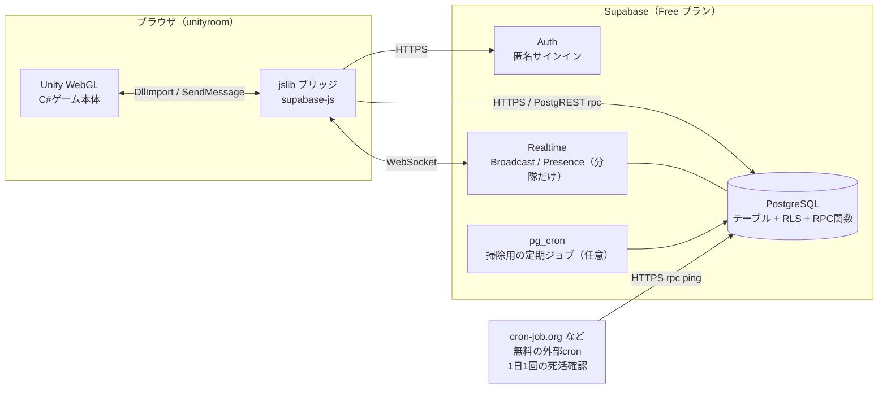
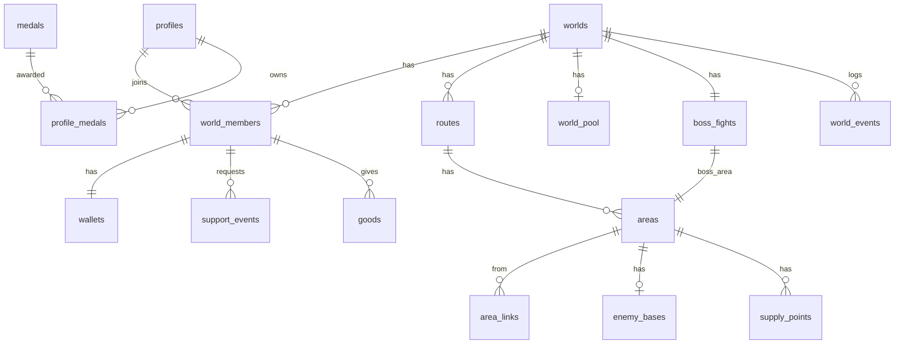
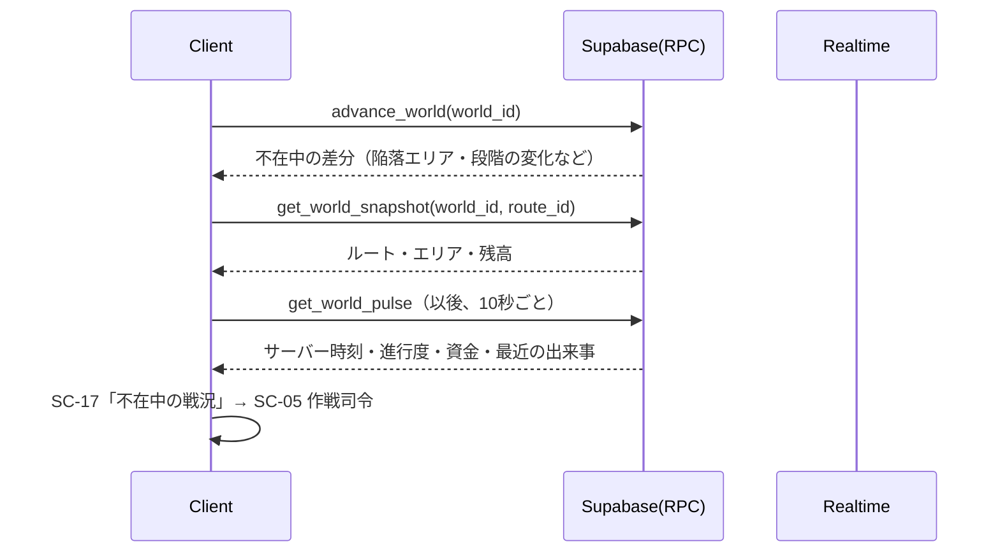
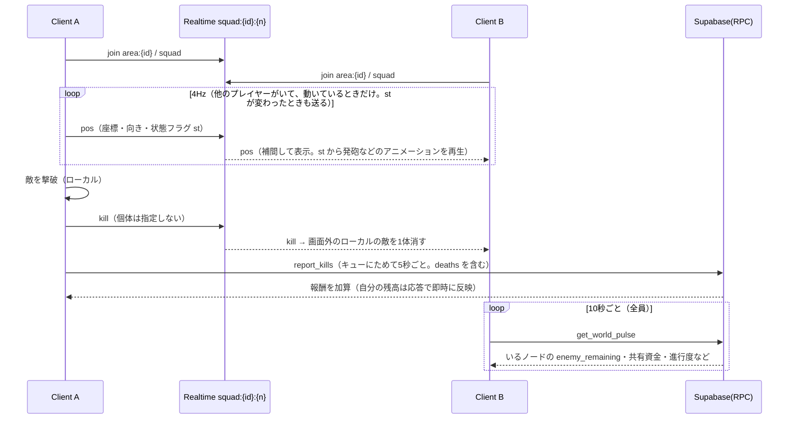
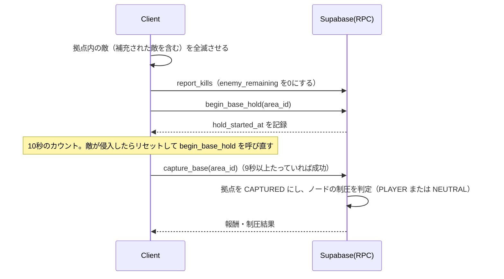
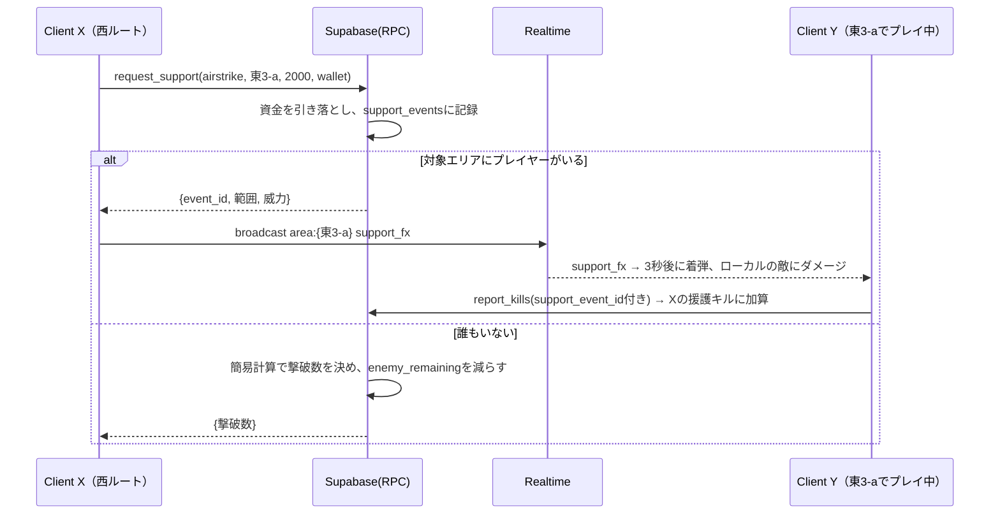
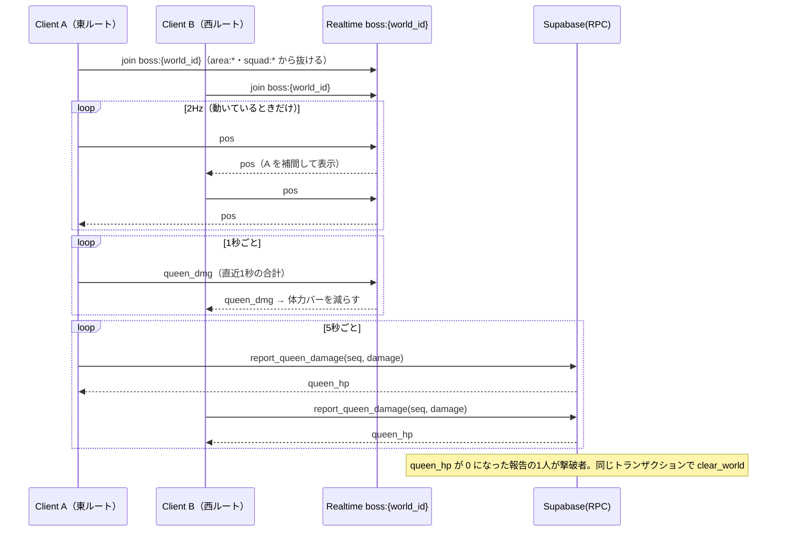
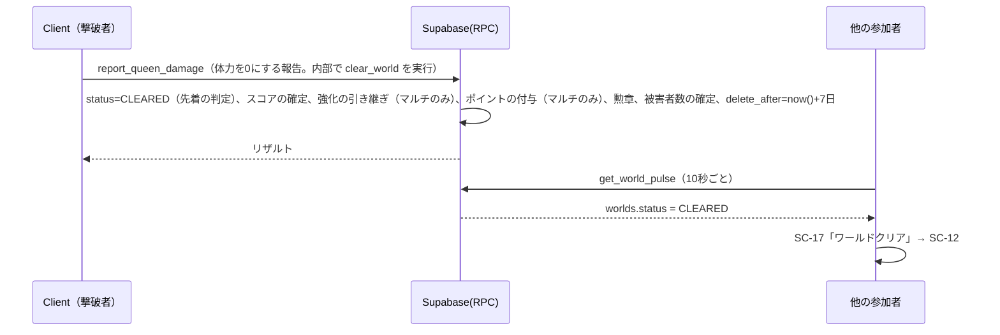

# Relay Resistance アーキテクチャ設計書

| 項目 | 内容 |
|---|---|
| 文書名 | アーキテクチャ設計書 |
| 版数 | 0.2（ドラフト） |
| 作成日 | 2026-09-23 |
| 更新日 | 2026-10-01 |
| 関連文書 | [01_要件定義書.md](01_要件定義書.md) / [02_機能仕様書.md](02_機能仕様書.md) / [03_画面仕様書.md](03_画面仕様書.md) |

---

## 1. 設計方針

| No | 方針 | 理由 |
|---|---|---|
| P-1 | **ワールドの状態はサーバーを正とする** | 誰も遊んでいなくても変化し、プレイヤーの時計に依存させないため |
| P-2 | **戦闘はクライアント内で完結させる** | 敵を同期しない仕様（FR-SYN-03）。WebGL の通信負荷を抑えるため |
| P-3 | **状態を変えるのはすべてサーバー関数（RPC）経由** | 資金・制圧の不正や競合を防ぐため。テーブルへの直接書き込みは禁止する |
| P-4 | **時間経過は遅延評価で計算し、バッチに依存しない** | 常時動くサーバーを持たないため。無料枠ではプロジェクトが一時停止することがあり、定期ジョブが動かない期間があっても結果が変わらないようにするため |
| P-5 | **同期は範囲を絞る** | 座標・攻撃アニメーション・撃破は同じ分隊のチャンネルだけ（ただし、全ルートが合流するボスエリアだけは、全員のチャンネルで同期する。FR-SYN-07）。ワールド全体（ルートの進行度・資金）は Realtime を使わず、10秒ごとの RPC で取得する。無料枠の Realtime のメッセージ数・同時接続数に収めるため（FR-SYN-01〜05） |
| P-6 | **バランス値はデータで持つ** | 再ビルドしなくても調整できるようにするため（NFR-10） |
| P-7 | **無料のサービスだけで運用する** | 要件 C-08。Supabase Free プラン＋unityroom＋無料の外部cron（死活監視用）だけで完結させる（12章） |

---

## 2. システム構成



- Edge Functions は使わない。ワールドの生成（ルートのDAGを作る処理）は PL/pgSQL の RPC `create_world` で行い、戦歴の文章は `world_events` をもとにクライアントがテンプレートで組み立てる。構成要素を減らし、無料枠の管理対象を少なくするため。

### 2.1 WebGL上でのSupabaseとの通信
- Unity WebGL では `System.Net.Http` による通信や、独自の WebSocket 実装が使えない（または不安定）。そのため、**supabase-js をブラウザ側で動かし、jslib を介して C# とやりとりする**構成にする。
  - supabase-js のバンドルは `.jspre`（または WebGL テンプレート）に含めて、外部CDNに依存しないようにする。
  - C# → JS：`[DllImport("__Internal")]` で関数を呼び出す（引数・戻り値は JSON 文字列）。
  - JS → C#：`SendMessage("SupabaseBridge", "OnXxx", json)` で結果を返す。非同期の呼び出しにはリクエストIDを付け、C# 側の `TaskCompletionSource` と対応づける。
- Unity エディタで実行するときは、同じインターフェースを実装した `EditorSupabaseGateway`（supabase-csharp、または UnityWebRequest＋WebSocketライブラリ）に切り替える。
- 【要確認】unityroom の利用規約上、外部サーバーとの通信に問題がないかを確認する。

---

## 3. クライアント（Unity）

### 3.1 レイヤー構成

```
┌─────────────────────────────────────────────┐
│ Presentation  UI(uGUI/TextMeshPro), HUD, 演出 │
├─────────────────────────────────────────────┤
│ Game          FPS制御, 敵AI, ボス, ビルボード, │
│               スポーン, 援護攻撃の演出         │
├─────────────────────────────────────────────┤
│ Application   WorldSession, WalletService,   │
│               SupportService, SyncService,   │
│               OfflineQueue                    │
├─────────────────────────────────────────────┤
│ Infrastructure ISupabaseGateway              │
│               ├ WebGLSupabaseGateway (jslib) │
│               └ EditorSupabaseGateway        │
└─────────────────────────────────────────────┘
```

### 3.2 ディレクトリ構成

```
Assets/
├─ _Project/
│  ├─ Scenes/            Boot, Title, Menu, Command(作戦司令), Stage, Result, Archive
│  ├─ Scripts/
│  │  ├─ Core/           GameBootstrap, SceneLoader, ServiceLocator, Config
│  │  ├─ Infrastructure/ ISupabaseGateway, WebGLSupabaseGateway, EditorSupabaseGateway, Dto/
│  │  ├─ Application/    WorldSession, WalletService, SupportService, UpgradeService,
│  │  │                  SyncService, WorldPulseService, OfflineQueue, ScoreService, PointService
│  │  ├─ Game/
│  │  │  ├─ Player/      PlayerController（二段ジャンプ）, Thruster, PlayerHealth, Stamina, WeaponHolder
│  │  │  ├─ Weapons/     WeaponBase, Handgun, AssaultRifle, Shotgun, WeaponData(SO)
│  │  │  ├─ Enemies/     EnemyBase, EnemyAI(StateMachine), EnemySpawner, ReinforcementDirector,
│  │  │  │                Alien, EliteAlien, Tank, Balloon, Spreader, Guard（各種類）, BodyPart（部位ダメージ）
│  │  │  ├─ Queen/       QueenController, QueenPhase, QueenSpawner（クイーン自身のスポーン）
│  │  │  ├─ Throwables/  Grenade, IncendiaryGrenade, AcidPuddle（スプレッダーの体液）
│  │  │  ├─ Stage/       AreaVolume, SupplyPoint, OutpostPoint, EnemyBaseObject, BaseCaptureController, DayNightController, StageBuilder
│  │  │  ├─ Support/     AirStrike, Turret
│  │  │  ├─ Remote/      RemotePlayerView（他プレイヤーの補間表示）
│  │  │  └─ Billboard/   Billboard2Face
│  │  └─ UI/             Screens/(SC-01〜17), Widgets/
│  ├─ Data/              ScriptableObject（敵・武器・エリアのプレハブ定義）
│  ├─ Art/               Sprites(Front/Back), Textures, Materials
│  └─ Audio/
├─ Plugins/WebGL/        SupabaseBridge.jslib, supabase.bundle.jspre
└─ WebGLTemplates/       RelayResistance/
```

### 3.3 主要クラス

| クラス | 責務 |
|---|---|
| `WorldSession` | 参加中のワールド・ルート・現在いるエリアを管理する。`advance_world` を呼んだ結果（不在中の戦況）を保持する |
| `WalletService` | 個人資金・共有資金の残高を管理する。10秒ごとの `WorldPulseService` の結果と、自分の操作の RPC 応答で更新し、UIへイベントを発行する |
| `WorldPulseService` | 10秒ごとに `get_world_pulse` を呼び、サーバー時刻・ワールドの状態（クリア/陥落）・各ルートの進行度・資金提供の記録・現在いるノードの状態・最近の出来事を取り込む。朝・夜の判定（`DayNightController`）の時刻の基準にもなる |
| `SupportService` | 支援要請（物資・援護攻撃・拠点攻撃・設営・共有資金）の RPC を呼び出す |
| `SyncService` | ノードのチャンネルに入る・出る、座標＋状態フラグの送受信（4Hz。他のプレイヤーがいるときだけ。状態が変わったときも送る）、撃破・死亡のブロードキャスト |
| `PointService` | ポイントの残高と解放済みの要素を管理し、`spend_points` を呼び出す |
| `BaseCaptureController` | 敵拠点の制圧（全滅の判定、10秒のカウント、リセット、`begin_base_hold` / `capture_base` の呼び出し。F-08 9.2） |
| `DayNightController` | サーバー時刻から朝・夜を判定し、環境光・空・霧を切り替える（F-20） |
| `OfflineQueue` | 撃破報告・死亡数などを連番（seq）付きでキューにためて、まとめて送る（5秒ごと） |
| `EnemySpawner` | サーバーの `enemy_remaining` を上限として、ローカルに敵を出現させる。他プレイヤーの撃破を受けてローカルの敵を減らす |
| `ReinforcementDirector` | 後方からの増援を出す判定とスポーン（F-07 8.4） |
| `Billboard2Face` | カメラの方を向かせ（Y軸のみ回転）、前面と背面のスプライトを切り替える |
| `StageBuilder` | ルート・エリアの定義からステージのプレハブを並べて組み立てる |

### 3.4 ビルボードの実装

```csharp
// Billboard2Face.cs（概要）
void LateUpdate() {
    var toCam = cam.position - transform.position;
    toCam.y = 0f;
    // 見た目はカメラの方を向ける（Y軸のみ）
    spriteRoot.rotation = Quaternion.LookRotation(-toCam);
    // 論理的な正面（facing）とカメラ方向の内積で、前面と背面を切り替える
    bool front = Vector3.Dot(facing.forward, toCam) >= 0f;
    renderer.sprite = front ? frontSprite : backSprite;
}
```
- 前面と背面のスプライトは1枚のアトラスにまとめ、ドローコールを減らす。
- 敵の数が多いときは、GPU Instancing が使えるマテリアル（Unlit/Transparent Cutout）を使う。

### 3.5 ステージの構成
- エリア1つを1つのプレハブ（`AreaChunk`）として作り、ルートの定義に従って Z 方向に並べる。
- 壁・遮蔽物は、ローポリゴンのメッシュにテクスチャを貼って表現する。
- ステージのシーンでは、プレイヤーの前後2エリアだけを有効にし、それ以外は無効にする（描画と物理の負荷を減らす）。

---

## 4. サーバー（Supabase）

### 4.1 使う機能

| 機能 | 用途 |
|---|---|
| Auth | 匿名サインイン。`auth.uid()` をプレイヤーIDにする |
| PostgreSQL | すべての状態。RLS＋`SECURITY DEFINER` の RPC 関数で更新する |
| Realtime Broadcast / Presence | 同じ分隊での座標・攻撃アニメーション（状態フラグ）・撃破・死亡と、対象ノードでの援護攻撃の演出（DBに保存しない） |
| RPC（10秒ごとの `get_world_pulse`） | ルートの進行度・資金・ワールドの状態など、ワールド全体の同期。Realtime の Postgres Changes は使わない（メッセージ数と接続数を節約するため） |
| pg_cron | 保存期間を過ぎたワールドの削除（任意。8章） |

### 4.2 リアルタイムのチャンネル設計

| チャンネル名 | 種類 | 購読者 | 主なメッセージ |
|---|---|---|---|
| `area:{area_id}` | Presence＋Broadcast | そのノードにいるプレイヤー（最大20人） | 分隊の割り当てに使う Presence、`support_fx` |
| `squad:{area_id}:{n}` | Broadcast | 同じ分隊のプレイヤー（最大4人） | `pos`（4Hz。状態フラグ `st` を含む）, `kill`, `death` |
| `boss:{world_id}` | Presence＋Broadcast | ボスエリアにいる全プレイヤー（最大20人）。**ボスエリアでは `area:*`・`squad:*` の代わりにこのチャンネルだけに入る** | `pos`（2Hz。分隊なし）, `queen_dmg`（1秒ごとの合計ダメージ）, `death`, `support_fx` |

- ボスエリアはワールドに1つで、全ルートのプレイヤーが合流する（FR-SYN-07）。ボスエリアに入ったら、前のノードの `area:*`・`squad:*` から抜けて `boss:*` に入る。出たら逆にする。同時に入るチャンネルは常に1組だけなので、接続数は変わらない。
- `queen_dmg` は表示用（体力バーを減らす）。クイーンの体力を決めるのは RPC `report_queen_damage` だけとする（Broadcast は状態を変えない）。
- ボスエリアではエイリアン・近衛兵の `kill` を送らない（通信量の削減）。

- **ワールド全体の同期（ルートの進行度・資金）にはチャンネルを使わない。** 旧設計の `world:*` と `route:*`（Postgres Changes）は廃止し、10秒ごとの RPC `get_world_pulse` に置き換えた（下記）。Realtime の接続は、ステージに入っている間の `area:*` と `squad:*` だけになる（作戦司令やメニューでは接続しなくてよい）。
- ノードを移ったら、前のノードの `area:*` と `squad:*` から抜け、新しいノードのチャンネルに入る。
- 分隊の番号 `n` は、`area:*` の Presence で各分隊の人数を見て、空きのある最小の番号を選ぶ。同時に入って5人以上になった場合は、後から入った人が次の番号へ移る。
- ワープ先ごとの人数（SC-05・SC-06 の 👤×n）は Presence ではなく、`world_members.current_area` を集計して `get_world_snapshot` で返す（全ノードのチャンネルを購読しないようにするため）。
- `pos` メッセージは `{uid, x, y, z, yaw, st, t}` の形で、クライアント側で250ms遅らせて補間して表示する。`st` は状態フラグ（発砲中・投擲・スラスター使用中・しゃがみ）。**発砲の方向と命中対象は含めない**（FR-SYN-03）。
- 無料枠のメッセージ数を節約するため（12章）、次のようにする。
  - `pos` は分隊の中だけで送り、分隊に**他のプレイヤーがいるときだけ**送る。止まっているときは送らない。ただし `st` が変わったときは、止まっていても1回送る（攻撃アニメーションの同期に別メッセージは使わない）。
  - `game_config.pos_sync_enabled` が false のときは `pos` を送らない（月の使用量が上限に近づいたときに手動で切り替える）。
  - 他人の個人資金は配信しない。
  - `report_kills` は5秒ごとにまとめて送る。
- Broadcast で届いた `kill` はあくまで表示用（ローカルの敵を消す）。個体は指定しない。サーバーの `enemy_remaining` を減らすのは RPC `report_kills` だけとする。

### 4.3 ワールド全体の同期（`get_world_pulse`）

| 項目 | 内容 |
|---|---|
| 呼び出し | クライアントが参加中に10秒ごと（`WorldPulseService`）。引数：`world_id`, `area_id`（いるノード。作戦司令なら null）, `last_event_id` |
| 返す内容 | サーバー時刻・`worlds.status`・ルートごとの進行度・共有プールの残高・自分の残高・前回以降の資金提供／支援の記録（最大20件）・いるノードの状態・前回以降の `world_events`（機能仕様書 19.4）。**`area_id` がボスエリアのときは、`boss_fights.queen_hp` も返す**（クライアントの体力表示の補正用。機能仕様書 19.6） |
| 処理 | 未処理の侵攻ティックがあるときだけ `advance_world` を実行する（6.2）。それ以外は読み取りだけで、ロックを取らない |
| サイズ | 2KB以内。1人あたり1時間で約0.7MB。20人が1時間遊んでも約14MB |
| 負荷 | 20人×6回/分＝120リクエスト/分（1ワールド）。100ワールドが満員でも、約1.2万リクエスト/分だが、ゲームを遊べる人数は Realtime の同時接続（約200人）が先に上限になるため、実際は最大でも約1,200リクエスト/分になる（12.2） |

- 進行度は `areas` を集計して求める（`routes` ごとの `PLAYER` ノード数 / 総ノード数、最前線のノード名）。1回の集計は最大500ノードの行を数えるだけで軽い。`worlds` の行に集計値（`progress_cache`）をキャッシュして、更新は `report_kills` 等で制圧が起きたときにだけ行う。
- 10秒ごとの同期に合わせて、次の内容は Realtime に流さない：他のルートの状況、他人の資金の増減、ワールドの状態（クリア・陥落）。クリア・陥落は、最大10秒遅れで各クライアントに通知される。

---

## 5. データモデル

### 5.1 ER図



### 5.2 テーブル定義（主要な列）

```sql
-- プレイヤー
create table profiles (
  id              uuid primary key references auth.users,
  display_name    text not null check (char_length(display_name) between 1 and 12),
  tag             smallint not null,                 -- #1234
  icon_id         smallint not null default 0,
  total_contrib   bigint not null default 0,
  good_count      int not null default 0,
  carry_upgrades  jsonb not null default '{}',       -- 引き継ぎ強化（資金による強化。マルチをクリアしたときだけ更新）{"mag":2,"reload":3,"recoil":1,"atk":0,"supply_ammo":1,"supply_heal":0,"bomb_qty":1,"bomb_area":0,"bomb_atk":0,"turret_qty":0,"turret_range":0,"turret_atk":0}
  points          int not null default 0,            -- 所持ポイント（マルチのクリアで付与）
  unlocks         jsonb not null default '{}',       -- ポイントで解放・強化した内容 {"weapons":["smg","ar"],"grenades":["frag"],"stats":{"hp":3,"stamina":0,"speed":2,"ammo":1,"throw":0},"thruster":{"energy":2,"regen":0,"boost":1},"skins":["s1"],"skills":[]}
  created_at      timestamptz not null default now()
);

-- ワールド
create table worlds (
  id                 uuid primary key default gen_random_uuid(),
  name               text not null,                  -- 第12戦域
  mode               text not null check (mode in ('solo','multi')),
  owner_id           uuid references profiles,       -- ソロ：持ち主 / マルチ：作成した人
  status             text not null default 'ACTIVE'
                     check (status in ('ACTIVE','CLEARED','FALLEN')),
  created_at         timestamptz not null default now(),
  closes_at          timestamptz,                    -- マルチ：created_at + 30日 / ソロ：null（期限なし）
  last_simulated_at  timestamptz not null default now(),
  ended_at           timestamptz,                    -- クリアまたは陥落した時刻
  cleared_by         uuid references profiles,
  delete_after       timestamptz,                    -- ended_at + 7日（リザルト期間）
  max_members        int not null default 20,
  seed               bigint not null,
  casualties         bigint not null default 0,      -- 被害者数の累計（機能仕様書 6.5。マルチのみ）
  progress_cache     jsonb,                          -- ルートごとの進行度のキャッシュ（get_world_pulse 用）
  level              smallint not null default 0     -- 【Ph.2】ダイナミックレベリング。Ph.1 では常に 0
);

create table world_members (
  world_id        uuid references worlds on delete cascade,
  player_id       uuid references profiles,
  route_id        uuid not null,                     -- 所属ルート（ワープで他のルートにも行ける）
  upgrades        jsonb not null default '{}',       -- ワールド内の強化
  fund_contrib    bigint not null default 0,
  base_captures   int not null default 0,            -- 制圧した敵拠点の数（功績度 × 1000）
  kills           int not null default 0,            -- 戦歴・勲章の表示用（功績度には含めない。無限湧きでの稼ぎを防ぐため）
  support_kills   int not null default 0,            -- 同上
  deaths          int not null default 0,            -- 倒れた回数（戦死者数として集計。被害者数の式には含めない）
  score           bigint,                            -- クリア時に確定（敵拠点制圧数×1000 ＋ 資金貢献額×100）。ポイント＝score÷100
  current_area    uuid,                              -- 最後に入ったエリア
  current_area_at timestamptz,
  last_report_seq bigint not null default 0,         -- 撃破報告の連番（二重送信の防止）
  last_played_at  timestamptz,
  primary key (world_id, player_id)
);

-- 作戦期間中のマルチワールドを数えるための索引（枠のチェックを速くする）
create index worlds_active_multi on worlds (closes_at) where mode = 'multi' and status = 'ACTIVE';

create table wallets (
  world_id   uuid, player_id uuid,
  balance    bigint not null default 0 check (balance >= 0),
  updated_at timestamptz not null default now(),
  primary key (world_id, player_id),
  foreign key (world_id, player_id) references world_members on delete cascade
);

create table world_pool (                             -- マルチワールドのみ作る
  world_id uuid primary key references worlds on delete cascade,
  balance  bigint not null default 0 check (balance >= 0)
);

-- ルート・エリア
create table routes (
  id uuid primary key default gen_random_uuid(),
  world_id uuid references worlds on delete cascade,
  name text not null                                  -- 東ルート
);

create table areas (
  id              uuid primary key default gen_random_uuid(),
  route_id        uuid references routes on delete cascade,  -- ボスエリア（kind = 'boss'）は全ルート共通なので null。ワールドとの対応は boss_fights.area_id で持つ
  code            text not null,                      -- 東3-a（1ルート30〜50ノード）
  kind            text not null check (kind in ('spawn','normal','boss')),
  length_m        real not null,                      -- 3D空間の長さ（侵食の計算には使わない）
  owner           text not null check (owner in ('PLAYER','ALIEN','NEUTRAL')),  -- NEUTRAL＝中立エリア
  encroach        real not null default 0,            -- 侵食された割合（0〜1。1以上で ALIEN）
  enemy_base_cnt  int not null,                       -- 基本の敵数
  enemy_remaining int not null,
  is_protected    boolean not null default false,
  chunk_prefab    text not null                       -- クライアント側のプレハブキー
);

-- ボスエリアはワールドに1つ。クイーンの体力・撃破者・戦闘の開始時刻を持つ（全ルートが合流する）
create table boss_fights (
  world_id        uuid primary key references worlds on delete cascade,
  area_id         uuid not null references areas,     -- ボスエリアのノード（kind = 'boss'、route_id は null）
  queen_hp        bigint not null,                    -- 現在の体力（初期値は queen_hp × 倍率）
  queen_hp_max    bigint not null,
  started_at      timestamptz,                        -- 最初にボスエリアに入った時刻（クイーンのスポーンの基準）
  killed_by       uuid references profiles,           -- 体力を0にした報告を最初に受け付けたプレイヤー
  killed_at       timestamptz
);

create table area_links (                             -- DAGの辺（spawn→boss方向。各ルートの最終ノード → 共通のボスエリア）
  from_area uuid references areas on delete cascade,
  to_area   uuid references areas on delete cascade,
  primary key (from_area, to_area)
);

create table enemy_bases (
  area_id         uuid primary key references areas on delete cascade,
  state           text not null default 'ALIEN' check (state in ('ALIEN','CAPTURED')),
  supply_pct      real not null default 100,          -- 敵拠点攻撃要請で減る
  hold_started_at timestamptz,                        -- 制圧の10秒カウントの開始時刻（begin_base_hold）。null＝カウントなし
  hold_by         uuid references profiles,
  captured_at     timestamptz,
  captured_by     uuid references profiles
);
-- 耐久値・「破壊」は廃止した（制圧だけ）。
-- 「制圧拠点」（ワープ先）は state = 'CAPTURED' かつ areas.owner = 'PLAYER' で判定する。
-- ノードを取り返されると owner が ALIEN になり、拠点も state = 'ALIEN'・supply_pct = 100 に戻る（自動的にワープ先から外れる）。

-- 途中拠点（outposts）は廃止した。リスポーン地点・ワープ先は、制圧した敵拠点（enemy_bases）と初期スポーン地点だけ。

create table supply_points (
  id      uuid primary key default gen_random_uuid(),
  area_id uuid references areas on delete cascade,
  stock   jsonb not null default '{}'                 -- {"ammo":3,"heal_s":2,...}
);

-- イベント・支援
create table support_events (
  id           uuid primary key default gen_random_uuid(),
  world_id     uuid references worlds on delete cascade,
  requester_id uuid references profiles,
  kind         text not null,     -- supply/airstrike/turret/base_attack/pool（get_world_pulse で全員に表示する）
  target_area  uuid references areas,
  amount       bigint not null,
  paid_from    text not null check (paid_from in ('wallet','pool')),
  result       jsonb,             -- 撃破数など
  created_at   timestamptz not null default now()
);

create table world_events (       -- 戦歴の元データ
  id bigserial primary key,
  world_id uuid references worlds on delete cascade,
  kind text not null, actor_id uuid, payload jsonb,
  created_at timestamptz not null default now()
);

-- 撃破報告は1件ずつ保存しない（無料枠のDB容量 500MB に収めるため）。
-- 二重送信は world_members.last_report_seq で防ぎ、集計値だけを world_members に加算する。

create table suspicious_logs (    -- 不正の疑いがある報告だけを記録する
  id bigserial primary key,
  world_id uuid, player_id uuid,
  reason text not null, payload jsonb,
  created_at timestamptz not null default now()
);

create table goods (
  world_id uuid, from_id uuid, to_id uuid,
  created_at timestamptz not null default now(),
  primary key (world_id, from_id, to_id),
  check (from_id <> to_id)        -- 自分には押せない
);

create table medals (id text primary key, name text, description text);
create table profile_medals (
  player_id uuid references profiles, medal_id text references medals,
  count int not null default 1, first_world uuid, first_at timestamptz,
  primary key (player_id, medal_id)
);

-- バランス値
create table game_config (key text primary key, value jsonb not null);
```

### 5.3 RLS の方針

| テーブル | SELECT | INSERT / UPDATE / DELETE |
|---|---|---|
| `profiles` | 全員 | 本人のみ（`display_name`, `icon_id` だけ）。その他の列は RPC 経由 |
| `worlds` | 全員（ワールド一覧のため） | 禁止（RPC / cron だけ） |
| `routes`, `areas` 系 | そのワールドの参加者（CLEARED・FALLEN は全員） | 禁止（RPC / cron だけ） |
| `wallets` | 同じワールドの参加者 | 禁止（RPC だけ） |
| `world_members` | 同じワールドの参加者 | 禁止（RPC だけ） |
| `boss_fights` | そのワールドの参加者（CLEARED・FALLEN は全員） | 禁止（RPC だけ） |
| `goods` | 全員 | RPC `give_good` だけ |
| `game_config` | 全員 | 禁止（管理者のみ） |

---

## 6. サーバー関数（RPC）

すべて `SECURITY DEFINER` とし、関数内で `auth.uid()` を検証する。状態を変える関数は、最初に `advance_world(world_id)` を呼ぶ。

**作戦期間のチェック**：マルチワールドで `now() >= closes_at`、または `status <> 'ACTIVE'`（リザルト期間）のときは、状態を変える関数（`join_world`, `report_kills`, `begin_base_hold`, `capture_base`, `pickup_supply`, `request_support`, `buy_upgrade`, `report_queen_damage`, `clear_world`）をエラー `OPERATION_CLOSED` で拒否する。`give_good`・`spend_points`・参照系の関数（`get_world_pulse` など）はリザルト期間中も使える。ソロワールド（`closes_at` が null）はチェックしない。

| 関数 | 引数 | 処理 |
|---|---|---|
| `ensure_profile` | name, icon_id | プロフィールを作る・更新する |
| `list_worlds` | — | 作戦期間中のマルチワールドの一覧と、作戦中の数 / 上限を返す。最後の計算から4時間以上経ったワールドには `advance_world` を実行してから返す。ついでに、保存期間を過ぎたワールドを最大5件削除する（8章） |
| `create_world` | mode | ワールド枠（100個）と1人あたりの上限を確認し、ルート（マルチは最大10本、ソロは1本）のDAG・ノード（1ルート30〜50個）・敵拠点・共通のボスエリア（1つ。`boss_fights` も作る）を生成し、作成者を参加させる。`closes_at = now() + 30日`。ソロは引き継ぎ強化をコピーせず、初期状態で始める |
| `get_world_pulse` | world_id, area_id, last_event_id | 10秒ごとの同期（4.3）。サーバー時刻・ワールドの状態・ルートごとの進行度・資金・いるノードの状態・最近の出来事を返す |
| `join_world` | world_id / null(おまかせ) | 参加者が20人未満か確認し（ワールドの行をロックして数える）、参加し、所属ルートを割り当て（人数の少ないルートを優先）、財布を作り、マルチなら引き継ぎ強化をコピーする |
| `advance_world` | world_id | 未処理の侵攻ティックを計算する（6.2）。不在中の差分を返す |
| `get_world_snapshot` | world_id | 全ルートのエリア・拠点・残高と、ワープ先の一覧・ワープ先ごとの人数をまとめて返す |
| `warp` | area_id, context | ワープ先として有効か（初期スポーン地点、または `state = 'CAPTURED'` かつ `owner = 'PLAYER'` の制圧拠点）を確認し、`current_area` を更新する。`context` は出撃・リスポーン・ステージ内（ファストトラベル）。ステージ内の場合は `game_config` の `fast_travel_enabled` / `fast_travel_cooldown_sec` / `fast_travel_cost` / `fast_travel_combat_block_sec` を確認し、費用を引き落とす。初回の出撃（`fast_travel_new_member_free`）は、費用・制限なしで通す |
| `enter_area` | area_id | 歩いて隣のエリアに入ったときに `current_area` を更新する。撃破報告の位置チェックに使う |
| `report_kills` | seq, area_id, kills, is_reinforcement, deaths | 撃破を検証し、報酬を加算、`enemy_remaining` を減らし、ノードの制圧（`PLAYER` または `NEUTRAL`。中立エリアの昇格を含む）を判定する。倒れた回数（`deaths`）を加算する（戦死者数）。キル数は `kills` に加算するが、功績・資金以外には反映しない。撃破報酬は種類ごとの資金（近衛兵・クイーンは0） |
| `begin_base_hold` | area_id | 敵拠点の制圧の10秒カウントを開始（またはリセット）する。`enemy_remaining` が0で、拠点が `ALIEN` で、`current_area` が一致することを確認して、`hold_started_at` を記録する |
| `capture_base` | area_id | `hold_started_at` から9秒以上（通信の遅れを許容）たっていれば、拠点を `CAPTURED` にし、報酬・実績を加算してノードの制圧判定に進む。足りなければ `HOLD_NOT_READY` を返す |
| `spend_points` | item_id | ポイントを引き落として、武器・投擲武器の開放、プレイヤー強化（体力・スタミナ・移動速度・所持弾薬数・所持投擲武器数。各10段階）、スラスター強化（エネルギー量・回復速度・加速量。各10段階）、スキン・スキルを `profiles.unlocks` に反映する。費用は `game_config` の倍率・費用の範囲から補間式（機能仕様書 13.1）で計算する |
| `pickup_supply` | supply_point_id, item | 在庫をアトミックに減らす |
| `request_support` | kind, target, amount, paid_from | 資金の引き落とし、効果の適用、`support_events` への記録、Broadcast 用の結果を返す |
| `buy_upgrade` | stat, paid_from | 個人資金または共有資金で、武器・補給・援護爆撃・タレットの強化（各5段階。機能仕様書 13.1）をする（共有資金は誰でもどの用途にも使える） |
| `report_queen_damage` | seq, damage | ボスエリアにいるプレイヤーが、5秒ごとに与えたダメージを報告する。`current_area` がボスエリアか、二重送信でないか（`seq`）、1人あたりの上限を超えていないかを確認し、`boss_fights.queen_hp` を減らす（行をロックして更新）。`started_at` が null なら今の時刻を入れる。体力が0になったら、同じトランザクションの中で `killed_by` を記録して `clear_world` を実行する（最初に0にした1人が撃破者）。残りの体力と、クリア済みかどうかを返す |
| `clear_world` | world_id, boss_fight_started_at | クリア（クイーンの撃破）を確定する（先着1名。`report_queen_damage` から呼ばれる）。スコアの確定、強化の引き継ぎ（マルチのみ）、勲章の付与、ポイントの付与（マルチのみ。機能仕様書 20.1）、被害者数の確定 |
| `give_good` | world_id, to_id | グッドを付ける |
| `ping` | — | 何もせず `true` を返す。外部cronからの死活確認用（12.3） |

### 6.1 `create_world` の処理

```sql
-- 概要（PL/pgSQL）
perform pg_advisory_xact_lock(hashtext('create_world'));   -- 同時に作成されても上限を超えないようにする
select count(*) into active_cnt from worlds
 where mode = 'multi' and status = 'ACTIVE' and closes_at > now();  -- 期限切れは status の更新を待たずに除外
if active_cnt >= max_active_worlds then raise exception 'WORLD_LIMIT'; end if;
if exists (select 1 from worlds where owner_id = auth.uid() and mode = 'multi'
           and status = 'ACTIVE' and closes_at > now()) then raise exception 'OWNER_LIMIT'; end if;
insert into worlds (..., closes_at) values (..., now() + interval '30 days');
perform generate_routes(new_world_id, seed);                -- ルート・エリア・敵拠点を作る
perform join_world(new_world_id);
```
- 枠の数え方に `closes_at > now()` を含めるため、陥落した（期限が切れた）ワールドの `status` がまだ ACTIVE のままでも、枠は空いたものとして扱える。バッチで status を更新する必要はない。
- 1人あたりの上限も同じ条件で数えるため、自分が作成したワールドがクリア（CLEARED）または失敗（期限切れ・FALLEN）で終わった時点で、自動的に再び作成できるようになる。

### 6.2 `advance_world` の処理

```sql
-- 概要（PL/pgSQL）
select * from worlds where id = $1 for update;       -- ワールド単位でロック
if mode = 'solo' or status <> 'ACTIVE' then return; end if;  -- ソロは時間経過で変化しない
sim_until := least(now(), closes_at);                 -- 作戦期間の終わりより後は計算しない
ticks := floor(extract(epoch from sim_until - created_at) / (4*3600))
       - floor(extract(epoch from last_simulated_at - created_at) / (4*3600));
for i in 1..ticks loop
  tick_time := ...;                                   -- i番目のティックの時刻
  week := floor((tick_time - created_at) / interval '7 days');
  d := 0.5 * power(1.5, week);                        -- ノード単位（旧：5m）
  perform encroach_step(world_id, d);                 -- 機能仕様書 F-05 6.2（余りの繰り越し、拠点の奪還を含む）
  perform add_casualties(world_id, tick_time);        -- F-05 6.5：4時間分の被害者数を worlds.casualties に加算
end loop;
if now() >= closes_at then                             -- 作成から30日を過ぎても未クリア
  status := 'FALLEN'; ended_at := closes_at; delete_after := closes_at + interval '7 days';
end if;
update worlds set last_simulated_at = sim_until;
```
- ティックの時刻は生成時刻を起点とする固定の格子にするため、何度呼んでも結果は同じになる（冪等）。
- 作戦期間は30日なので、不在が長い場合でも最大 `30日×6 = 180` ティックの処理になる。1ワールドは最大500ノード（10ルート×50）なので、ノード数×ティック数は最大約9万行の処理になる。侵食は隣接する `ALIEN` ノードを持つノードだけを対象にし（前線のノードだけ）、実際に更新する行はその一部になる。1回の関数呼び出しで処理できる規模だが、13章 No.4 で実測する。
- 侵食の重み付け（上流のALIENは2倍。`fly_forward_mult`）は、`areas` と `area_links`（DAGの向き）から計算する（機能仕様書 6.2）。分岐の片方だけを制圧してできた飛び地は、上流側の隣接ノードが `ALIEN` になるため、自動的に重み2が適用される。
- `add_casualties` の乱数（1時間あたり90〜130）は、`worlds.seed` と時間の番号から決まる擬似乱数（`hashtext(seed || hour_index)`）を使う。何度計算しても同じ結果になる（冪等）。
- クリア・陥落の確定時（`clear_world` / 期限切れ）には、最後のティックから終了時刻までの端数の時間（1時間未満は切り捨て）も同じ式で加算する。

### 6.3 `report_kills` の検証

| チェック | 内容 |
|---|---|
| 二重送信 | `seq <= world_members.last_report_seq` なら、何もせず現在の残高を返す。受け付けたら `last_report_seq = seq` にする |
| 位置 | そのプレイヤーの直近の入場記録と `area_id` が一致するか |
| レート | 1プレイヤーあたりの撃破数・獲得額の上限（例：10秒で30体、1時間で◆20,000） |
| 上限 | 増援でない撃破は `enemy_remaining` を超えない |
| 超過時 | 上限を超えた分は報酬を付けず、`suspicious_logs` に記録する |

---

## 7. 主要なシーケンス

### 7.1 ワールドに入る（不在中の計算を含む）


- ワールド全体の同期は Realtime を購読せず、10秒ごとの RPC で行う（4.3）。Realtime に接続するのは、ステージに入ってからになる。

### 7.2 ノードでの戦闘と撃破の同期



### 7.2.1 敵拠点の制圧


- あきらめた場合は、何も呼ばない。`hold_started_at` は次に `begin_base_hold` が呼ばれたときに上書きされる。

### 7.3 他ルートへの援護攻撃


- 「対象エリアにプレイヤーがいるか」は Realtime Presence（`area:*` チャンネル）で判定し、クライアントX から RPC の引数として渡す。サーバー側では `world_members.current_area` の最終更新時刻でも確認する。
- Broadcast の送信者はRPCの応答を受けた要請者（X）とする（DBトリガーから Broadcast する方式でもよい）。

### 7.3.1 ボスエリアでの合流とクイーン戦


- 敵（エイリアン・近衛兵）は各クライアントでローカルにスポーンし、撃破は通知しない。体力バーは `queen_dmg` で即時に更新し、10秒ごとの `get_world_pulse` で補正する。

### 7.4 ワールドクリア


- 戦歴の文章は保存せず、SC-13 を開いたときにクライアントが `world_events` から組み立てる。

### 7.5 作戦期間の終了（陥落）

- 各クライアントは `closes_at` を知っているので、プレイ中に時刻になったら自分で SC-17「侵略完了」を表示してステージを終える。サーバーからの通知は必要ない。
- サーバー側では、`closes_at` を過ぎた後の操作をすべて RPC が拒否する。`status` を FALLEN に書き換えるのは、次にそのワールドが参照されたとき（`advance_world`）でよい。

---

## 8. 時間で変わる処理とバッチ

時間の経過で起きることを洗い出し、それぞれバッチ（定期的な処理）が必要かどうかを整理した。
**ゲームを正しく動かすために必須のバッチはない。** すべて、参照されたときに計算する（遅延評価）か、時刻と比べて判定する。

| 時間で変わること | 処理のタイミング | バッチ |
|---|---|---|
| エイリアンの侵攻（4時間ごと） | `advance_world`（ワールドに入る・作戦司令を開く・一覧を見る・状態を変える操作の直前） | 不要 |
| エイリアンの週ごとの強化 | 作成時刻と現在時刻から計算する | 不要 |
| 制圧した敵拠点の奪還（ノードが侵食されたとき） | `advance_world` の中（`encroach_step`） | 不要 |
| 被害者数の加算 | `advance_world` の中（`add_casualties`）。乱数は seed から決まる | 不要 |
| 朝・夜の切替 | クライアントが、`get_world_pulse` で得たサーバー時刻から判定する | 不要 |
| ワールド全体の同期（進行度・資金） | クライアントが10秒ごとに `get_world_pulse` を呼ぶ | 不要 |
| 作戦期間の終了（作成から30日） | 各 RPC が `closes_at` と比べて拒否する。`status` の書き換えは次の `advance_world` で行う | 不要 |
| ワールド枠の空き | `create_world` で `closes_at > now()` を条件に数える | 不要 |
| 陥落の通知 | クライアントが `closes_at` を見て自分で表示する | 不要 |
| リザルト期間（1週間）を過ぎたワールドの削除 | `list_worlds` が呼ばれるたびに最大5件ずつ削除する＋ pg_cron で1日1回 | **任意**（下記） |
| プロジェクトの一時停止の防止 | 外部の無料cronが1日1回 `ping` を呼ぶ | **推奨**（12.3） |

### 8.1 pg_cron（任意）

| ジョブ | 間隔 | 内容 |
|---|---|---|
| `purge_worlds` | 1日1回 | `delete_after < now()` のワールドを CASCADE で削除する。`suspicious_logs` の30日より古い行も削除する |

- pg_cron は Supabase の Free プランでも使える拡張機能で、追加の費用はかからない。
- ただし、プロジェクトが一時停止している間は動かない。削除は `list_worlds` でも少しずつ行うため、pg_cron が止まっていてもデータが増え続けることはない。

---

## 9. 不正対策とセキュリティ

| 脅威 | 対策 |
|---|---|
| 資金の改ざん | 残高は RPC でしか変えられない。クライアントの値は表示用 |
| 撃破数の水増し | `report_kills` のレート制限・上限チェック（6.3）。怪しい行動は記録してランキングから除外する |
| クイーンの即時撃破 | `report_queen_damage` で、ボスエリアへの入場記録と、1人あたりの報告できるダメージの上限（強化段階・武器・経過時間から算出）を確認する。上限を超えた分は無視して `suspicious_logs` に記録する。`clear_world` では、クイーン戦開始からの最短時間も確認する |
| 敵拠点の即時制圧 | `capture_base` で、サーバー時刻による10秒（9秒以上）の経過、`enemy_remaining` が0であること、`current_area` の一致を確認する。基準を満たさない呼び出しは `suspicious_logs` に記録する |
| ポイントの不正な付与 | ポイントは `clear_world`（サーバー）だけが付与する。`spend_points` は残高を確認して引き落とす。クライアントは残高を書き換えられない（RLS） |
| 他人のデータの書き換え | RLS。すべての RPC で `auth.uid()` を使う |
| Broadcast の偽装 | Broadcast は表示だけに使い、状態を変えない |
| 名前の不適切な表現 | `ensure_profile` でNGワードチェックを行う |
| APIキー | クライアントと外部cronに入れるのは `anon` キーだけ。`service_role` キーはどこにも置かない（管理作業は Supabase のダッシュボードで行う） |
| ワールド枠の独占 | `create_world` で1人あたりの上限（作戦期間中は1個）を確認する |

---

## 10. 性能とWebGLについての考慮

| 項目 | 対策 |
|---|---|
| ビルドサイズ | Brotli 圧縮、テクスチャはASTC/DXTで圧縮、コード削減（IL2CPPのStrip）を High にする、使わないパッケージを外す |
| 描画 | ビルボードをアトラス化・インスタンシング、影なし（ベイクしたライト）、前後2エリアだけを有効にする |
| GC | 敵・弾・エフェクトはオブジェクトプールで使い回す。JSON のやりとりは `JsonUtility` を使い、確保を減らす |
| 通信 | 座標は4Hz（他のプレイヤーがいて、動いているときだけ）、撃破報告は5秒ごとにまとめて送る。同じ分隊でないプレイヤーとは通信しない。ワールド全体の同期は10秒ごとの RPC（約2KB） |
| 描画・物理 | 床の体液（スプレッダー）は同時に最大20か所。バルーン・スプレッダーの爆発エフェクトはオブジェクトプールで使い回す。1ルート最大50ノードでも、有効にするのは前後2ノードだけ（3.5） |
| スレッド | WebGL はシングルスレッドのため、重い計算はしない。async は `UniTask` などで PlayerLoop 上で動かす |

---

## 11. 環境と運用

| 環境 | 用途 | Supabase プロジェクト |
|---|---|---|
| dev | 開発。Unity エディタから接続 | ローカル（Supabase CLI の `supabase start`。Docker で動くため費用なし） |
| stg | unityroom の限定公開で確認 | relay-stg（Free プロジェクト1つ目） |
| prod | unityroom で公開 | relay-prod（Free プロジェクト2つ目） |

- Free プランで同時に動かせるプロジェクトは2つまでのため、dev はローカルで動かす。
- DBのスキーマ・RPC・cron は `supabase/migrations/` で管理し、Supabase CLI で反映する。
- 接続先（URL・anonキー）は、ビルドするときに `ScriptableObject`（`EnvConfig`）を切り替えて埋め込む。
- バランス値は `game_config` を更新するだけで反映させる（クライアントは起動時と、ワールドに入るときに取得する）。

---

## 12. 無料枠での運用

### 12.1 使うサービス（すべて無料）

| サービス | プラン | 用途 |
|---|---|---|
| unityroom | 無料 | ゲームの公開（WebGL ホスティング） |
| Supabase | Free | 認証・DB・Realtime・pg_cron |
| cron-job.org | 無料 | 1日1回 `ping` を呼び、Supabase の一時停止を防ぐ（12.3） |
| GitHub | Free | ソースコードの管理。cron-job.org の代わりに GitHub Actions の定期実行でも ping できる |
| Supabase CLI＋Docker Desktop | 無料 | ローカルでの開発・マイグレーション |

- Edge Functions は使わないので、その上限は気にしなくてよい。

### 12.2 Supabase Free プランの上限と、この設計での見込み

> 上限の値は執筆時点の把握によるもので、変わることがある。実装を始める前に、Supabase の公式の料金ページで必ず確認すること。

| 項目 | Free の上限（目安） | この設計での見込み | 対策 |
|---|---|---|---|
| DB容量 | 500 MB | ワールド100個×ルート10本×ノード最大50個＝最大5万行の `areas`（1行約200バイトで約10MB）。リザルト期間のワールドを含めても数十MBに収まる見込み。撃破報告は1件ずつ保存しない | 撃破報告を保存しない（5.2）。保存期間を過ぎたワールドを削除する（8章） |
| 月間アクティブユーザー | 50,000 | 匿名ユーザーも数に入る | 十分な余裕がある |
| Realtime 同時接続数 | 200 | 1人につき1接続（チャンネルは1本の接続にまとめる）。**同時にプレイできるのは全体で約200人まで**。1ワールド20人なら、10ワールド分が同時に満員で遊べる程度 | 超えたら接続を待たせる表示を出す。人数が増えたら有料プランを検討する |
| Realtime メッセージ数 | 月200万件 | **最も厳しい上限。** ワープでプレイヤーが最前線に集まるため、座標の同期が使用量の大半を占める。送信と受信の両方が数えられる前提で見積もると、4人の分隊が4Hzで1時間動き続けると約23万件（4Hz×4人の送信＋3人ずつの受信）。**月に合計9時間分ほどで上限に達する** | 12.4 を参照 |
| データ転送量（egress） | 月5 GB | 10秒ごとの `get_world_pulse`（約2KB）が主な使用量で、1人1時間あたり約0.7MB。月に約7,000人時間ぶんに相当する。ゲーム本体は unityroom から配信されるので数えられない | 応答は差分だけにする（前回以降の記録だけを返す）。作戦司令やステージの外のメニュー画面では間隔を30秒に延ばす。上限に近づいたら間隔を延ばす（`pulse_interval_sec` を `game_config` で変更できるようにする） |
| 一時停止 | 一定期間（目安：1週間）アクセスがないと停止 | 停止中はゲームが遊べなくなる。ワールドの状態は時刻から計算するため、再開後のずれは起きない | 12.3 の死活確認 |
| バックアップ | 自動バックアップなし | — | 月1回、`supabase db dump` を手元に保存する |

### 12.3 一時停止を防ぐ死活確認

- cron-job.org（無料）で1日1回、次のリクエストを送る。
  ```
  POST https://<project>.supabase.co/rest/v1/rpc/ping
  apikey: <anon key>
  Content-Type: application/json
  {}
  ```
- `ping` は何もせずに `true` を返すだけの RPC とする（6章）。`anon` キーはクライアントにも入っている公開用のキーなので、外部サービスに登録しても問題ない。
- GitHub Actions を使う場合は `schedule` で1日1回 `curl` を実行する。公開リポジトリで60日間コミットがないと定期実行が止まるため、cron-job.org の方が手間が少ない。
- 【要確認】アクセスがあっても停止の判定に数えられない場合がないか、Supabase の最新の案内を確認する。

### 12.4 座標同期のメッセージ数の見積もりと対策

同じエリアに集まったときの、座標同期だけの1時間あたりのメッセージ数（送信と受信の両方を数えた場合）：

| 条件 | 1時間あたり | 月200万件に達するまでのプレイ時間 |
|---|---|---|
| 20人が同じチャンネルで4Hz（分隊なし） | 約550万件 | 約20分 |
| 4人の分隊で4Hz | 約23万件 | 約9時間 |
| 4人の分隊で2Hz | 約12万件 | 約17時間 |
| 4人の分隊で2Hz、動いているときだけ（稼働率を5割と仮定） | 約6万件 | 約35時間 |

**ボスエリア（全員同期）の見積もり**：ボスエリアは全ルートが合流する1か所で、分隊に分けずに全員を同期する（FR-SYN-07）ため、ここだけ座標のメッセージが急増する。送信と受信の両方を数えた場合：

| 条件 | 1分あたり | 10分のクイーン戦1回 | 月200万件に達するまで |
|---|---|---|---|
| 20人が4Hz | 約9.1万件 | 約91万件 | 約2回 |
| 20人が2Hz（既定） | 約4.6万件 | 約46万件 | 約4回 |
| 20人が1Hz | 約2.3万件 | 約23万件 | 約9回 |
| 10人が2Hz | 約1.1万件 | 約11万件 | 約18回 |

- 全員が動き続ける最悪の場合の値。止まっている間は送らないため、実際は半分程度の見込み。
- 月に何度もクリアされる運用では、この使用量だけで上限に近づく。ボスエリアの頻度は既定で 2Hz に下げ、人数が多いときは 1Hz に下げる（`boss_pos_hz_crowded`）。それでも足りない場合は、座標の同期を止める（`pos_sync_enabled`）か、ボスエリアでの表示人数を絞る（【要確認】）。
- クイーンの体力（`queen_dmg`）は1秒ごとの合計だけを送るため、20人でも約380件/分にしかならず、ほぼ影響しない。

対策（上から順に効果が大きい）：
1. **分隊（最大4人）**で座標を同期する範囲を区切る（機能仕様書 F-18 19.3）。
2. 動いているときだけ送る。止まっている間は送らない。
3. 送信頻度を 4Hz → 2Hz に下げる（ビルボード表示なので、補間すれば見た目への影響は小さい）。
4. 使用量が上限の80%に近づいたら、`game_config.pos_sync_enabled` を false にして、その月は座標の同期を止める。撃破・死亡・援護攻撃の同期は続ける。

- 無料枠のままでは、座標同期は「ときどき他のプレイヤーが見える」程度の頻度しか確保できない。多くの人に遊ばれるようになったら、Supabase の有料プランへの移行、または座標同期をやめる判断が必要になる。
- 実際にどう数えられるか（送信だけか、受信も含むか）は、試作で計測して確認する（13章 No.2）。

---

## 13. 技術的な課題（要検証）

| No | 課題 | 検証の内容 |
|---|---|---|
| 1 | supabase-js を jslib から使ったときの動作 | Auth・Realtime・RPC が unityroom の iframe 内で動くか、試作して確認する |
| 2 | Realtime のメッセージ数 | 試作で実際のメッセージ数を計測し、月200万件に収まるか確認する（12.2） |
| 3 | 敵を同期しないことによる違和感 | 同じエリアで他プレイヤーの撃破によって敵が消える見え方を確認する |
| 4 | `advance_world` の処理時間 | 最大180ティック×最大500ノードで1秒以内に終わるか（前線のノードだけを対象にする最適化を含めて計測する） |
| 5 | 匿名アカウントの消失 | 引き継ぎコードの必要性 |
| 6 | `get_world_pulse` の負荷と egress | 10秒ごとの呼び出しで、Supabase Free の上限（リクエスト数・転送量5GB）に収まるか。同時200人での応答時間 |
| 7 | 敵拠点の制圧（10秒カウント）の同期 | 同じ拠点に複数人がいるとき、`begin_base_hold` のリセットが他のプレイヤーに正しく反映されるか。他のプレイヤーの敵が侵入したことを、分隊の外にどう伝えるか（同じノードの他の分隊はカウントを共有できない） |
| 8 | 500ノード分の生成 | `generate_routes` が1回の呼び出しで完了するか（最大500行の挿入） |
| 9 | ボスエリアの全員同期 | 20人が同じチャンネルで2Hzのとき、Realtime の1チャンネルあたりの上限（メッセージ数・ペイロード）と、クライアント側の描画・補間の負荷に収まるか。送信と受信のメッセージ数を実測する（No.2 と合わせて） |
| 10 | クイーンの体力共有 | `queen_dmg`（1秒ごと）と `report_queen_damage`（5秒ごと）、10秒ごとの補正で、体力バーのずれが気にならないか。20人が同時に報告したときの `boss_fights` の行ロックの競合と、撃破者の判定の正しさ |
