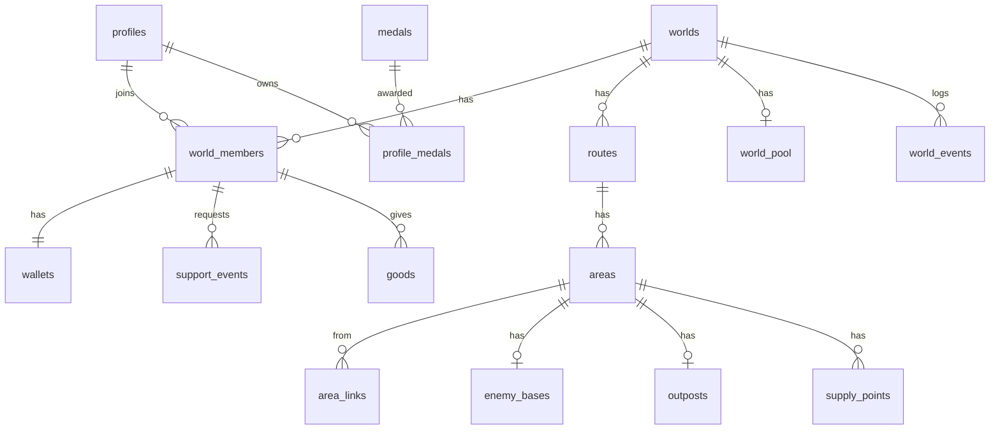
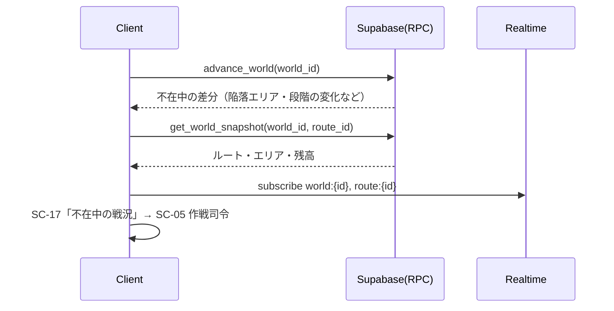
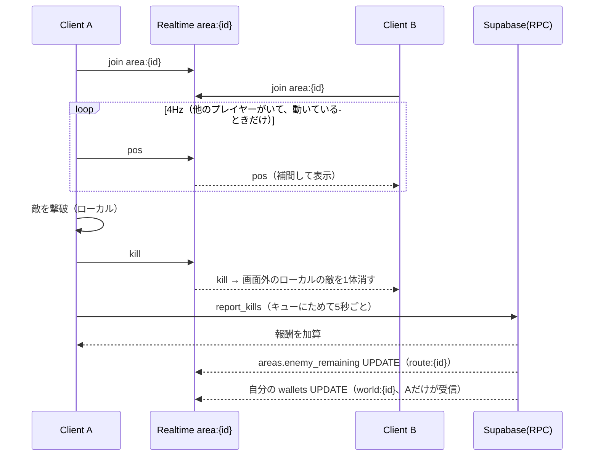
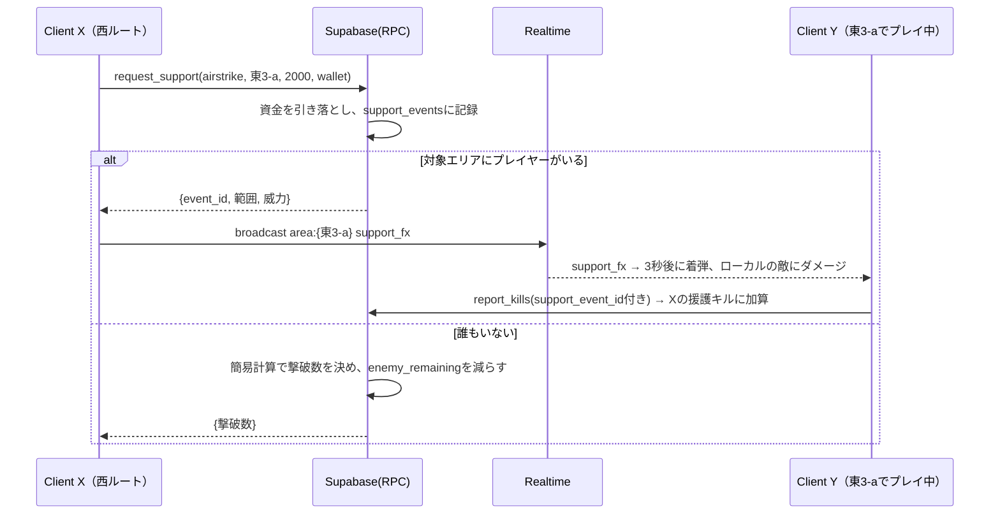
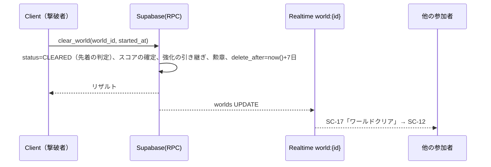

# Relay Resistance アーキテクチャ設計書

| 項目 | 内容 |
|---|---|
| 文書名 | アーキテクチャ設計書 |
| 版数 | 0.1（ドラフト） |
| 作成日 | 2026-09-23 |
| 関連文書 | [01_要件定義書.md](01_要件定義書.md) / [02_機能仕様書.md](02_機能仕様書.md) / [03_画面仕様書.md](03_画面仕様書.md) |

---

## 1. 設計方針

| No | 方針 | 理由 |
|---|---|---|
| P-1 | **ワールドの状態はサーバーを正とする** | 誰も遊んでいなくても変化し、プレイヤーの時計に依存させないため |
| P-2 | **戦闘はクライアント内で完結させる** | 敵を同期しない仕様（FR-SYN-03）。WebGL の通信負荷を抑えるため |
| P-3 | **状態を変えるのはすべてサーバー関数（RPC）経由** | 資金・制圧の不正や競合を防ぐため。テーブルへの直接書き込みは禁止する |
| P-4 | **時間経過は遅延評価で計算し、バッチに依存しない** | 常時動くサーバーを持たないため。無料枠ではプロジェクトが一時停止することがあり、定期ジョブが動かない期間があっても結果が変わらないようにするため |
| P-5 | **同期は範囲を絞る** | 座標は同じエリアのチャンネルだけ、資金はワールド単位。無料枠の Realtime のメッセージ数に収めるため |
| P-6 | **バランス値はデータで持つ** | 再ビルドしなくても調整できるようにするため（NFR-10） |
| P-7 | **無料のサービスだけで運用する** | 要件 C-08。Supabase Free プラン＋unityroom＋無料の外部cron（死活監視用）だけで完結させる（12章） |

---

## 2. システム構成


- Edge Functions は使わない。ワールドの生成（ルートのDAGを作る処理）は PL/pgSQL の RPC `create_world` で行い、戦歴の文章は `world_events` をもとにクライアントがテンプレートで組み立てる。構成要素を減らし、無料枠の管理対象を少なくするため。

### 2.1 WebGL上でのSupabaseとの通信
- Unity WebGL では `System.Net.Http` による通信や、独自の WebSocket 実装が使えない（または不安定）。そのため、**supabase-js をブラウザ側で動かし、jslib を介して C# とやりとりする**構成にする。
  - supabase-js のバンドルは `.jspre`（または WebGL テンプレート）に含めて、外部CDNに依存しないようにする。
  - C# → JS：`[DllImport("__Internal")]` で関数を呼び出す（引数・戻り値は JSON 文字列）。
  - JS → C#：`SendMessage("SupabaseBridge", "OnXxx", json)` で結果を返す。非同期の呼び出しにはリクエストIDを付け、C# 側の `TaskCompletionSource` と対応づける。
- Unity エディタで実行するときは、同じインターフェースを実装した `EditorSupabaseGateway`（supabase-csharp、または UnityWebRequest＋WebSocketライブラリ）に切り替える。
- 【要確認】unityroom の利用規約上、外部サーバーとの通信に問題がないかを確認する。

---

## 3. クライアント（Unity）

### 3.1 レイヤー構成

```
┌─────────────────────────────────────────────┐
│ Presentation  UI(uGUI/TextMeshPro), HUD, 演出 │
├─────────────────────────────────────────────┤
│ Game          FPS制御, 敵AI, ボス, ビルボード, │
│               スポーン, 援護攻撃の演出         │
├─────────────────────────────────────────────┤
│ Application   WorldSession, WalletService,   │
│               SupportService, SyncService,   │
│               OfflineQueue                    │
├─────────────────────────────────────────────┤
│ Infrastructure ISupabaseGateway              │
│               ├ WebGLSupabaseGateway (jslib) │
│               └ EditorSupabaseGateway        │
└─────────────────────────────────────────────┘
```

### 3.2 ディレクトリ構成

```
Assets/
├─ _Project/
│  ├─ Scenes/            Boot, Title, Menu, Command(作戦司令), Stage, Result, Archive
│  ├─ Scripts/
│  │  ├─ Core/           GameBootstrap, SceneLoader, ServiceLocator, Config
│  │  ├─ Infrastructure/ ISupabaseGateway, WebGLSupabaseGateway, EditorSupabaseGateway, Dto/
│  │  ├─ Application/    WorldSession, WalletService, SupportService, UpgradeService,
│  │  │                  SyncService, OfflineQueue, ScoreService
│  │  ├─ Game/
│  │  │  ├─ Player/      PlayerController, PlayerHealth, Stamina, WeaponHolder
│  │  │  ├─ Weapons/     WeaponBase, Handgun, AssaultRifle, Shotgun, WeaponData(SO)
│  │  │  ├─ Enemies/     EnemyBase, EnemyAI(StateMachine), EnemySpawner, ReinforcementDirector
│  │  │  ├─ Boss/        BossController, BossPhase
│  │  │  ├─ Stage/       AreaVolume, SupplyPoint, OutpostPoint, EnemyBaseObject, StageBuilder
│  │  │  ├─ Support/     AirStrike, Turret
│  │  │  ├─ Remote/      RemotePlayerView（他プレイヤーの補間表示）
│  │  │  └─ Billboard/   Billboard2Face
│  │  └─ UI/             Screens/(SC-01〜17), Widgets/
│  ├─ Data/              ScriptableObject（敵・武器・エリアのプレハブ定義）
│  ├─ Art/               Sprites(Front/Back), Textures, Materials
│  └─ Audio/
├─ Plugins/WebGL/        SupabaseBridge.jslib, supabase.bundle.jspre
└─ WebGLTemplates/       RelayResistance/
```

### 3.3 主要クラス

| クラス | 責務 |
|---|---|
| `WorldSession` | 参加中のワールド・ルート・現在いるエリアを管理する。`advance_world` を呼んだ結果（不在中の戦況）を保持する |
| `WalletService` | 個人資金・共有資金の残高を管理する。Realtime の通知で更新し、UIへイベントを発行する |
| `SupportService` | 支援要請（物資・援護攻撃・拠点攻撃・設営・共有資金）の RPC を呼び出す |
| `SyncService` | エリアのチャンネルに入る・出る、座標の送受信（4Hz。他のプレイヤーがいるときだけ）、撃破・死亡のブロードキャスト |
| `OfflineQueue` | 撃破報告などを連番（seq）付きでキューにためて、まとめて送る（5秒ごと） |
| `EnemySpawner` | サーバーの `enemy_remaining` を上限として、ローカルに敵を出現させる。他プレイヤーの撃破を受けてローカルの敵を減らす |
| `ReinforcementDirector` | 後方からの増援を出す判定とスポーン（F-07 8.4） |
| `Billboard2Face` | カメラの方を向かせ（Y軸のみ回転）、前面と背面のスプライトを切り替える |
| `StageBuilder` | ルート・エリアの定義からステージのプレハブを並べて組み立てる |

### 3.4 ビルボードの実装

```csharp
// Billboard2Face.cs（概要）
void LateUpdate() {
    var toCam = cam.position - transform.position;
    toCam.y = 0f;
    // 見た目はカメラの方を向ける（Y軸のみ）
    spriteRoot.rotation = Quaternion.LookRotation(-toCam);
    // 論理的な正面（facing）とカメラ方向の内積で、前面と背面を切り替える
    bool front = Vector3.Dot(facing.forward, toCam) >= 0f;
    renderer.sprite = front ? frontSprite : backSprite;
}
```
- 前面と背面のスプライトは1枚のアトラスにまとめ、ドローコールを減らす。
- 敵の数が多いときは、GPU Instancing が使えるマテリアル（Unlit/Transparent Cutout）を使う。

### 3.5 ステージの構成
- エリア1つを1つのプレハブ（`AreaChunk`）として作り、ルートの定義に従って Z 方向に並べる。
- 壁・遮蔽物は、ローポリゴンのメッシュにテクスチャを貼って表現する。
- ステージのシーンでは、プレイヤーの前後2エリアだけを有効にし、それ以外は無効にする（描画と物理の負荷を減らす）。

---

## 4. サーバー（Supabase）

### 4.1 使う機能

| 機能 | 用途 |
|---|---|
| Auth | 匿名サインイン。`auth.uid()` をプレイヤーIDにする |
| PostgreSQL | すべての状態。RLS＋`SECURITY DEFINER` の RPC 関数で更新する |
| Realtime Broadcast | エリア内での座標・撃破・死亡・援護攻撃の演出（DBに保存しない） |
| Realtime Postgres Changes | 残高、エリアの状態、ワールドの状態の変化を通知する |
| pg_cron | 保存期間を過ぎたワールドの削除（任意。8章） |

### 4.2 リアルタイムのチャンネル設計

| チャンネル名 | 種類 | 購読者 | 主なメッセージ |
|---|---|---|---|
| `world:{world_id}` | Postgres Changes | ワールドの参加者全員 | 自分の `wallets`（`player_id` で絞り込む）、`world_pool` / `worlds` / `world_events` のINSERT・UPDATE |
| `route:{route_id}` | Postgres Changes | そのルートを見ている人（作戦司令・プレイ中） | `areas` / `outposts` / `enemy_bases` / `supply_points` のUPDATE |
| `area:{area_id}` | Presence＋Broadcast | そのエリアにいるプレイヤー（最大20人） | 分隊の割り当てに使う Presence、`support_fx` |
| `squad:{area_id}:{n}` | Broadcast | 同じ分隊のプレイヤー（最大4人） | `pos`（4Hz）, `kill`, `death` |

- エリアを移ったら、前のエリアの `area:*` と `squad:*` から抜け、新しいエリアのチャンネルに入る。
- 分隊の番号 `n` は、`area:*` の Presence で各分隊の人数を見て、空きのある最小の番号を選ぶ。同時に入って5人以上になった場合は、後から入った人が次の番号へ移る。
- ワープ先ごとの人数（SC-05・SC-06 の 👤×n）は Presence ではなく、`world_members.current_area` を集計して `get_world_snapshot` で返す（全エリアのチャンネルを購読しないようにするため）。
- `pos` メッセージは `{uid, x, y, z, yaw, t}` の形で、クライアント側で250ms遅らせて補間して表示する。
- 無料枠のメッセージ数を節約するため（12章）、次のようにする。
  - `pos` は分隊の中だけで送り、分隊に**他のプレイヤーがいるときだけ**送る。止まっているときは送らない。
  - `game_config.pos_sync_enabled` が false のときは `pos` を送らない（月の使用量が上限に近づいたときに手動で切り替える）。
  - 他人の個人資金の変化は配信しない（自分の財布だけを購読する）。
  - `report_kills` は5秒ごとにまとめて送り、`areas.enemy_remaining` の更新回数を減らす。
- Broadcast で届いた `kill` はあくまで表示用（ローカルの敵を消す）。サーバーの `enemy_remaining` を減らすのは RPC `report_kills` だけとする。

---

## 5. データモデル

### 5.1 ER図



### 5.2 テーブル定義（主要な列）

```sql
-- プレイヤー
create table profiles (
  id              uuid primary key references auth.users,
  display_name    text not null check (char_length(display_name) between 1 and 12),
  tag             smallint not null,                 -- #1234
  icon_id         smallint not null default 0,
  total_contrib   bigint not null default 0,
  good_count      int not null default 0,
  carry_upgrades  jsonb not null default '{}',       -- 引き継ぎ強化 {"hp":8,"stamina":6,...}
  created_at      timestamptz not null default now()
);

-- ワールド
create table worlds (
  id                 uuid primary key default gen_random_uuid(),
  name               text not null,                  -- 第12戦域
  mode               text not null check (mode in ('solo','multi')),
  owner_id           uuid references profiles,       -- ソロ：持ち主 / マルチ：作成した人
  status             text not null default 'ACTIVE'
                     check (status in ('ACTIVE','CLEARED','FALLEN')),
  created_at         timestamptz not null default now(),
  closes_at          timestamptz,                    -- マルチ：created_at + 30日 / ソロ：null（期限なし）
  last_simulated_at  timestamptz not null default now(),
  ended_at           timestamptz,                    -- クリアまたは陥落した時刻
  cleared_by         uuid references profiles,
  delete_after       timestamptz,                    -- ended_at + 7日（リザルト期間）
  max_members        int not null default 20,
  seed               bigint not null
);

create table world_members (
  world_id        uuid references worlds on delete cascade,
  player_id       uuid references profiles,
  route_id        uuid not null,                     -- 所属ルート（ワープで他のルートにも行ける）
  upgrades        jsonb not null default '{}',       -- ワールド内の強化
  fund_contrib    bigint not null default 0,
  base_captures   int not null default 0,
  kills           int not null default 0,
  support_kills   int not null default 0,
  score           bigint,                            -- クリア時に確定
  current_area    uuid,                              -- 最後に入ったエリア
  current_area_at timestamptz,
  last_report_seq bigint not null default 0,         -- 撃破報告の連番（二重送信の防止）
  last_played_at  timestamptz,
  primary key (world_id, player_id)
);

-- 作戦期間中のマルチワールドを数えるための索引（枠のチェックを速くする）
create index worlds_active_multi on worlds (closes_at) where mode = 'multi' and status = 'ACTIVE';

create table wallets (
  world_id   uuid, player_id uuid,
  balance    bigint not null default 0 check (balance >= 0),
  updated_at timestamptz not null default now(),
  primary key (world_id, player_id),
  foreign key (world_id, player_id) references world_members on delete cascade
);

create table world_pool (                             -- マルチワールドのみ作る
  world_id uuid primary key references worlds on delete cascade,
  balance  bigint not null default 0 check (balance >= 0)
);

-- ルート・エリア
create table routes (
  id uuid primary key default gen_random_uuid(),
  world_id uuid references worlds on delete cascade,
  name text not null                                  -- 東ルート
);

create table areas (
  id              uuid primary key default gen_random_uuid(),
  route_id        uuid references routes on delete cascade,
  code            text not null,                      -- 東3-a
  kind            text not null check (kind in ('spawn','normal','boss')),
  length_m        real not null,
  owner           text not null check (owner in ('PLAYER','ALIEN')),
  encroach_m      real not null default 0,
  enemy_base_cnt  int not null,                       -- 基本の敵数
  enemy_remaining int not null,
  is_protected    boolean not null default false,
  chunk_prefab    text not null                       -- クライアント側のプレハブキー
);

create table area_links (                             -- DAGの辺（spawn→boss方向）
  from_area uuid references areas on delete cascade,
  to_area   uuid references areas on delete cascade,
  primary key (from_area, to_area)
);

create table enemy_bases (
  area_id      uuid primary key references areas on delete cascade,
  hp           real not null, hp_max real not null,
  supply_pct   real not null default 100,
  destroyed_at timestamptz,                           -- null = 健在
  destroyed_by uuid references profiles
);
-- 「制圧拠点」（ワープ先）は列を持たず、destroyed_at is not null かつ areas.owner = 'PLAYER' で判定する。
-- エリアを取り返されると owner が ALIEN になり、自動的にワープ先から外れる。

create table outposts (
  area_id  uuid primary key references areas on delete cascade,
  state    text not null check (state in ('NONE','PLAYER','ALIEN','DESTROYED')),
  built_by uuid references profiles,
  built_at timestamptz
);

create table supply_points (
  id      uuid primary key default gen_random_uuid(),
  area_id uuid references areas on delete cascade,
  stock   jsonb not null default '{}'                 -- {"ammo":3,"heal_s":2,...}
);

-- イベント・支援
create table support_events (
  id           uuid primary key default gen_random_uuid(),
  world_id     uuid references worlds on delete cascade,
  requester_id uuid references profiles,
  kind         text not null,     -- supply/airstrike/turret/base_attack/outpost/pool
  target_area  uuid references areas,
  amount       bigint not null,
  paid_from    text not null check (paid_from in ('wallet','pool')),
  result       jsonb,             -- 撃破数など
  created_at   timestamptz not null default now()
);

create table world_events (       -- 戦歴の元データ
  id bigserial primary key,
  world_id uuid references worlds on delete cascade,
  kind text not null, actor_id uuid, payload jsonb,
  created_at timestamptz not null default now()
);

-- 撃破報告は1件ずつ保存しない（無料枠のDB容量 500MB に収めるため）。
-- 二重送信は world_members.last_report_seq で防ぎ、集計値だけを world_members に加算する。

create table suspicious_logs (    -- 不正の疑いがある報告だけを記録する
  id bigserial primary key,
  world_id uuid, player_id uuid,
  reason text not null, payload jsonb,
  created_at timestamptz not null default now()
);

create table goods (
  world_id uuid, from_id uuid, to_id uuid,
  created_at timestamptz not null default now(),
  primary key (world_id, from_id, to_id),
  check (from_id <> to_id)        -- 自分には押せない
);

create table medals (id text primary key, name text, description text);
create table profile_medals (
  player_id uuid references profiles, medal_id text references medals,
  count int not null default 1, first_world uuid, first_at timestamptz,
  primary key (player_id, medal_id)
);

-- バランス値
create table game_config (key text primary key, value jsonb not null);
```

### 5.3 RLS の方針

| テーブル | SELECT | INSERT / UPDATE / DELETE |
|---|---|---|
| `profiles` | 全員 | 本人のみ（`display_name`, `icon_id` だけ）。その他の列は RPC 経由 |
| `worlds` | 全員（ワールド一覧のため） | 禁止（RPC / cron だけ） |
| `routes`, `areas` 系 | そのワールドの参加者（CLEARED・FALLEN は全員） | 禁止（RPC / cron だけ） |
| `wallets` | 同じワールドの参加者 | 禁止（RPC だけ） |
| `world_members` | 同じワールドの参加者 | 禁止（RPC だけ） |
| `goods` | 全員 | RPC `give_good` だけ |
| `game_config` | 全員 | 禁止（管理者のみ） |

---

## 6. サーバー関数（RPC）

すべて `SECURITY DEFINER` とし、関数内で `auth.uid()` を検証する。状態を変える関数は、最初に `advance_world(world_id)` を呼ぶ。

**作戦期間のチェック**：マルチワールドで `now() >= closes_at`、または `status <> 'ACTIVE'`（リザルト期間）のときは、状態を変える関数（`join_world`, `report_kills`, `damage_enemy_base`, `pickup_supply`, `request_support`, `buy_upgrade`, `build_outpost`, `clear_world`）をエラー `OPERATION_CLOSED` で拒否する。`give_good` と参照系の関数はリザルト期間中も使える。ソロワールド（`closes_at` が null）はチェックしない。

| 関数 | 引数 | 処理 |
|---|---|---|
| `ensure_profile` | name, icon_id | プロフィールを作る・更新する |
| `list_worlds` | — | 作戦期間中のマルチワールドの一覧と、作戦中の数 / 上限を返す。最後の計算から4時間以上経ったワールドには `advance_world` を実行してから返す。ついでに、保存期間を過ぎたワールドを最大5件削除する（8章） |
| `create_world` | — | ワールド枠（100個）と1人あたりの上限を確認し、ルートのDAG・エリア・敵拠点を生成し、作成者を参加させる。`closes_at = now() + 30日` |
| `join_world` | world_id / null(おまかせ) | 参加者が20人未満か確認し（ワールドの行をロックして数える）、参加し、所属ルートを割り当て、財布を作り、引き継ぎ強化をコピーする |
| `advance_world` | world_id | 未処理の侵攻ティックを計算する（6.2）。不在中の差分を返す |
| `get_world_snapshot` | world_id | 全ルートのエリア・拠点・残高と、ワープ先の一覧・ワープ先ごとの人数をまとめて返す |
| `warp` | area_id | ワープ先として有効か（初期スポーン地点・`PLAYER` の途中拠点・制圧拠点・前線基地）を確認し、`current_area` を更新する。出撃・リスポーン・ステージ内のワープで使う |
| `enter_area` | area_id | 歩いて隣のエリアに入ったときに `current_area` を更新する。撃破報告の位置チェックに使う |
| `report_kills` | seq, area_id, kills, is_reinforcement | 撃破を検証し、報酬を加算、`enemy_remaining` を減らし、制圧を判定する |
| `damage_enemy_base` | area_id, damage | プレイヤーの攻撃で拠点の耐久値を減らす。破壊を判定する |
| `pickup_supply` | supply_point_id, item | 在庫をアトミックに減らす |
| `request_support` | kind, target, amount, paid_from | 資金の引き落とし、効果の適用、`support_events` への記録、Broadcast 用の結果を返す |
| `buy_upgrade` | stat, paid_from | 個人資金または共有資金で強化する（共有資金は誰でもどの用途にも使える） |
| `build_outpost` | area_id | 途中拠点を設営する（どのルートの `PLAYER` エリアでも可） |
| `clear_world` | world_id, boss_fight_started_at | クリアを確定する（先着1名）。スコアの確定、強化の引き継ぎ、勲章の付与 |
| `give_good` | world_id, to_id | グッドを付ける |
| `ping` | — | 何もせず `true` を返す。外部cronからの死活確認用（12.3） |

### 6.1 `create_world` の処理

```sql
-- 概要（PL/pgSQL）
perform pg_advisory_xact_lock(hashtext('create_world'));   -- 同時に作成されても上限を超えないようにする
select count(*) into active_cnt from worlds
 where mode = 'multi' and status = 'ACTIVE' and closes_at > now();  -- 期限切れは status の更新を待たずに除外
if active_cnt >= max_active_worlds then raise exception 'WORLD_LIMIT'; end if;
if exists (select 1 from worlds where owner_id = auth.uid() and mode = 'multi'
           and status = 'ACTIVE' and closes_at > now()) then raise exception 'OWNER_LIMIT'; end if;
insert into worlds (..., closes_at) values (..., now() + interval '30 days');
perform generate_routes(new_world_id, seed);                -- ルート・エリア・敵拠点を作る
perform join_world(new_world_id);
```
- 枠の数え方に `closes_at > now()` を含めるため、陥落した（期限が切れた）ワールドの `status` がまだ ACTIVE のままでも、枠は空いたものとして扱える。バッチで status を更新する必要はない。
- 1人あたりの上限も同じ条件で数えるため、自分が作成したワールドがクリア（CLEARED）または失敗（期限切れ・FALLEN）で終わった時点で、自動的に再び作成できるようになる。

### 6.2 `advance_world` の処理

```sql
-- 概要（PL/pgSQL）
select * from worlds where id = $1 for update;       -- ワールド単位でロック
if mode = 'solo' or status <> 'ACTIVE' then return; end if;  -- ソロは時間経過で変化しない
sim_until := least(now(), closes_at);                 -- 作戦期間の終わりより後は計算しない
ticks := floor(extract(epoch from sim_until - created_at) / (4*3600))
       - floor(extract(epoch from last_simulated_at - created_at) / (4*3600));
for i in 1..ticks loop
  tick_time := ...;                                   -- i番目のティックの時刻
  week := floor((tick_time - created_at) / interval '7 days');
  d := 5 * power(1.5, week);
  perform encroach_step(world_id, d);                 -- 機能仕様書 F-05 6.2
  perform repair_enemy_bases(world_id, tick_time);    -- F-05 6.3
end loop;
if now() >= closes_at then                             -- 作成から30日を過ぎても未クリア
  status := 'FALLEN'; ended_at := closes_at; delete_after := closes_at + interval '7 days';
end if;
update worlds set last_simulated_at = sim_until;
```
- ティックの時刻は生成時刻を起点とする固定の格子にするため、何度呼んでも結果は同じになる（冪等）。
- 作戦期間は30日なので、不在が長い場合でも最大 `30日×6 = 180` ティックの処理になる。エリア数×ティック数でも数万行程度で、1回の関数呼び出しで処理できる規模になる。

### 6.3 `report_kills` の検証

| チェック | 内容 |
|---|---|
| 二重送信 | `seq <= world_members.last_report_seq` なら、何もせず現在の残高を返す。受け付けたら `last_report_seq = seq` にする |
| 位置 | そのプレイヤーの直近の入場記録と `area_id` が一致するか |
| レート | 1プレイヤーあたりの撃破数・獲得額の上限（例：10秒で30体、1時間で◆20,000） |
| 上限 | 増援でない撃破は `enemy_remaining` を超えない |
| 超過時 | 上限を超えた分は報酬を付けず、`suspicious_logs` に記録する |

---

## 7. 主要なシーケンス

### 7.1 ワールドに入る（不在中の計算を含む）



### 7.2 エリアでの戦闘と撃破の同期



### 7.3 他ルートへの援護攻撃


- 「対象エリアにプレイヤーがいるか」は Realtime Presence（`area:*` チャンネル）で判定し、クライアントX から RPC の引数として渡す。サーバー側では `world_members.current_area` の最終更新時刻でも確認する。
- Broadcast の送信者はRPCの応答を受けた要請者（X）とする（DBトリガーから Broadcast する方式でもよい）。

### 7.4 ワールドクリア


- 戦歴の文章は保存せず、SC-13 を開いたときにクライアントが `world_events` から組み立てる。

### 7.5 作戦期間の終了（陥落）

- 各クライアントは `closes_at` を知っているので、プレイ中に時刻になったら自分で SC-17「侵略完了」を表示してステージを終える。サーバーからの通知は必要ない。
- サーバー側では、`closes_at` を過ぎた後の操作をすべて RPC が拒否する。`status` を FALLEN に書き換えるのは、次にそのワールドが参照されたとき（`advance_world`）でよい。

---

## 8. 時間で変わる処理とバッチ

時間の経過で起きることを洗い出し、それぞれバッチ（定期的な処理）が必要かどうかを整理した。
**ゲームを正しく動かすために必須のバッチはない。** すべて、参照されたときに計算する（遅延評価）か、時刻と比べて判定する。

| 時間で変わること | 処理のタイミング | バッチ |
|---|---|---|
| エイリアンの侵攻（4時間ごと） | `advance_world`（ワールドに入る・作戦司令を開く・一覧を見る・状態を変える操作の直前） | 不要 |
| エイリアンの週ごとの強化 | 作成時刻と現在時刻から計算する | 不要 |
| 敵拠点の修復（12時間後） | `advance_world` の中 | 不要 |
| 作戦期間の終了（作成から30日） | 各 RPC が `closes_at` と比べて拒否する。`status` の書き換えは次の `advance_world` で行う | 不要 |
| ワールド枠の空き | `create_world` で `closes_at > now()` を条件に数える | 不要 |
| 陥落の通知 | クライアントが `closes_at` を見て自分で表示する | 不要 |
| リザルト期間（1週間）を過ぎたワールドの削除 | `list_worlds` が呼ばれるたびに最大5件ずつ削除する＋ pg_cron で1日1回 | **任意**（下記） |
| プロジェクトの一時停止の防止 | 外部の無料cronが1日1回 `ping` を呼ぶ | **推奨**（12.3） |

### 8.1 pg_cron（任意）

| ジョブ | 間隔 | 内容 |
|---|---|---|
| `purge_worlds` | 1日1回 | `delete_after < now()` のワールドを CASCADE で削除する。`suspicious_logs` の30日より古い行も削除する |

- pg_cron は Supabase の Free プランでも使える拡張機能で、追加の費用はかからない。
- ただし、プロジェクトが一時停止している間は動かない。削除は `list_worlds` でも少しずつ行うため、pg_cron が止まっていてもデータが増え続けることはない。

---

## 9. 不正対策とセキュリティ

| 脅威 | 対策 |
|---|---|
| 資金の改ざん | 残高は RPC でしか変えられない。クライアントの値は表示用 |
| 撃破数の水増し | `report_kills` のレート制限・上限チェック（6.3）。怪しい行動は記録してランキングから除外する |
| ボスの即時撃破 | `clear_world` でボス戦開始からの最短時間・ボスエリアへの入場記録を確認する |
| 他人のデータの書き換え | RLS。すべての RPC で `auth.uid()` を使う |
| Broadcast の偽装 | Broadcast は表示だけに使い、状態を変えない |
| 名前の不適切な表現 | `ensure_profile` でNGワードチェックを行う |
| APIキー | クライアントと外部cronに入れるのは `anon` キーだけ。`service_role` キーはどこにも置かない（管理作業は Supabase のダッシュボードで行う） |
| ワールド枠の独占 | `create_world` で1人あたりの上限（作戦期間中は1個）を確認する |

---

## 10. 性能とWebGLについての考慮

| 項目 | 対策 |
|---|---|
| ビルドサイズ | Brotli 圧縮、テクスチャはASTC/DXTで圧縮、コード削減（IL2CPPのStrip）を High にする、使わないパッケージを外す |
| 描画 | ビルボードをアトラス化・インスタンシング、影なし（ベイクしたライト）、前後2エリアだけを有効にする |
| GC | 敵・弾・エフェクトはオブジェクトプールで使い回す。JSON のやりとりは `JsonUtility` を使い、確保を減らす |
| 通信 | 座標は4Hz（他のプレイヤーがいて、動いているときだけ）、撃破報告は5秒ごとにまとめて送る。同じエリアでないプレイヤーとは通信しない |
| スレッド | WebGL はシングルスレッドのため、重い計算はしない。async は `UniTask` などで PlayerLoop 上で動かす |

---

## 11. 環境と運用

| 環境 | 用途 | Supabase プロジェクト |
|---|---|---|
| dev | 開発。Unity エディタから接続 | ローカル（Supabase CLI の `supabase start`。Docker で動くため費用なし） |
| stg | unityroom の限定公開で確認 | relay-stg（Free プロジェクト1つ目） |
| prod | unityroom で公開 | relay-prod（Free プロジェクト2つ目） |

- Free プランで同時に動かせるプロジェクトは2つまでのため、dev はローカルで動かす。
- DBのスキーマ・RPC・cron は `supabase/migrations/` で管理し、Supabase CLI で反映する。
- 接続先（URL・anonキー）は、ビルドするときに `ScriptableObject`（`EnvConfig`）を切り替えて埋め込む。
- バランス値は `game_config` を更新するだけで反映させる（クライアントは起動時と、ワールドに入るときに取得する）。

---

## 12. 無料枠での運用

### 12.1 使うサービス（すべて無料）

| サービス | プラン | 用途 |
|---|---|---|
| unityroom | 無料 | ゲームの公開（WebGL ホスティング） |
| Supabase | Free | 認証・DB・Realtime・pg_cron |
| cron-job.org | 無料 | 1日1回 `ping` を呼び、Supabase の一時停止を防ぐ（12.3） |
| GitHub | Free | ソースコードの管理。cron-job.org の代わりに GitHub Actions の定期実行でも ping できる |
| Supabase CLI＋Docker Desktop | 無料 | ローカルでの開発・マイグレーション |

- Edge Functions は使わないので、その上限は気にしなくてよい。

### 12.2 Supabase Free プランの上限と、この設計での見込み

> 上限の値は執筆時点の把握によるもので、変わることがある。実装を始める前に、Supabase の公式の料金ページで必ず確認すること。

| 項目 | Free の上限（目安） | この設計での見込み | 対策 |
|---|---|---|---|
| DB容量 | 500 MB | ワールド100個×ルート4本×エリア約12個でも数千行。撃破報告は1件ずつ保存しないため、数十MBに収まる見込み | 撃破報告を保存しない（5.2）。保存期間を過ぎたワールドを削除する（8章） |
| 月間アクティブユーザー | 50,000 | 匿名ユーザーも数に入る | 十分な余裕がある |
| Realtime 同時接続数 | 200 | 1人につき1接続（チャンネルは1本の接続にまとめる）。**同時にプレイできるのは全体で約200人まで**。1ワールド20人なら、10ワールド分が同時に満員で遊べる程度 | 超えたら接続を待たせる表示を出す。人数が増えたら有料プランを検討する |
| Realtime メッセージ数 | 月200万件 | **最も厳しい上限。** ワープでプレイヤーが最前線に集まるため、座標の同期が使用量の大半を占める。送信と受信の両方が数えられる前提で見積もると、4人の分隊が4Hzで1時間動き続けると約23万件（4Hz×4人の送信＋3人ずつの受信）。**月に合計9時間分ほどで上限に達する** | 12.4 を参照 |
| データ転送量（egress） | 月5 GB | RPC の応答は小さい（数KB）。ゲーム本体は unityroom から配信されるので数えられない | ワールドの状態は差分だけを取得する |
| 一時停止 | 一定期間（目安：1週間）アクセスがないと停止 | 停止中はゲームが遊べなくなる。ワールドの状態は時刻から計算するため、再開後のずれは起きない | 12.3 の死活確認 |
| バックアップ | 自動バックアップなし | — | 月1回、`supabase db dump` を手元に保存する |

### 12.3 一時停止を防ぐ死活確認

- cron-job.org（無料）で1日1回、次のリクエストを送る。
  ```
  POST https://<project>.supabase.co/rest/v1/rpc/ping
  apikey: <anon key>
  Content-Type: application/json
  {}
  ```
- `ping` は何もせずに `true` を返すだけの RPC とする（6章）。`anon` キーはクライアントにも入っている公開用のキーなので、外部サービスに登録しても問題ない。
- GitHub Actions を使う場合は `schedule` で1日1回 `curl` を実行する。公開リポジトリで60日間コミットがないと定期実行が止まるため、cron-job.org の方が手間が少ない。
- 【要確認】アクセスがあっても停止の判定に数えられない場合がないか、Supabase の最新の案内を確認する。

### 12.4 座標同期のメッセージ数の見積もりと対策

同じエリアに集まったときの、座標同期だけの1時間あたりのメッセージ数（送信と受信の両方を数えた場合）：

| 条件 | 1時間あたり | 月200万件に達するまでのプレイ時間 |
|---|---|---|
| 20人が同じチャンネルで4Hz（分隊なし） | 約550万件 | 約20分 |
| 4人の分隊で4Hz | 約23万件 | 約9時間 |
| 4人の分隊で2Hz | 約12万件 | 約17時間 |
| 4人の分隊で2Hz、動いているときだけ（稼働率を5割と仮定） | 約6万件 | 約35時間 |

対策（上から順に効果が大きい）：
1. **分隊（最大4人）**で座標を同期する範囲を区切る（機能仕様書 F-18 19.3）。
2. 動いているときだけ送る。止まっている間は送らない。
3. 送信頻度を 4Hz → 2Hz に下げる（ビルボード表示なので、補間すれば見た目への影響は小さい）。
4. 使用量が上限の80%に近づいたら、`game_config.pos_sync_enabled` を false にして、その月は座標の同期を止める。撃破・死亡・援護攻撃の同期は続ける。

- 無料枠のままでは、座標同期は「ときどき他のプレイヤーが見える」程度の頻度しか確保できない。多くの人に遊ばれるようになったら、Supabase の有料プランへの移行、または座標同期をやめる判断が必要になる。
- 実際にどう数えられるか（送信だけか、受信も含むか）は、試作で計測して確認する（13章 No.2）。

---

## 13. 技術的な課題（要検証）

| No | 課題 | 検証の内容 |
|---|---|---|
| 1 | supabase-js を jslib から使ったときの動作 | Auth・Realtime・RPC が unityroom の iframe 内で動くか、試作して確認する |
| 2 | Realtime のメッセージ数 | 試作で実際のメッセージ数を計測し、月200万件に収まるか確認する（12.2） |
| 3 | 敵を同期しないことによる違和感 | 同じエリアで他プレイヤーの撃破によって敵が消える見え方を確認する |
| 4 | `advance_world` の処理時間 | 最大ティック数×エリア数で1秒以内に終わるか |
| 5 | 匿名アカウントの消失 | 引き継ぎコードの必要性 |
